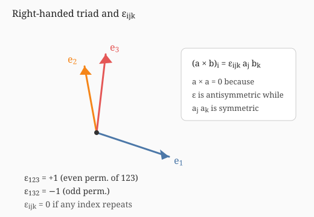

## 指标记号与爱因斯坦求和约定

好的记号能让推导整洁、公式紧凑，并更容易看出结构与洞察。**指标记号**（index notation）在理论物理与（相当一部分）应用数学中几乎无处不在：用下标标明点的坐标、向量分量、矩阵元素以及一般张量的分量等。本节按预备知识深度保留讲义中的主要表述与典型例题；曲线坐标与协变/逆变分量的完整讨论见第 [9 章](../ch09-tensor/index.md)。

### 基本概念

我们从已经熟悉的例子开始。\\(\\mathbb{R}^n\\) 中一点的坐标写作 \\((x\_1,x\_2,\ldots,x\_n)\\)，第 \\(i\\) 个坐标记为 \\(x\_i\\)。

向量空间 \\(\\mathbb{R}^n\\) 中的笛卡尔基向量写作 \\(\mathbf{e}\_1,\mathbf{e}\_2,\ldots,\mathbf{e}\_n\\)，第 \\(i\\) 个基向量记为 \\(\mathbf{e}\_i\\)。一般向量可写为

\\[
\mathbf{v} = \sum\_{i=1}^{n} v\_i \mathbf{e}\_i ,
\\]

其中数 \\(v\_i\\) 是该向量在给定基下的第 \\(i\\) 个分量。采用下文的求和约定后，也可简写为 \\(\mathbf{v}=v\_i\mathbf{e}\_i\\)。

矩阵 \\(M\\) 的第 \\(i\\) 行第 \\(j\\) 列元素记为 \\(M\_{ij}\\)。

### 爱因斯坦求和约定

**爱因斯坦求和约定**（Einstein summation convention）可以一句话说清：

> 不要写出求和号；重复出现**恰好两次**的指标自动表示求和。

例如，两向量的点积

\\[
\mathbf{u}\cdot\mathbf{v} = \sum\_{i=1}^{n} u\_i v\_i \equiv u\_i v\_i ,
\\]

两矩阵的乘积

\\[
[AB]\_{ij} = \sum\_{k=1}^{n} A\_{ik} B\_{kj} \equiv A\_{ik} B\_{kj} .
\\]

使用指标记号必须保持良好习惯，否则会写出别人无法解读、甚至毫无意义的式子。一个典型错误是“该换名的指标没换名”。比较下面两个都声称表示矩阵乘积 \\(ABC\\) 的 \\(ij\\) 元的写法：

\\[
[ABC]\_{ij} = A\_{ik} B\_{kk} C\_{kj}
\quad\text{（错误：}k\text{ 出现三次）},
\qquad
[ABC]\_{ij} = A\_{ik} B\_{kl} C\_{lj}
\quad\text{（正确）}.
\\]

经验法则：每个指标应**恰好出现一次**（此时不求和）或**恰好两次**（此时求和）。若某指标出现超过两次，应假定自己写错了。

被求和的指标——上式中的 \\(k,l\\)——称为**哑指标**（dummy indices）；不被求和的——\\(i,j\\)——称为**自由指标**（free indices）。自由指标在计算过程中**绝不可改动**；哑指标则可随意改名：

\\[
\begin{aligned}
A\_{ik} B\_{kl} C\_{lj}
&= A\_{im} B\_{ml} C\_{lj}
= A\_{ia} B\_{ab} C\_{bj}
= A\_{il} B\_{lk} C\_{kj}
&& \text{（正确）}, \\\\
A\_{ik} B\_{kl} C\_{lj}
&= A\_{jm} B\_{ml} C\_{li}
= \cdots
&& \text{（很糟：自由指标被改乱）}.
\end{aligned}
\\]

### 特殊符号

下面两个符号将反复出现。

**Kronecker delta**

\\[
\delta\_{ij} =
\begin{cases}
1, & i = j, \\\\
0, & \text{其余}.
\end{cases}
\\]

每个空间维数都有对应版本，但写法相同；它就是 \\(n\times n\\) 单位矩阵的分量：\\([I]\_{ij}=\delta\_{ij}\\)。常用性质：

\\[
\delta\_{ij} a\_j = a\_i, \qquad
\delta\_{ij} \delta\_{jk} = \delta\_{ik}, \qquad
\delta\_{ii} = n .
\\]

在正交曲线坐标系中，单位基矢量满足 \\(\mathbf{e}\_i\cdot\mathbf{e}\_j=\delta\_{ij}\\)（见第 [7 章](../ch07-coordinates/01-general.md)）。

**Levi-Civita 符号**（完全反对称符号）\\(\varepsilon\_{ijk}\\) 在三维定义为

\\[
\varepsilon\_{ijk} =
\begin{cases}
+1, & (i,j,k)\text{ 为 }(1,2,3)\text{ 的偶排列}, \\\\
-1, & (i,j,k)\text{ 为 }(1,2,3)\text{ 的奇排列}, \\\\
0, & \text{其余}.
\end{cases}
\\]

严格地说，\\(\varepsilon\_{ijk}\\) 是三维的完全反对称符号；各维都有对应版本。特别地，二维写作 \\(\varepsilon\_{ij}\\)，其分量为 \\(\varepsilon\_{12}=+1\\)、\\(\varepsilon\_{21}=-1\\)、\\(\varepsilon\_{11}=\varepsilon\_{22}=0\\)。

例如 \\(\varepsilon\_{123}=\varepsilon\_{231}=\varepsilon\_{312}=1\\)，\\(\varepsilon\_{132}=-1\\)。任意两指标互换变号：\\(\varepsilon\_{ijk}=-\varepsilon\_{jik}\\)。

### 向量与矩阵的指标形式

矩阵 \\(A\\) 的分量是 \\(A\_{ij}\\)，向量 \\(\mathbf{b}\\) 的分量是 \\(b\_i\\)。著名方程 \\(A\mathbf{x}=\mathbf{b}\\) 写作

\\[
A\_{ij} x\_j = b\_i .
\\]

**例（本征值问题）** 矩阵 \\(A\\) 的本征值与本征向量可写为

\\[
A\_{ij} v\_j^{(\alpha)} = \lambda^{(\alpha)} v\_i^{(\alpha)}, \qquad \alpha=1,\ldots,n .
\\]

注意：此处希腊指标 \\(\alpha\\) **并不参与求和**——它根本不进入“指标记号”的求和规则，只是给第 \\(\alpha\\) 组本征对编号。

矩阵 \\(R\\) **正交**，是指 \\(R^{\mathsf{T}}R=I\\)，其中 \\(R^{\mathsf{T}}\\) 为转置，分量 \\([R^{\mathsf{T}}]\_{ij}=R\_{ji}\\)。于是正交条件的指标形式为

\\[
R\_{ki} R\_{kj} = \delta\_{ij} .
\\]

矩阵**对称**是指 \\(R=R^{\mathsf{T}}\\)，即 \\(R\_{ij}=R\_{ji}\\)；Kronecker delta 本身是对称的。矩阵**反对称**是指 \\(A=-A^{\mathsf{T}}\\)，即 \\(A\_{ij}=-A\_{ji}\\)。

**例（二维旋转矩阵正交）** 二维旋转

\\[
R = \begin{pmatrix} \cos\theta & -\sin\theta \\\\ \sin\theta & \cos\theta \end{pmatrix}
\\]

满足

\\[
\begin{aligned}
R\_{k1} R\_{k1}
&= \cos\theta\cdot\cos\theta + \sin\theta\cdot\sin\theta = 1, \\\\
R\_{k1} R\_{k2}
&= \cos\theta\cdot(-\sin\theta) + \sin\theta\cdot\cos\theta = 0 ,
\end{aligned}
\\]

其余两式可同样验证。它们也可写成 \\(\exp\) 形式，其中生成元矩阵是反对称的。

矩阵的**迹**定义为 \\(\operatorname{tr}A=A\_{ii}\\)。

**例** Kronecker delta 的迹为 \\(\delta\_{ii}=n\\)。

**例** \\(\operatorname{tr}(AB)=\operatorname{tr}(BA)\\)。用指标写出：

\\[
\operatorname{tr}(AB) = A\_{ij} B\_{ji} = B\_{ji} A\_{ij} = \operatorname{tr}(BA) .
\\]

第一步是定义；第二步用到 \\(A\_{ij}\\)、\\(B\_{ji}\\) 都是普通数因而可交换；第三步再回到定义。仿此可证 \\(\operatorname{tr}(ABC)=\operatorname{tr}(CAB)\\)。

**矩阵的一种分解** 对 \\(n\times n\\) 矩阵可写

\\[
\begin{aligned}
M\_{ij}
&= \frac{1}{n} M\_{kk}\delta\_{ij} + \frac{1}{2}(M\_{ij}-M\_{ji}) \\\\
&\quad + \Bigl(\frac{1}{2}(M\_{ij}+M\_{ji}) - \frac{1}{n}M\_{kk}\delta\_{ij}\Bigr) .
\end{aligned}
\\]

右边三项依次对应“迹部分”、反对称部分与无迹对称部分。其用途在于：在旋转群作用下这三块**各自独立变换、互不混杂**；用更抽象的语言说，它们分属旋转群的不同不可约表示。

\\(3\times 3\\) 矩阵的行列式可写为 \\(\det M=\varepsilon\_{ijk}M\_{1i}M\_{2j}M\_{3k}\\)；二维为 \\(\det M=\varepsilon\_{ij}M\_{1i}M\_{2j}\\)；\\(n\\) 维一般形式为

\\[
\det M = \varepsilon\_{i\_1 i\_2\cdots i\_n} M\_{1 i\_1} M\_{2 i\_2}\cdots M\_{n i\_n} .
\\]

更一般地还有

\\[
\varepsilon\_{a\_1\cdots a\_n}\det M
= \varepsilon\_{i\_1\cdots i\_n} M\_{a\_1 i\_1}\cdots M\_{a\_n i\_n} .
\\]

**例** 二维旋转矩阵行列式为 \\(+1\\)：

\\[
\det R
= \varepsilon\_{ij} R\_{1i} R\_{2j}
= \varepsilon\_{12} R\_{11} R\_{22} + \varepsilon\_{21} R\_{12} R\_{21}
= \cos\theta\cdot\cos\theta - (-\sin\theta)\sin\theta
= 1 .
\\]

更多矩阵与特征值内容见[线性代数基础](06-linear-algebra.md)。

### 点积与叉积

设向量 \\(\mathbf{u},\mathbf{v}\\) 的分量为 \\(u\_i,v\_i\\)。它们的**标量积**（点积）是数

\\[
\mathbf{u}\cdot\mathbf{v} = u\_1 v\_1 + u\_2 v\_2 + u\_3 v\_3 = u\_i v\_i ,
\\]

也可写为 \\(\delta\_{ij} u\_i v\_j\\)。

它们的**向量积**（叉积）是

\\[
\begin{aligned}
\mathbf{u}\times\mathbf{v}
&= (u\_2 v\_3-u\_3 v\_2)\mathbf{e}\_1 + (u\_3 v\_1-u\_1 v\_3)\mathbf{e}\_2 \\\\
&\quad + (u\_1 v\_2-u\_2 v\_1)\mathbf{e}\_3 .
\end{aligned}
\\]

用指标记号则可紧凑地写成

\\[
(\mathbf{u}\times\mathbf{v})\_i = \varepsilon\_{ijk} u\_j v\_k .
\\]

**例** 用指标记号证明对任意向量 \\(\mathbf{u}\\) 有 \\(\mathbf{u}\times\mathbf{u}=\mathbf{0}\\)。这并非因为问题困难，而是因为所用手法在指标计算中极为常见：

\\[
\begin{aligned}
(\mathbf{u}\times\mathbf{u})\_i
&= \varepsilon\_{ijk} u\_j u\_k
&& \text{（1：写成指标）} \\\\
&= \varepsilon\_{ijk} u\_k u\_j
&& \text{（2：}u\_j u\_k\text{ 对 }j,k\text{ 对称）} \\\\
&= \varepsilon\_{ikj} u\_j u\_k
&& \text{（3：改名哑指标）} \\\\
&= -\varepsilon\_{ijk} u\_j u\_k
&& \text{（4：}\varepsilon\text{ 对任意两指标反对称）}.
\end{aligned}
\\]

于是该向量等于其自身的相反，故必为零。一般地：**对称因子与反对称因子对同一对指标缩并，结果为零**。

### 三重积与 \\(\varepsilon\\)–\\(\delta\\) 恒等式

设三向量分量为 \\(u\_i,v\_i,w\_i\\)。**标量三重积**为

\\[
\mathbf{u}\cdot(\mathbf{v}\times\mathbf{w}) = \varepsilon\_{ijk} u\_i v\_j w\_k ;
\\]

证明不过是把定义写开。由此用指标记号易见

\\[
\mathbf{v}\cdot(\mathbf{u}\times\mathbf{w}) = -\mathbf{u}\cdot(\mathbf{v}\times\mathbf{w}),
\qquad
\mathbf{w}\cdot(\mathbf{u}\times\mathbf{v}) = \mathbf{u}\cdot(\mathbf{v}\times\mathbf{w}) .
\\]

**向量三重积**恒等式为 \\(\mathbf{u}\times(\mathbf{v}\times\mathbf{w})=(\mathbf{u}\cdot\mathbf{w})\mathbf{v}-(\mathbf{u}\cdot\mathbf{v})\mathbf{w}\\)。写成指标：

\\[
\varepsilon\_{ijk} u\_j (\varepsilon\_{klm} v\_l w\_m)
= u\_j w\_j v\_i - u\_j v\_j w\_i
= (\delta\_{il}\delta\_{jm}-\delta\_{im}\delta\_{jl}) u\_j v\_l w\_m .
\\]

由于这对任意三向量成立，我们便得到有用的恒等式

\\[
\varepsilon\_{ijk}\varepsilon\_{klm} = \delta\_{il}\delta\_{jm} - \delta\_{im}\delta\_{jl} .
\\]

再缩并一次可得 \\(\varepsilon\_{ijk}\varepsilon\_{ljk}=2\delta\_{il}\\)，以及 \\(\varepsilon\_{ijk}\varepsilon\_{ijk}=6\\)。另有 \\(\varepsilon\_{ijk}\delta\_{jk}=0\\)。更一般的矢量恒等式见[附录：矢量恒等式](../appendix/vector-identities.md)。

### 导数与微分方程

偏导数采用记号

\\[
\frac{\partial}{\partial x\_i} \;\longrightarrow\; \partial\_i .
\\]

**例（真空中的 Maxwell 方程）**

\\[
\begin{aligned}
\nabla\cdot\mathbf{E}=0
&\;\longrightarrow\;
\partial\_i E\_i = 0, \\\\
\nabla\cdot\mathbf{B}=0
&\;\longrightarrow\;
\partial\_i B\_i = 0, \\\\
\nabla\times\mathbf{E}+\partial\_t\mathbf{B}=\mathbf{0}
&\;\longrightarrow\;
\varepsilon\_{ijk}\partial\_j E\_k + \partial\_t B\_i = 0, \\\\
\nabla\times\mathbf{B}-\mu\_0\varepsilon\_0\partial\_t\mathbf{E}=\mathbf{0}
&\;\longrightarrow\;
\varepsilon\_{ijk}\partial\_j B\_k - \mu\_0\varepsilon\_0\partial\_t E\_i = 0 .
\end{aligned}
\\]

**例** 用指标计算 \\(\nabla\times\nabla\varphi\\)：

\\[
\begin{aligned}
(\nabla\times\nabla\varphi)\_i
&= \varepsilon\_{ijk}\partial\_j\partial\_k\varphi
&& \text{（1：写成指标）} \\\\
&= \varepsilon\_{ijk}\partial\_k\partial\_j\varphi
&& \text{（2：混合偏导可交换）} \\\\
&= -\varepsilon\_{ikj}\partial\_k\partial\_j\varphi
&& \text{（3：}\varepsilon\text{ 反对称）} \\\\
&= -(\nabla\times\nabla\varphi)\_i
&& \text{（4：回到向量记号）}.
\end{aligned}
\\]

结论显然是 \\(\nabla\times\nabla\varphi=\mathbf{0}\\)。

**例** 建立恒等式 \\(\nabla\times(\nabla\times\mathbf{E})=\nabla(\nabla\cdot\mathbf{E})-\nabla^2\mathbf{E}\\)。左边为

\\[
\begin{aligned}
\bigl[\nabla\times(\nabla\times\mathbf{E})\bigr]\_i
&= \varepsilon\_{ijk}\partial\_j(\varepsilon\_{klm}\partial\_l E\_m)
&& \text{（1：写成指标）} \\\\
&= (\delta\_{il}\delta\_{jm}-\delta\_{im}\delta\_{jl})\partial\_j\partial\_l E\_m
&& \text{（2：缩并的 }\varepsilon\text{–}\delta\text{ 恒等式）} \\\\
&= \partial\_i\partial\_j E\_j - \partial\_j\partial\_j E\_i
&& \text{（3：化简 }\delta\text{ 并整理）}.
\end{aligned}
\\]

\\(\nabla\\) 的分量定义与 Stokes、Gauss 定理见[向量分析基础](05-vector-analysis.md)。

### 张量

**向量**是有大小与方向的物理量，例如速度、力、位移、电场与磁场。**张量**把这一概念推广：它（一般）依赖于不止一个方向。例子包括应力、应变、电导率、介电张量、压电性、弹性以及 Riemann 曲率张量等。在量子多体物理中，基于张量的方法也可用于寻找基态的优良近似——这是相当活跃的研究方向。

**应力**是单位面积上的力，刻画相邻物质元之间维持相对运动或相对位移所需的作用。它依赖两个方向：力的方向 \\(f\_i\\)，以及面积元的方向 \\(\mathrm{d}A\_j\\)。力、面积与应力的关系写作

\\[
f\_i = \sigma\_{ij}\,\mathrm{d}A\_j ,
\\]

其中 \\(\sigma\_{ij}\\) 为**应力张量**。由 \\(f\_i\\) 与 \\(\mathrm{d}A\_j\\) 的线性性易见应力对两者双线性，故称应力为**二秩张量**。

与此类似，**电导率**描述外加电场 \\(E\_i\\) 与电流 \\(J\_i\\) 的关系

\\[
J\_i = \sigma\_{ij} E\_j .
\\]

同样，\\(J\_i\\) 与 \\(E\_j\\) 的线性性意味着 \\(\sigma\_{ij}\\) 双线性，因而也是二秩张量。（应力与电导率习惯上用同一字母 \\(\\sigma\\)，纯属巧合。）

张量的“线性程度”称为它的**秩**：若张量是 \\(k\\) 线性的，则称它为 \\(k\\) 秩张量。一秩张量就是向量；零秩张量是标量（如温度、密度）。更高秩的例子很多：联系应力与应变的弹性张量是四秩的，Riemann 曲率张量亦然。

另一个常见例子是**压电性**：弹性材料在机械力作用下会伸长或压缩；有些材料对外加电场也有同样响应。电场 \\(E\_i\\) 诱发应力 \\(\sigma\_{ij}\\)，系统通过弹性变形松弛；应力与电场的线性关系为

\\[
\sigma\_{ij} = \gamma\_{ijk} E\_k ,
\\]

其中 \\(\gamma\_{ijk}\\) 为压电张量，是三秩张量。

最后强调：并非凡带指标者皆为张量。重要反例包括坐标变换本身（例如旋转矩阵 \\(R\_{ij}\\)），以及半整数自旋的电子——它们不是张量，而称为**旋量**（spinors）。

### 坐标变换

一般坐标变换下，新坐标 \\(x^{\prime}\_i\\) 与旧坐标的关系可写为

\\[
x^{\prime}\_i = R\_{ij} x\_j + t\_i ,
\\]

其中 \\(t\_i\\) 为平移，\\(R\_{ij}\\) 为正交变换（旋转或反射）。本书（及相应讲义）中限制为保原点的变换，即取 \\(t\_i=0\\)。这类变换称为**齐次变换**，构成**正交群** \\(O(n)\\)。它们不改变向量 \\(\mathbf{x}\\) 的长度：

\\[
x\_i x\_i = x^{\prime}\_i x^{\prime}\_i = R\_{ij} x\_j R\_{ik} x\_k
\quad\Rightarrow\quad
R\_{ij} R\_{ik} = \delta\_{jk} .
\\]

正交群有两个不连通分支：保定向的变换（旋转）与反定向的变换（反射）。旋转构成子群——**特殊正交群** \\(SO(n)\\)，即真坐标变换。

由于坐标 \\(x\_i\\) 同时也是位置向量的分量，关系 \\(x^{\prime}\_i=R\_{ij}x\_j\\) 同样描述任意向量在坐标变换下的分量变化。因此对力或电场等亦有

\\[
f^{\prime}\_i = R\_{ij} f\_j , \qquad E^{\prime}\_i = R\_{ij} E\_j .
\\]

这对更高秩张量意味着什么？以电导率 \\(J\_i=\sigma\_{ij}E\_j\\) 为例。在新坐标系中 \\(J^{\prime}\_i=\sigma^{\prime}\_{ij}E^{\prime}\_j\\)，再利用向量分量的变换律，并利用 \\(R\\) 的正交性，可得

\\[
\sigma^{\prime}\_{ij} = R\_{ik} R\_{jl} \sigma\_{kl} .
\\]

对 \\(n\\) 秩张量，自然推广为

\\[
T^{\prime}\_{i\_1\cdots i\_n}
= R\_{i\_1 j\_1}\cdots R\_{i\_n j\_n}\, T\_{j\_1\cdots j\_n} .
\\]

在某些表述中，这一变换律被提升为“\\(n\\) 秩张量”的定义本身。完整讨论见第 [9 章](../ch09-tensor/index.md)。

### 各向同性张量

**各向同性**表示某性质或量没有内禀方向性，或者说“从所有方向看来都一样”。张量各向同性，是指其分量在一切坐标选择下相同，即对一切正交变换 \\(R\\) 有

\\[
T^{\prime}\_{i\_1\cdots i\_n} = T\_{i\_1\cdots i\_n}
\quad\Rightarrow\quad
T\_{i\_1\cdots i\_n}
= R\_{i\_1 j\_1}\cdots R\_{i\_n j\_n}\, T\_{j\_1\cdots j\_n} .
\\]

这对其可能形式施加了很强的限制。特别地，**唯一的各向同性向量是零向量**。

**例** Kronecker delta 是各向同性的：因 \\(R\\) 正交，

\\[
R\_{ik} R\_{jl} \delta\_{kl} = \delta\_{ij} .
\\]

事实上：二维中独立的二秩各向同性张量只有 \\(\delta\_{ij}\\) 与 \\(\varepsilon\_{ij}\\)；三维中二秩各向同性张量本质上只有 \\(\delta\_{ij}\\)。证明二维情形的想法是选取特殊的 \\(R\\) 来限制分量。例如旋转 \\(90^\circ\\)，

\\[
R = \begin{pmatrix} 0 & -1 \\\\ 1 & 0 \end{pmatrix},
\\]

给出 \\(T\_{11}=T\_{22}\\)、\\(T\_{12}=-T\_{21}\\)，从而

\\[
T\_{ij} = A\delta\_{ij} + B\varepsilon\_{ij} .
\\]

我们已知 \\(\delta\_{ij}\\) 各向同性；再验证 \\(\varepsilon\_{ij}\\) 亦然，便知不能再化约。

不加证明地指出：三维中线性无关的三秩各向同性张量只有 Levi-Civita 张量 \\(\varepsilon\_{ijk}\\)；而四秩各向同性张量有三个线性无关的基

\\[
\delta\_{ij}\delta\_{kl}, \qquad \delta\_{ik}\delta\_{jl}, \qquad \delta\_{il}\delta\_{jk} .
\\]

在直角笛卡尔坐标中度量即 \\(\delta\_{ij}\\)，故协变与逆变分量一致：\\(a\_i=a^i\\)。曲线坐标需用 \\(g\_{ij}\\) 升降指标；本书主体多采用欧氏分量约定。

配套习题见[指标记号习题](07-index-exercises.md)。
