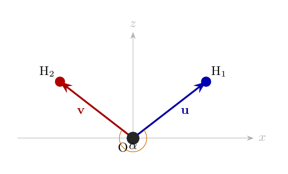
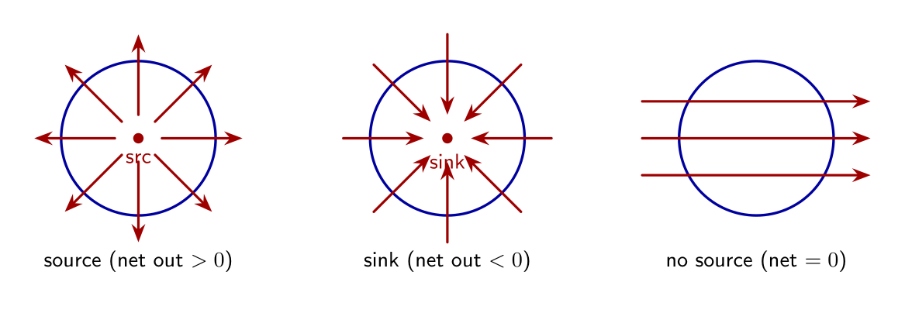
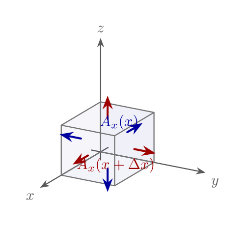
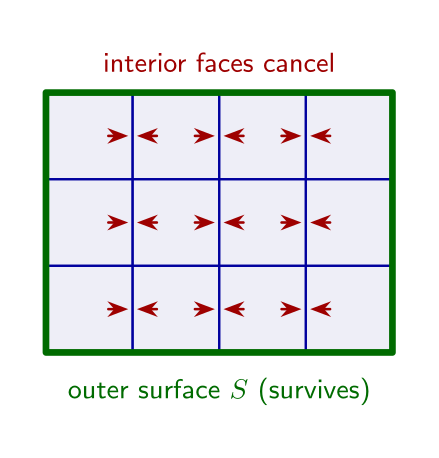

## 向量分析基础

### 标量与向量

**标量**仅由大小决定，如温度、质量。**向量**（如速度、力）既有大小又有方向，本书用粗体 \\(\mathbf{A}\\) 表示。在直角坐标系中

\\[
\mathbf{A} = A\_x \mathbf{e}\_x + A\_y \mathbf{e}\_y + A\_z \mathbf{e}\_z, \qquad
|\mathbf{A}| = \sqrt{A\_x^2 + A\_y^2 + A\_z^2} .
\\]

单位向量常记 \\(\mathbf{e}\_x,\mathbf{e}\_y,\mathbf{e}\_z\\)（或 \\(\mathbf{i},\mathbf{j},\mathbf{k}\\)）。采用**右手坐标系**：四指由 \\(x\\) 转向 \\(y\\)，拇指指向 \\(z\\)。

### 向量的线性运算

\\[
a\mathbf{A} = aA\_x \mathbf{e}\_x + aA\_y \mathbf{e}\_y + aA\_z \mathbf{e}\_z, \qquad
\mathbf{A} \pm \mathbf{B} = (A\_x \pm B\_x)\mathbf{e}\_x + \cdots
\\]

几何上，\\(\mathbf{A} + \mathbf{B}\\) 对应平行四边形法则。

详解与例题见第 9 章[向量代数](../ch09-tensor/01-vector-algebra.md)。

### 点积（数量积）

\\[
\mathbf{A} \cdot \mathbf{B} = |\mathbf{A}|\\,|\mathbf{B}|\cos\theta = A\_x B\_x + A\_y B\_y + A\_z B\_z .
\\]

点积满足交换律 \\(\mathbf{A} \cdot \mathbf{B} = \mathbf{B} \cdot \mathbf{A}\\)。若 \\(\mathbf{A} \cdot \mathbf{B} = 0\\)，则两向量正交。由点积可反解夹角

\\[
\cos\theta = \frac{\mathbf{A}\cdot\mathbf{B}}{|\mathbf{A}|\\,|\mathbf{B}|} .
\\]

**例（水分子键角）.** 取氧原子为原点，分子置于 \\(xz\\) 平面。近似实验构型（键长约 \\(0.96\\) 埃）下两氢原子直角坐标为

\\[
\mathrm{H}\_1:\ (0.757,\ 0,\ 0.586),\qquad
\mathrm{H}\_2:\ (-0.757,\ 0,\ 0.586)
\\]

（单位：埃）。键矢量

\\[
\mathbf{u}=\overrightarrow{\mathrm{OH}\_1}=(0.757,\ 0,\ 0.586),\qquad
\mathbf{v}=\overrightarrow{\mathrm{OH}\_2}=(-0.757,\ 0,\ 0.586) .
\\]

于是

\\[
\mathbf{u}\cdot\mathbf{v}=-0.757^2+0.586^2,\qquad
|\mathbf{u}|=|\mathbf{v}|=\sqrt{0.757^2+0.586^2},
\\]

\\[
\cos\alpha=\frac{\mathbf{u}\cdot\mathbf{v}}{|\mathbf{u}|\\,|\mathbf{v}|}
=\frac{0.586^2-0.757^2}{0.757^2+0.586^2}\approx -0.251 .
\\]

故键角 \\(\alpha=\arccos(-0.251)\approx 104.5^{\circ}\\)，与水分子实测 H–O–H 角一致。一般地，若 \\(\mathbf{u}=(a,0,b)\\)、\\(\mathbf{v}=(-a,0,b)\\)，则

\\[
\cos\alpha=\frac{b^2-a^2}{a^2+b^2} .
\\]

### 叉积（向量积）

\\[
|\mathbf{A} \times \mathbf{B}| = |\mathbf{A}|\\,|\mathbf{B}|\sin\theta,
\\]

方向垂直于 \\(\mathbf{A},\mathbf{B}\\) 所在平面，由右手法则确定。分量形式：

\\[
\mathbf{A} \times \mathbf{B} = \begin{vmatrix}
\mathbf{e}\_x & \mathbf{e}\_y & \mathbf{e}\_z \\\\
A\_x & A\_y & A\_z \\\\
B\_x & B\_y & B\_z
\end{vmatrix}, \qquad
\mathbf{A} \times \mathbf{B} = -\mathbf{B} \times \mathbf{A} .
\\]

指标记号：\\((\mathbf{A} \times \mathbf{B})\_i = \varepsilon\_{ijk} A\_j B\_k\\)（见[指标记号与爱因斯坦求和约定](04-index-notation.md)）。

### 标量三重积

\\[
(\mathbf{A} \times \mathbf{B}) \cdot \mathbf{C} = \mathbf{B} \cdot (\mathbf{C} \times \mathbf{A}) = \mathbf{C} \cdot (\mathbf{A} \times \mathbf{B})
\\]

其绝对值等于 \\(\mathbf{A},\mathbf{B},\mathbf{C}\\) 张成的平行六面体体积。

### 微分算符 \\(\nabla\\)

**梯度**（作用在标量场 \\(\varphi\\) 上）：

\\[
\nabla \varphi = \mathbf{e}\_x \frac{\partial \varphi}{\partial x} + \mathbf{e}\_y \frac{\partial \varphi}{\partial y} + \mathbf{e}\_z \frac{\partial \varphi}{\partial z}, \qquad
\nabla \varphi = \left( \frac{\partial \varphi}{\partial x}, \frac{\partial \varphi}{\partial y}, \frac{\partial \varphi}{\partial z} \right) .
\\]

**散度**与**旋度**（作用在向量场 \\(\mathbf{A}\\) 上）：

\\[
\nabla \cdot \mathbf{A} = \frac{\partial A\_x}{\partial x} + \frac{\partial A\_y}{\partial y} + \frac{\partial A\_z}{\partial z}, \qquad
\nabla \times \mathbf{A} = \begin{vmatrix}
\mathbf{e}\_x & \mathbf{e}\_y & \mathbf{e}\_z \\\\
\partial/\partial x & \partial/\partial y & \partial/\partial z \\\\
A\_x & A\_y & A\_z
\end{vmatrix} .
\\]

**Laplace 算符**：\\(\nabla^2 = \nabla \cdot \nabla\\)。在直角坐标中 \\(\nabla^2 \varphi = \partial^2 \varphi / \partial x^2 + \partial^2 \varphi / \partial y^2 + \partial^2 \varphi / \partial z^2\\)。

恒等式 \\(\nabla \times (\nabla \varphi) = \mathbf{0}\\)、\\(\nabla \cdot (\nabla \times \mathbf{A}) = 0\\) 及 Stokes、Gauss 定理等，见[附录：矢量恒等式](../appendix/vector-identities.md)。柱、球坐标中的 \\(\nabla\\) 形式见第 [7 章](../ch07-coordinates/index.md)；线积分、通量与旋度的推导见第 [9 章](../ch09-tensor/03-grad-del.md)。

### 梯度的几何意义

设标量场 \\(f(\mathbf{r})\\)。从 \\(\mathbf{r}\\) 到 \\(\mathbf{r}+\mathrm{d}\mathbf{r}\\) 时，

\\[
\mathrm{d}f = \nabla f \cdot \mathrm{d}\mathbf{r} = |\nabla f|\,|\mathrm{d}\mathbf{r}|\cos\theta .
\\]

沿等值线（\\(f\\) 不变）取位移时 \\(\mathrm{d}f=0\\)，故 \\(\nabla f\\) **垂直于等值面/等值线**，并指向 \\(f\\) 增大的一侧。单位步长下 \\(f\\) 变化最快的方向即 \\(\nabla f\\) 的方向，变化率为 \\(|\nabla f|\\)。

物理例子：温度梯度 \\(\nabla T\\) 指向升温最快的方向；各向同性介质中热流密度常取 \\(-\kappa\nabla T\\)（\\(\kappa\\) 为热导率）。两点间的势差可写成路径积分

\\[
f(B)-f(A)=\int\_A^B \nabla f\cdot\mathrm{d}\mathbf{r} .
\\]

路径无关性与例题见[梯度与 ∇ 算符](../ch09-tensor/03-grad-del.md)。

### 散度、Gauss 定理与“源”

向量场 \\(\mathbf{W}\\) 的**散度**

\\[
\nabla\cdot\mathbf{W}
= \frac{\partial W\_x}{\partial x}+\frac{\partial W\_y}{\partial y}+\frac{\partial W\_z}{\partial z}
\\]

可理解为：**单位体积内向外净通量的产生率**。Gauss（散度）定理

\\[
\oint\_S \mathbf{W}\cdot\mathrm{d}\mathbf{S}
= \int\_V (\nabla\cdot\mathbf{W})\,\mathrm{d}V
\\]

把封闭曲面 \\(S\\) 上的总外通量，等于体内“源”的体积分。

图景上可把体积剖成许多小长方体：相邻面的通量成对抵消，只剩外表面贡献；对单个小长方体，沿 \\(x\\) 方向进出两侧的差给出 \\((\partial W\_x/\partial x)\,\mathrm{d}V\\)，三向合起来即 \\((\nabla\cdot\mathbf{W})\,\mathrm{d}V\\)。完整推导见[通量与散度](../ch09-tensor/04-flux-divergence.md)。

### 旋度、Stokes 定理与“旋转感”

**旋度** \\(\nabla\times\mathbf{W}\\) 由 Stokes 定理与环量联系：

\\[
\oint\_C \mathbf{W}\cdot\mathrm{d}\boldsymbol{\ell}
= \int\_S (\nabla\times\mathbf{W})\cdot\mathrm{d}\mathbf{S} .
\\]

小回路环量除以面积，近似给出旋度在法向的分量。对刚体转动速度场 \\(\mathbf{v}=\boldsymbol{\omega}\times\mathbf{r}\\)，有 \\(\nabla\times\mathbf{v}=2\boldsymbol{\omega}\\)，故常把旋度与“旋转”联系。推导与例题见[旋度与 Stokes 定理](../ch09-tensor/05-curl-stokes.md)。

**注意**：场线看起来在“绕圈”，旋度却可以处处为零。直导线电流的磁场

\\[
\mathbf{B}(r)=\frac{\mu\_0 I}{2\pi r}\,\hat{\boldsymbol{\theta}}
\\]

（\\(r\\) 为到导线的垂直距离）在 \\(r>0\\) 处 \\(\nabla\times\mathbf{B}=\mathbf{0}\\)（\\(r=0\\) 处未定义），但任何**包围导线**的闭合回路上环量非零（Ampère 定律）。这提醒：旋度是**局域**性质；整体环量还依赖是否圈住奇线。柱坐标下该结论对应因子 \\(\frac{1}{r}\frac{\mathrm{d}(rB)}{\mathrm{d}r}\\) 在 \\(B\propto 1/r\\) 时为零。

### 常用矢量微分恒等式（练习）

\\[
\begin{aligned}
\mathbf{a}\times(\mathbf{b}\times\mathbf{c})
&= (\mathbf{a}\cdot\mathbf{c})\mathbf{b}-(\mathbf{a}\cdot\mathbf{b})\mathbf{c}, \\\\
\nabla\times(\nabla\times\mathbf{W})
&= \nabla(\nabla\cdot\mathbf{W})-\nabla^2\mathbf{W}, \\\\
\nabla\cdot(f\mathbf{W})
&= (\nabla f)\cdot\mathbf{W}+f\,\nabla\cdot\mathbf{W}, \\\\
\nabla\times(f\mathbf{W})
&= (\nabla f)\times\mathbf{W}+f\,\nabla\times\mathbf{W}, \\\\
\nabla\cdot(\mathbf{V}\times\mathbf{W})
&= \mathbf{W}\cdot(\nabla\times\mathbf{V})-\mathbf{V}\cdot(\nabla\times\mathbf{W}) .
\end{aligned}
\\]

证明可用直角坐标分量或[指标记号](04-index-notation.md)。更完整列表见[附录：矢量恒等式](../appendix/vector-identities.md)。电磁学中这些恒等式如何通向波动方程，见第 [5 章应用：电磁学中的数学方法](../ch05-math-physics-eq/06-em-methods.md)。
