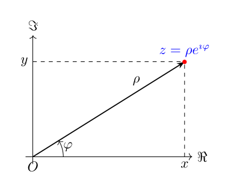
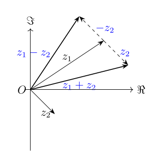
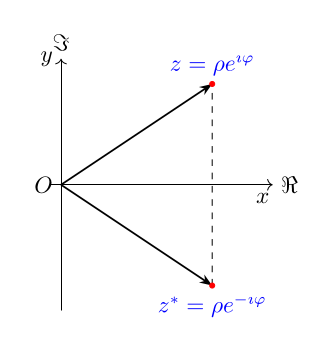
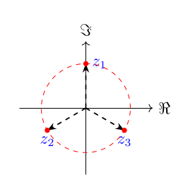

### 复数的定义

一元二次方程\\(a x^2 + b x + c = 0 (a\neq 0, b,c \in \mathbb{R})\\)的求解大家一定都不陌生.当\\(\Delta \equiv b^2 - 4 a c \geq 0\\)时,方程有解,求根公式可得

\\[
x = \frac{-b \pm \sqrt{\Delta}}{2a} .
\\]

当\\(\Delta < 0\\)时,方程无解.这里的无解其实是指没有实数解.
当我们引入以下这一核心定义后,

\\[
\mathrm{i} ^2 = -1   \text{或}   \mathrm{i} = \sqrt{-1} .
\\]

\\(\mathrm{i}\\)为**虚数**,将定义域扩展到复数,二次方程就有确定的两个解,当\\(\Delta < 0\\)时,方程有两个复数解:

\\[
x = \frac{-b \pm \mathrm{i} \sqrt{-\Delta}}{2a} .
\\]

复数\\(z\\)定义为

\\[
z = x + \mathrm{i}   y ,
\\]

\\(x,y \in {\mathbb{R}}\\).\\(x,y\\)分别为复数\\(z\\)的**实部**(real part) 和**虚部**(imaginary part),分别记作\\(\Re z\\)和\\(\Im z\\).
上式成为复数的代数式.复数域常用\\(\mathbb{C}\\)来表示.若将\\(z\\)看成是由\\(x,y\\)组成的有序对\\((x,y)\\),记为

\\[
z \equiv (x,y),
\\]

则有\\(1 = (1,0), \mathrm{i} = (0, 1)\\).如果将\\(x,y\\)当做平面上点的坐标,复数\\(z\\)就和平面上的点一一对应起来,形成的图叫做**阿干特图**(Argand diagram).
形成的平面叫做**复数平面**(complex plane),坐标轴成为**实轴**(real axis)和**虚轴**(imaginary axis).

自然我们可以改用极坐标来表示,

\\[
\\[
\begin{aligned}
& \rho = \sqrt{x^2 + y^2}\\\\
& \varphi = \arctan y/x
\end{aligned}
\\]
\\]

或

\\[
\\[
\begin{aligned}
& x = \rho \cos\varphi \\\\
& y = \rho \sin\varphi
\end{aligned}
\\]
\\]

则我们得到复数\\(z\\)的三角式

\\[
z = \rho (\cos\varphi +  \mathrm{i}  \sin\varphi) ,
\\]

或指数式

\\[
z = \rho e^{\mathrm{i} \varphi} .
\\]

\\(\rho = |z|\\) 为复数的**模**(modulus), \\(\varphi\\)为复数的**辐角**(argument),记作\\(\Arg z\\).
对于任意一个\\(z=\rho e^{\mathrm{i} \varphi}\\),由于恒等式\\(e^{\mathrm{i} 2\pi n} = 1\\), \\(n = 0, \pm 1, \pm 2, \dots, \in \mathbb{Z}\\),
可以知道辐角\\(\Arg z\\)不能唯一确定,它们之间相差\\(2\pi\\)的整数倍,其中满足

\\[
-\pi < \Arg z \leq \pi ,
\\]

的辐角为\\(z\\)的主辐角,记为\\(\arg z\\).\\(\arg z\\) 为\\(\Arg z\\)的主值.

\\[
\Arg z = \arg z + 2 n \pi   (n = 0, \pm 1, \pm 2\dots).
\\]

> **注** 有些文献中, 主值的大小写与这里的规定刚好相反, 注意区分.

> **例** 试将复数\\(z\_1 = -1 + \sqrt{3} \mathrm{i}\\) 和复数\\(z\_2 = 1 + \cos \theta + \mathrm{i} \sin\theta (-\pi < \theta \leq \pi)\\) 化为三角式和指数表示式.

> **解** 由于\\(r = |z\_1| = \sqrt{(-1)^2 + (\sqrt{3})^2} = 2\\),
\\(\arg z\_1 = \arctan (\frac{\sqrt{3}}{-1}) = \frac{2\pi}{3}\\),
有三角式\\(z\_1  = 2(\cos \frac{2\pi}{3} + \mathrm{i} \sin \frac{2\pi}{3})\\)和指数式
\\(z\_1 = 2 e^{\mathrm{i} \frac{2\pi }{3}}\\).

类似地, \\(r = |z\_2| = 2 \cos \frac{\theta}{2}\\), \\(\arg z\_2 = \arctan \frac{\sin \theta{1 + \cos \theta} = \frac{\theta}{2}\\).
有三角式\\(z\_2 = 2 \cos\frac{\theta}{2} ( \cos\frac{\theta}{2} + \mathrm{i} \sin \frac{\theta}{2})\\)
和指数式 \\(z\_2 = 2\cos\frac{\theta}{2} e^{\mathrm{i} \frac{\theta}{2}}\\).

### 复数的运算

我们可以利用有序实数对的方式对复数进行基本运算: 加减乘除运算.**加法**运算可以定义为

\\[
z\_1 + z\_2 = (x\_1, y\_1) + (x\_2, y\_2) = (x\_1 + x\_2, y\_1 + y\_2) .
\\]

**乘法**运算定义为

\\[
z\_1 \cdot z\_2 = (x\_1, y\_1) \cdot (x\_2, y\_2) = (x\_1 x\_2 - y\_1 y\_2, x\_1 y\_2 + x\_2 y\_1) .
\\]

显然加法和乘法满足**交换律**和**结合律**,以后乘法运算符号\\(\cdot\\)均省略.
同实数一样,根据以上定义我们可以得到复数域中的一些特殊元素.对于任意复数\\(z\\),复数域中存在元素\\(e\\)满足以下性质

\\[
\\[
\begin{aligned}
& e + z = z + e = z ,\\\\
& e \cdot z = z \cdot e = z ,
\end{aligned}
\\]
\\]

可以得到对应的分别为

\\[
\\[
\begin{aligned}
(0, 0) &= 0\\\\
(1, 0) &= 1 ,
\end{aligned}
\\]
\\]

通过元素\\((0,0)\\),我们可以定义\\(-z\\)使得 \\(-z + z = 0\\). 于是有,\\(- z = (-x, -y)\\).于是我们定义
**减法**运算为

\\[
z\_1 - z\_2 \equiv z\_1 + (-z\_2) = (x\_1 - x\_2, y\_1 - y\_2) ,
\\]

通过元素\\((1,0)\\),我们定义\\(z^{-1\\)使得
\\(z^{-1} \cdot z = 1\\),于是有 \\(z^{-1} =e^{-\mathrm{i} \varphi}/\rho  \\).
或\\(z^{-1} = (\frac{x}{x^2 + y^2}, -\frac{y}{x^2 + y^2})\\).**除法**运算定义为

\\[
z\_1 / z\_2 \equiv z\_1 \cdot z\_2^{-1} = \frac{x\_1 x\_2 - y\_1 y\_2} {x\_2^2  +  y\_2^2 }  + \mathrm{i} \frac{y\_1 x\_2 - x\_1 y\_2} {x\_2^2  +  y\_2^2 } .
\\]

注意往往乘除写成极坐标表达更简洁:

\\[
z\_1 z\_2 = \rho\_1 e^{\mathrm{i} \varphi\_1 } \rho\_2 e^{\mathrm{i} \varphi\_2 } = \rho\_1 \rho\_2 e^{\mathrm{i} (\varphi\_1 + \varphi\_2)}
\\]

此外,复数还有一种运算较为特殊,称为**共轭**(complex conjugation)运算.共轭运算表示为

\\[
z^{*} \equiv (x, -y) = x - \mathrm{i} y ,
\\]

也记为\\(\bar{z}\\).
实部虚部可以通过

\\[
\operatorname{Re} a=\frac{a+\bar{a}}{2},   \Im a=\frac{a-\bar{a}}{2 \mathrm{i}}
\\]

复数和其共轭来表示.不难验证

\\[
\\[
\begin{aligned}
& \overline{a+b}=\bar{a}+\bar{b} \\\\
& \overline{a b}=\bar{a} \bar{b}
\end{aligned}
\\]
\\]

作为应用, 考虑方程

\\[
c\_0 z^n+c\_1 z^{n-1}+\cdots+c\_{n-1} z+c\_n=0 .
\\]

如果 \\(\zeta\\) 是这个方程的一个根, 则 \\(\bar{\zeta\\) 是方程

\\[
\bar{c}\_0 z^n+\bar{c}\_1 z^{n-1}+\cdots+\bar{c}\_{n-1} z+\bar{c}\_n=0 .
\\]

的根. 特别地, 如果系数为实数, 则 \\(\zeta\\) 和 \\(\bar{\zeta\\) 是同一方程的根,
而且我们得到定理：实系数方程的非实根以成对的共轭根出现.

为了得到\\(z\\)的模,我们可以利用共轭运算,\\(|z| = \sqrt{zz^{*}\\). 注意区分\\(|z|^2\\)和\\(z^2\\)的不同.

部分复数运算可以映射到复平面上.如共轭运算可以理解为对\\(z\\)以实轴为对称轴的镜面对称.对任意的\\(z\_1,z\_2\\),它们的加减
同向量的加减完全等价,由三角形的三边关系可得

\\[
\left| |z|- |z'| \right| \leq |z \pm z'| \leq |z| + |z'| .
\\]

> **例** 求\\(\sqrt[3]{-\mathrm{i}}\\).

> **解**

三次单位根在复平面上均分单位圆（lecture TikZ）：

> **例** 讨论\\(\Re \frac{1}{z} = 2\\)在复平面上的意义.

> **解**

\\[
\\[
\begin{aligned}
        \Re \frac{1}{z} &= 2\\\\
        \Re \frac{1}{x+\mathrm{i} y} &  = 2 \\\\
        \frac{x}{x^2 +y^2} & = 2 .
\end{aligned}
\\]
\\]

因此,我们得到方程

\\[
(x-\frac{1}{4})^2 + y^2 = \left( \frac{1}{4}\right)^2,
\\]

它表示以\\((\frac{1}{4},0)\\)为圆心,\\(\frac{1{4}\\)为半径的圆上各点集合.

> **注** 挑战自我: 试证明点 \\(a\_1, a\_2, a\_3\\) 当且仅当
\\(a\_1^2+a\_2^2+a\_3^2=a\_1 a\_2+a\_2 a\_3+a\_3 a\_1\\) 时为等边三角形的三个顶点.
