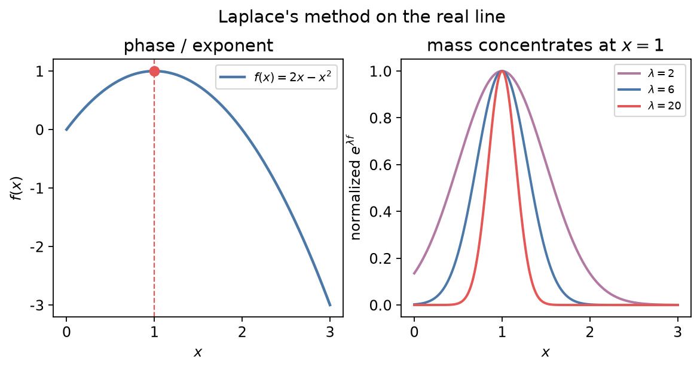
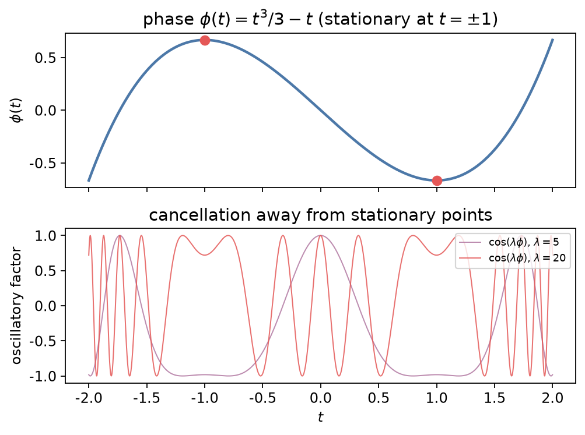
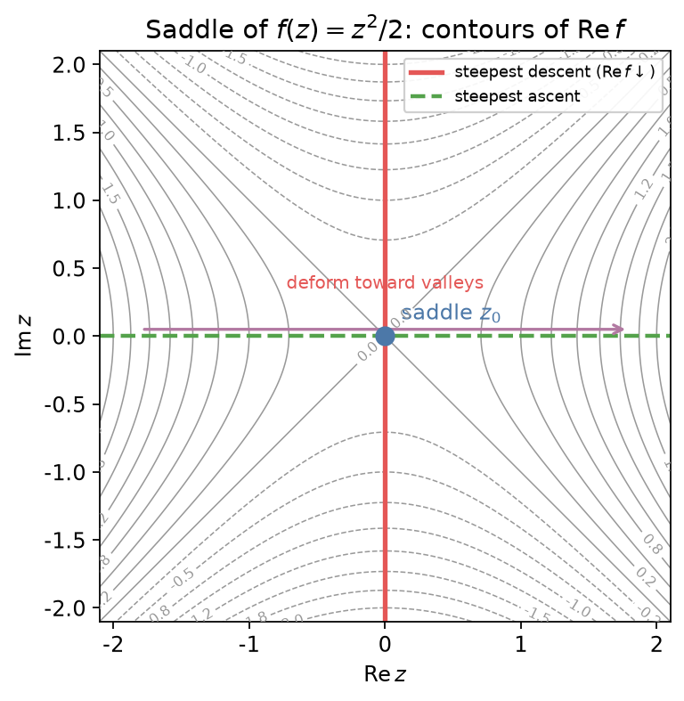
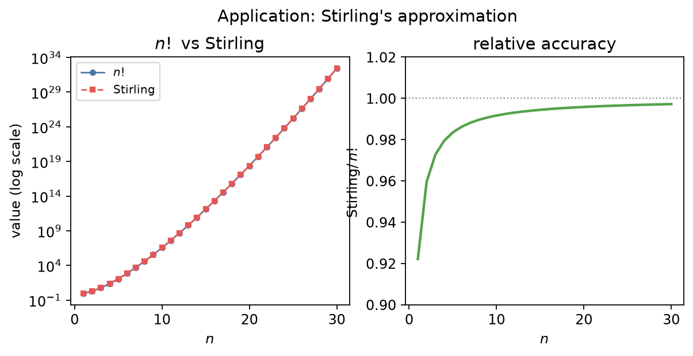

## 鞍点近似与相关渐近方法

大参数积分

\\[
I(\lambda)=\int\_C g(z)\,e^{\lambda f(z)}\,\mathrm{d}z
\qquad (\lambda\to +\infty)
\\]

的主要贡献往往只来自指数 \\(e^{\lambda f}\\) **最大**（或振荡最慢）的邻域。据此可把复杂积分化为局部高斯型积分。本节按实轴 Laplace 方法、驻相法、复平面鞍点/最速下降法三条线索展开，并给出物理与特殊函数中的典型应用。

前置：解析延拓与围道变形见[柯西定理](03-cauchy.md)、[留数](05-residue.md)。

### Laplace 方法（实轴）

设 \\(f\\) 在区间内部一点 \\(x\_0\\) 取严格最大值，\\(f'(x\_0)=0\\)，\\(f''(x\_0)<0\\)，且 \\(g(x\_0)\neq 0\\)。则 \\(\lambda\to+\infty\\) 时

\\[
I(\lambda)=\int\_a^b g(x)\,e^{\lambda f(x)}\,\mathrm{d}x
\sim
g(x\_0)\,e^{\lambda f(x\_0)}\sqrt{\frac{2\pi}{\lambda |f''(x\_0)|}}.
\\]

直觉：\\(e^{\lambda f}\\) 在最大值处形成越来越尖的峰，可用二次展开 \\(f(x)\approx f(x\_0)+\frac{1}{2}f''(x\_0)(x-x\_0)^2\\) 并延拓到全直线做高斯积分。

若最大值在端点，主导改为端点邻域的不完全高斯/指数衰减，阶常为 \\(\lambda^{-1}\\) 而非 \\(\lambda^{-1/2}\\)。

### 驻相法（stationary phase）

振荡积分

\\[
I(\lambda)=\int\_a^b g(t)\,e^{\mathrm{i}\lambda \phi(t)}\,\mathrm{d}t
\\]

在 \\(\lambda\\) 很大时，相位 \\(\phi\\) 变化快则正负相消；主要贡献来自 **驻点** \\(\phi'(t\_0)=0\\)。若 \\(\phi''(t\_0)\neq 0\\)，

\\[
I(\lambda)
\sim
g(t\_0)\,e^{\mathrm{i}\lambda \phi(t\_0)+\mathrm{i}(\pi/4)\mathrm{sgn}\,\phi''(t\_0)}
\sqrt{\frac{2\pi}{\lambda |\phi''(t\_0)|}}.
\\]

多个简单驻点时渐近式相加；端点另有 \\(O(\lambda^{-1})\\) 贡献。

Fourier 型积分、波动光学中的远场衍射、色散波包的群速度图像，都常用驻相法。

### 鞍点法 / 最速下降法（steepest descent）

当积分路径可在复平面变形时，令 \\(f\\) 为解析，鞍点满足

\\[
f'(z\_0)=0.
\\]

在 \\(z\_0\\) 附近 \\(f(z)\approx f(z\_0)+\frac{1}{2}f''(z\_0)(z-z\_0)^2\\)。**最速下降路径**是使 \\(\mathrm{Re}\,f\\) 沿路径下降最快（等价地 \\(\mathrm{Im}\,f\\) 沿路径近似为常数）的曲线，从而把积分化为实轴上的 Laplace 型积分。简单鞍点、\\(g(z\_0)\neq 0\\)、\\(f''(z\_0)\neq 0\\) 时，

\\[
I(\lambda)
\sim
g(z\_0)\,e^{\lambda f(z\_0)}\sqrt{\frac{2\pi}{\lambda |f''(z\_0)|}}\,e^{\mathrm{i}\theta},
\\]

其中相位因子 \\(e^{\mathrm{i}\theta}\\) 由下降路径的切向相对于 \\((z-z\_0)\\) 的取向决定（使二次型系数为负实数）。

**操作要点：**

1. 找鞍点 \\(f'(z\_0)=0\\)；
2. 判断哪些鞍点在变形后的围道上（或被围道“捕获”）；
3. 沿最速下降局部参数化，套用高斯近似；
4. 若经过奇点，需另加留数贡献。

高阶鞍点（\\(f''(z\_0)=0\\) 但更高阶导数非零）给出 Airy、Pearcey 等标准衍射积分，而非常高斯。

---

### 应用举例

#### 1. Stirling 公式（\\(n!\\) 的大 \\(n\\) 行为）

由

\\[
n!=\Gamma(n+1)=\int\_0^{\infty} e^{-t}\,t^{n}\,\mathrm{d}t
\\]

（取 \\(n\\) 为正整数或大的正实数）。令 \\(t=nu\\)，

\\[
n!=n^{n+1}\int\_0^{\infty}\exp\bigl(n\ln u-nu\bigr)\,\mathrm{d}u
=n^{n+1}e^{-n}\int\_0^{\infty}e^{n f(u)}\,\mathrm{d}u,
\\]

其中 \\(f(u)=\ln u-u+1\\)。最大值在 \\(u=1\\)（\\(f'(u)=1/u-1=0\\)，\\(f''(1)=-1\\)）。Laplace 方法给出

\\[
n!\sim \sqrt{2\pi n}\,\Bigl(\frac{n}{e}\Bigr)^n
\qquad (n\to\infty).
\\]

更精细的展开含 \\(1+\frac{1}{12n}+\cdots\\)。\\(\Gamma\\) 函数的其它性质见第 4 章[Γ 函数](../ch04-special/02-gamma-psi.md)。

#### 2. 高能 / 大波数 Fourier 型积分

形如

\\[
\int\_{-\infty}^{\infty} A(k)\,e^{\mathrm{i}(kx-\omega(k)t)}\,\mathrm{d}k
\\]

在 \\(t\\) 大、观测点随波包走时，相位 \\(\phi(k)=kx-\omega(k)t\\) 的驻点满足群速度条件

\\[
\phi'(k)=\frac{\mathrm{d}\omega}{\mathrm{d}k}=x/t,
\\]

驻相法给出波包振幅 \\(\propto t^{-1/2}\\)（一维）及相位。这是色散介质中波传播渐近分析的标准入口。

#### 3. 统计物理中的配分函数

正则配分函数

\\[
Z=\int \mathrm{d}\Gamma\, e^{-\beta H}
\\]

在低温（\\(\beta\to\infty\\)）或大自由度、经鞍点/Laplace 处理后，主导贡献来自使 \\(H\\)（或有效作用量）最小的宏观态；平均场、大偏差与“最可几分布”都与此同构。路径积分表述中，经典极限 \\(\hbar\to 0\\) 的鞍点即经典轨道（与第 2 章变分/哈密顿图像衔接）。

#### 4. Airy 积分与焦散（caustic）

当两个简单驻点合并（\\(\phi'=\phi''=0\\) 但 \\(\phi'''\neq 0\\)），高斯近似失效，标准型化为 Airy 函数

\\[
\mathrm{Ai}(x)=\frac{1}{2\pi}\int\_{-\infty}^{\infty}
\exp\Bigl(\mathrm{i}\bigl(\tfrac{1}{3}t^3+xt\bigr)\Bigr)\,\mathrm{d}t.
\\]

彩虹、透镜焦散、WKB 在转折点附近的连接公式，都用到这类较高阶鞍点。均匀渐近（uniform asymptotics）保证驻点分离与合并时公式光滑过渡。

#### 5. 与 WKB 的关系（一瞥）

量子力学中

\\[
\psi''(x)+k^2(x)\psi=0
\\]

在短波极限下，WKB 相位 \\(\int k\,\mathrm{d}x\\) 的驻点/转折点分析，与上述驻相、Airy 匹配是同一套渐近工具在微分方程上的体现。三维波动的几何光学极限给出程函方程 \\((\nabla\tau)^2=n^2\\)，见附录[程函方程与几何光学](../appendix/eikonal.md)。

---

### 小结

| 方法 | 典型积分 | 关键点 | 主导因子 |
|------|----------|--------|----------|
| Laplace | \\(\int g e^{\lambda f}\\)，\\(f\\) 实 | 最大值 | \\(e^{\lambda f\_\mathrm{max}}\lambda^{-1/2}\\) |
| 驻相 | \\(\int g e^{\mathrm{i}\lambda\phi}\\) | \\(\phi'=0\\) | \\(\lambda^{-1/2}\\) 振荡 |
| 鞍点/最速下降 | 复围道上同类积分 | \\(f'=0\\)，沿下降谷 | 同左，含路径相位 |

变形围道时务必核对：无穷远弧贡献、支割线、以及是否拾取极点留数。需要数值验证时，可对中等 \\(\lambda\\) 比较渐近式与直接求积（第 8 章[数值积分](../ch08-numerical/02-integration.md)）。

练习提示：对 \\(\int\_0^{\infty}e^{-n(t-\ln t)}\,\mathrm{d}t\\) 推出 Stirling 首项；对 \\(\int\_{-\infty}^{\infty}e^{\mathrm{i}\lambda t^2/2}\,\mathrm{d}t\\) 用驻相或Fresnel 积分核对 \\(\sqrt{2\pi/\lambda}\,e^{\mathrm{i}\pi/4}\\)。
