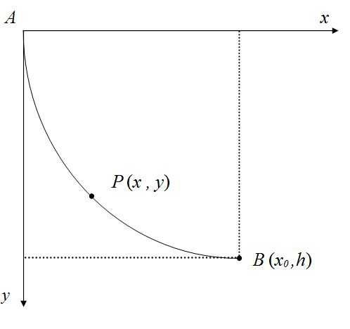
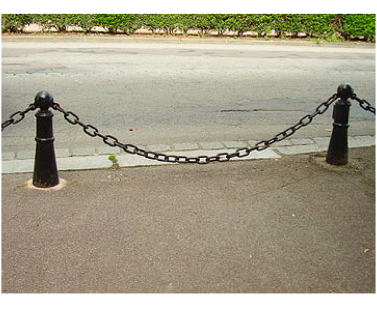

### 泛函

通过以下的几个例子,我们可以了解变分法具体解决什么问题.

如图所示,现在寻找在两点\\((x_1, y_1)\\)和\\((x_2,y_2)\\)间找一个最短的路径\\(y=u(x)\\).常识告诉我们,两点之间直线最短.
数学上表示出来为直线方程,

\\[
y = k x + b = \frac{y_2 - y_1}{x_2 - x_1} ( x - x_1) + y_1
\\]

这样的常识其实在数学上等价为一个最小化问题.对于任意路径,我们利用微积分求得该路径的长度.
\\(ds^2 = dx^2 + dy^2\\),

\\[
J[u] = \int_{x_1}^{x_2} \sqrt{ 1 + u'(x)^2} dx
\\]

其中 \\(u'(x) = du(x)/dx\\),满足边界条件\\(u(x_1) = y_1, u(x_2) = y_2\\).因此,我们的问题即求如何找到函数\\(u(x)\\)使得
\\(J\\)最小化.具体的求解我们下面介绍.这里的方括号区别于函数的圆括号,用来表示这里的映射是函数\\(\to\\)数的.
这种\\(J\\)和整个函数\\(u(x)\\)的依赖关系成为**泛函关系**.
设对于 (某一函数集合内的) 任意一个函数 \\(u(x)\\),
有另一个数 \\(J[u]\\) 与之对应, 则称 \\(J[u]\\) 为 \\(u(x)\\) 的**泛函**.
这里的函数集合, 即泛函的定义域, 通常包含要求 \\(u(x)\\) 满足一定的边界条件,
并且具有连 续的二阶导数. 这样的 \\(u(x)\\) 称为可取函数.

- **最速降线问题**(rachistochrone problem) 一质点在重力作用下无摩擦的沿着某一起终点高度差恒定的轨道下降,初速度为零,如何设计
  轨道形状使得所需下降时间最短.

  如图所示建立坐标,根据动能定理任意时刻的速度可以得到,进而得到总时间

\\[
T[u] = \int_{(x_0,y_0)}^{(x_1, y_1)} \frac{ds}{\sqrt{2 g(y_0 - u)}} = \int_{x_0}^{x_1} \frac{\sqrt{1+u'^2}}{\sqrt{2 g (y_0 - u)}} dx.
\\]

- **最小作用量原理**(least action principle) 理论力学上,它可以导出牛顿力学方程.我们定义的体系的动能为\\(K = \frac{1}{2} m \mathbf{v}^2\\),
  势能为\\(V = V(\mathbf{r})\\), 定义作用量

\\[
A[\mathbf{r}] = \int \left[ \frac{1}{2} m \left( \frac{d\mathbf{r}}{dt} \right)^2 - V(\mathbf{r}) \right] dt
\\]

  上式利用了定义\\(\mathbf{v} = \frac{d\mathbf{r}}{dt}\\). 对作用量\\(A\\)进行最小化将得到\\(\mathbf{r\\)满足的方程,即牛顿第二定律方程.

- **悬链线问题** (catenary problem)   自然界中有许多出现悬链线形状的地方,如雨后的蜘蛛网, 路边的铁链, 高压输电线等(如图), 有一质地均匀、柔软的绳索,两端固定,绳索仅受重力的作用而下垂.试问该绳索在平衡状态时是怎样的曲线?

  假设重力加速度恒为 \\(\mathrm{g}\\) ,则某物体重力势能可表述为 \\(U=m g h\\). 设绳子两端点距离为 \\(\mathrm{L\\).
建立 \\(x-y\\) 坐标系, \\(y\\) 表示高度, \\(y(x)\\) 代表绳索形成的曲线,绳索关于 \\(y\\) 轴对称.绳子上每个点的重力势 能个表示为重力势能公式两边求导的结果： \\(d U=d(m g \cdot y(x))=g \cdot y(x) \cdot d m\\).
设绳索单位长度质量为 \\(\rho\\) ,则根据其定义, \\(\frac{d m{d s}=\rho\\) ,所以
\\(d m=\rho \sqrt{d x^2+d y^2}=\rho \sqrt{1+\left(\frac{d y}{d x}\right)^2} d x\\)
代入得 \\(d U=\rho g \sqrt{1+\left(\frac{d y}{d x}\right)^2} d x \cdot y(x)\\)
作用于整条绳索上的重力势能表示为:

\\[
U[y(x)]=\int_{-L / 2}^{L / 2} \rho g \sqrt{1+y^{\prime}(x)^2} \cdot y(x) d x,
\\]

悬链线就是在此情形中重力势能最小的曲线.

### 泛函的极值

对于一般的情况,有函数到数的映射写成

\\[
J[u] = \int_{a}^{b}  dx L(u, u', u", \cdots| x),
\\]

其中\\(L(u, u', u",\cdots | x)\\)为\\(u\\)的半局域泛函, \\(u' \equiv du/dx, u" \equiv = du^2/dx^2\\).
对于不包含一阶以上的导数时,即\\(L = L(u,u')\\),对函数\\(u(x)\\)作一微小变化\\(\delta u(x)\\),称为\\(u(x)\\)的**变分**,在积分上下限处,
有\\(\delta u(a) = \delta u(b) = 0\\). \\(J[u]\\)取最小值时,需满足\\(\delta J[u] \equiv = J[u + \delta u] - J[u]\\)
为零.利用\\(\delta u' = \frac{\partial }{\partial x} \delta u\\)和\\(fg' = (fg)' - f'g\\),

\\[
\begin{aligned}
  J[u + \delta u] &= \int_{a}^{b}  dx L(u + \delta u, u' + \delta u'| x)
     \\\\
&= \int_{a}^{b} dx \left[ L(u, u'| x) + \frac{\partial L}{\partial u} \delta u + \frac{\partial L}{\partial u'} \delta u' \right]
     \\\\
&= \int_{a}^{b} dx \left[ L(u, u'| x) + \frac{\partial L}{\partial u} \delta u + \frac{\partial }{\partial x}\left( \frac{\partial L}{\partial u'} \delta u \right)
{}- \frac{\partial }{\partial x}\left( \frac{\partial L}{\partial u'} \right) \delta u  \right]
     \\\\
&= \int_{a}^{b} dx \left[ L(u, u'| x) + \left( \frac{\partial L}{\partial u} -  \frac{\partial }{\partial x}\left( \frac{\partial L}{\partial u'} \right)   \right) \delta u \right]
        + \left. \frac{\partial L}{\partial u'} \delta u \right|_{a}^{b}
\end{aligned}
\\]

于是,结合边界条件我们有

\\[
\delta J[u] = \int_{a}^{b} dx \left[ \frac{\partial L}{\partial u} -  \frac{\partial }{\partial x}\left( \frac{\partial L}{\partial u'} \right)   \right] \delta u
\\]

被积函数对任意变化\\(\delta u\\)都需要满足\\(\delta J[u] = 0\\),于是我们得到

\\[
\frac{\partial L}{\partial u} -  \frac{\partial }{\partial x}\left( \frac{\partial L}{\partial u'} \right) = 0 .
\\]

这就是著名的**欧拉-拉格朗日方程**(Euler-Lagrange Equation).

利用该方程,可以得到两点之间距离最短满足

\\[
0 = - \frac{\mathrm{d} }{\mathrm{d} x} \frac{u'}{\sqrt{1 + u'^2}} = \frac{-u"}{(1+ u'^2)^{3/2}}
\\]

也就是

\\[
u" = 0
\\]

也就是解为直线方程\\( u = k x + b\\),\\(k,b\\)的值由边界条件确定.

对最小作用量原理问题,可以得到

\\[
0 = - \frac{\mathrm{d} V(\mathbf{r})}{\mathrm{d} \mathbf{r}} - \frac{\mathrm{d} }{\mathrm{d} t} \left[ m \frac{d\mathbf{r}}{dt} \right]
\\]

若质量\\(m\\)不依赖于时间,得到牛顿方程,

\\[
m \frac{d^2\mathbf{r}}{dt^2} = - \frac{\mathrm{d} V(\mathbf{r})}{\mathrm{d} \mathbf{r}} \equiv \mathbf{F} .
\\]

对于如多目标变量的\\(J(u_1, u_2, \cdots, u_n, u_1', u_2', \cdots, u_n'|x)\\), 对于每一个\\(u_i\\), \\(i=1,2,\dots,n\\)都有独立的欧拉方程

\\[
\frac{\partial L}{\partial u_i} -  \frac{\partial }{\partial x}\left( \frac{\partial L}{\partial u'_i} \right) = 0 .
\\]

对于多变量的情况,\\(u(x,y)\\), 如

\\[
J[u]=\iint_R F\left(x, y, u, u_x, u_y\right) d x d y .
\\]

对应的Euler方程为

\\[
F_u-\frac{\partial}{\partial x} F_{u_x}-\frac{\partial}{\partial y} F_{u_y}=0.
\\]

例如,对于肥皂泡构成的膜,物理上表面张力要求该膜形成的膜面积最小, 对应的能量可以用\\(E(u)\\)来表示,
用合适的单位,可以表示

\\[
E(u)=\iint_S\left[1+\left(\frac{\partial u}{\partial x}\right)^2+\left(\frac{\partial u}{\partial y}\right)^2\right]^{1 / 2} d x d y.
\\]

Euler方程为最小面积方程

\\[
-\frac{\partial}{\partial x}\left(\frac{1}{\sqrt{A}} \frac{\partial u}{\partial x}\right)-\frac{\partial}{\partial y}\left(\frac{1}{\sqrt{A}} \frac{\partial u}{\partial y}\right)=0,
\\]

其中

\\[
A=1+\left(\frac{\partial u}{\partial x}\right)^2+\left(\frac{\partial u}{\partial y}\right)^2.
\\]
