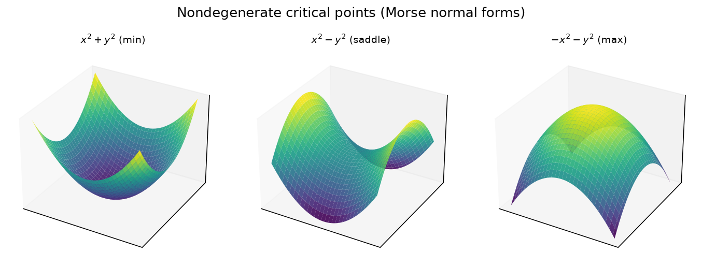
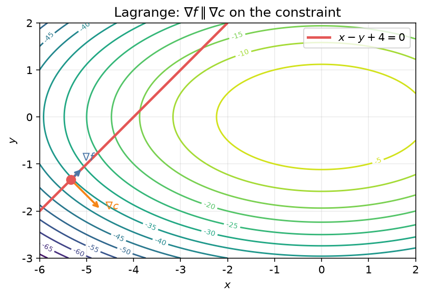

## Lagrange 乘子法

**Lagrange 乘子法**（method of Lagrange multipliers）用于在约束条件下求函数的临界点。本节按 PX286 第 7 章整理有限维情形；积分型约束下的变分问题见[约束变分](03-constrained.md)。

### 无约束临界点与约束

设 \\(f:\mathbb{R}^n\to\mathbb{R}\\)。若在 \\(\mathbf{x}\in\mathbb{R}^n\\) 处梯度恒为零，即所有偏导数 \\(\partial f/\partial x\_i=0\\)，则称 \\(\mathbf{x}\\) 为 \\(f\\) 的**临界点**，\\(f(\mathbf{x})\\) 为**临界值**。

在 \\(n=3\\) 时，下列函数均以原点为孤立临界点、临界值为 0：

\\[
x^2+y^2+z^2,\quad
x^2+y^2-z^2,\quad
x^2-y^2-z^2,\quad
-x^2-y^2-z^2 .
\\]

若在临界点处**Hessian 矩阵**

\\[
H\_{ij}=\frac{\partial^2 f}{\partial x\_i\partial x\_j}
\\]

非奇异，则称该临界点**非退化**（Morse）。Hessian 负特征空间的维数称为 **Morse 指数**；上例中指数依次为 \\(0,1,2,3\\)（分别对应极小、鞍、鞍、极大型）。Morse 引理断言：非退化临界点局部都等价于这些标准二次型之一。退化例子如 \\(f=x^3+y^2+z^2\\)（\\(A\_2\\) 奇点 / fold catastrophe）。

**约束**指函数 \\(c:\mathbb{R}^n\to\mathbb{R}\\)，要求 \\(c(\mathbf{x})=0\\)，从而把定义域限制在零水平集 \\(c^{-1}(0)\\) 上。简单情形（如 \\(c=z\\)）可显式参数化并消元，一般则难以消元，因而需要乘子法。

### 乘子法

设目标函数为 \\(f\\)，约束为 \\(c\_i(\mathbf{x})=0\\)（\\(i=1,\ldots,k\\)）。则 \\(f\\) 在约束下的临界点，等价于辅助函数

\\[
F = f - \sum\_{i=1}^{k}\lambda\_i c\_i
\\]

的无约束临界点，再联立 \\(c\_i=0\\)。亦即对每个坐标 \\(x\_j\\)，

\\[
\frac{\partial F}{\partial x\_j}
= \frac{\partial f}{\partial x\_j} - \sum\_{i=1}^{k}\lambda\_i \frac{\partial c\_i}{\partial x\_j}
= 0 .
\\]

参数 \\(\lambda\_i\\) 称为 **Lagrange 乘子**。也可把 \\(\lambda\_i\\) 视为自变量，把 \\(F\\) 看成 \\(\mathbb{R}^n\times\mathbb{R}^k\to\mathbb{R}\\) 的函数：此时 \\(\partial F/\partial\lambda\_i=-c\_i=0\\) 自动包含约束方程，约束临界点即是 \\(F\\) 的普通临界点。

**例** 求 \\(f=x^2+y^2+z^2\\) 在约束 \\(c=x+y+z-1=0\\) 下的临界点。由

\\[
2x-\lambda=0,\quad
2y-\lambda=0,\quad
2z-\lambda=0,\quad
x+y+z=1
\\]

得 \\(x=y=z=\lambda/2\\)，再由约束得唯一解 \\((1/3,1/3,1/3)\\)。

**例** 求 \\(f=x+y\\) 在 \\(c=xy-1=0\\) 下的临界点。由

\\[
1-\lambda y=0,\quad
1-\lambda x=0,\quad
xy=1
\\]

得 \\(x=y\\)，故有两点 \\((1,1)\\) 与 \\((-1,-1)\\)。

### 几何图像

梯度 \\(\nabla f\\) 指向 \\(f\\) 增加最快的方向，且与水平集正交。对微小位移 \\(\mathrm{d}\mathbf{x}\\)，

\\[
\mathrm{d}f = \mathrm{d}\mathbf{x}\cdot\nabla f .
\\]

无约束临界点要求对任意 \\(\mathrm{d}\mathbf{x}\\) 都有 \\(\mathrm{d}f=0\\)。有约束时，允许的位移须保持约束：\\(\mathrm{d}c\_i=\mathrm{d}\mathbf{x}\cdot\nabla c\_i=0\\)，即 \\(\mathrm{d}\mathbf{x}\\) 与每个 \\(\nabla c\_i\\) 正交。于是约束临界点意味着：对一切允许位移有 \\(\mathrm{d}\mathbf{x}\cdot\nabla f=0\\)，从而

\\[
\nabla f \in \operatorname{span}\\{\nabla c\_1,\ldots,\nabla c\_k\\},
\\]

或写成

\\[
\nabla f = \sum\_{i=1}^{k}\lambda\_i \nabla c\_i
\qquad\Leftrightarrow\qquad
\nabla f - \sum\_{i=1}^{k}\lambda\_i \nabla c\_i = \mathbf{0} .
\\]

这正是乘子法的内容：在约束曲面上，\\(f\\) 的梯度必落在约束梯度张成的法空间中。

### 高度函数

取 \\(f=z\\)（“高度”）。

**例（单位球面）** 约束 \\(c=x^2+y^2+z^2-1=0\\)。乘子方程为

\\[
-\lambda\\,2x=0,\quad
-\lambda\\,2y=0,\quad
1-\lambda\\,2z=0,
\\]

连同球面方程。由第三式知 \\(\lambda\neq 0\\)，故 \\(x=y=0\\)，再得 \\(z=\pm 1\\)，即南北极 \\((0,0,\pm 1)\\)。

**例（环面，简述）** 适当选取环面约束后，乘子法给出四个临界点

\\[
(0,0,-R-\rho),\\;
(0,0,-R+\rho),\\;
(0,0,R-\rho),\\;
(0,0,R+\rho)
\\]

（\\(0<\rho<R\\)），分别对应极小、鞍、鞍、极大。

### 距离函数

考虑到定点 \\(\mathbf{a}=(a\_x,a\_y,a\_z)\\) 的平方距离

\\[
f\_\mathbf{a}=(x-a\_x)^2+(y-a\_y)^2+(z-a\_z)^2 .
\\]

**例** 约束 \\(c=z=0\\)（平面）时，乘子法给出唯一临界点 \\((a\_x,a\_y,0)\\)——即 \\(\mathbf{a}\\) 在平面上的正交投影。

**例** 约束为单位球面时，方程表明临界点落在原点与 \\(\mathbf{a}\\) 的连线上，即为 \\(\pm\mathbf{a}/|\mathbf{a}|\\)。

### 驻相与群速度

波场常写为满足色散关系 \\(D(k,\omega)=0\\) 的傅里叶积分。复指数剧烈振荡导致相消干涉，主要贡献来自**相位在约束 \\(D=0\\) 下的驻点**。对相位 \\(kx-\omega t\\) 用乘子法得

\\[
x-\lambda\frac{\partial D}{\partial k}=0,
\qquad
-t-\lambda\frac{\partial D}{\partial\omega}=0,
\\]

从而

\\[
\frac{x}{t}=\frac{\partial\omega}{\partial k}=v\_g ,
\\]

即扰动以**群速度** \\(v\_g=\partial\omega/\partial k\\) 传播。声波 \\(\omega^2=c^2 k^2\\) 时 \\(v\_g=\pm c\\)；深水重力波 \\(\omega^2=gk\\) 时 \\(v\_g=\tfrac{1}{2}\sqrt{g/k}\\)。

### 多个约束

**例** 高度 \\(f=z\\) 同时受球面 \\(c\_1=x^2+y^2+z^2-1=0\\) 与平面 \\(c\_2=hx+ky+lz=0\\) 约束。乘子法给出（在 \\(\lambda\_1,\lambda\_2\neq 0\\) 且 \\((h,k)\neq\mathbf{0}\\) 时）

\\[
\begin{aligned}
x&=\mp\frac{hl}{\sqrt{h^2+k^2}\\,\sqrt{h^2+k^2+l^2}},\\\\
y&=\mp\frac{kl}{\sqrt{h^2+k^2}\\,\sqrt{h^2+k^2+l^2}},\\\\
z&=\pm\frac{\sqrt{h^2+k^2}}{\sqrt{h^2+k^2+l^2}}.
\end{aligned}
\\]

**例（圆上多边形）** 顶点被迫落在单位圆上时，极大化围成面积；乘子法表明相邻顶点张角相等，故极大者为正 \\(N\\) 边形。

### Shannon 熵与最概然分布

设离散随机变量取值 \\(x\_i\\) 的概率为 \\(p\_i\\)。在仅知道期望 \\(\langle X\rangle\\) 时，Shannon 主张选取使**熵**

\\[
S=-\sum\_{i=1}^{N}p\_i\ln p\_i
\\]

最大的分布，约束为

\\[
\sum\_i p\_i=1,
\qquad
\sum\_i p\_i x\_i=\langle X\rangle .
\\]

乘子法给出

\\[
-\ln p\_i-1-\lambda\_1-\lambda\_2 x\_i=0
\quad\Rightarrow\quad
p\_i=e^{-(1+\lambda\_1)-\lambda\_2 x\_i} .
\\]

归一化定义配分函数 \\(Z=\sum\_i e^{-\lambda\_2 x\_i}\\)（从而 \\(e^{1+\lambda\_1}=Z\\)），而 \\(\lambda\_2\\) 由期望约束确定：

\\[
\langle X\rangle=-\frac{\partial\ln Z}{\partial\lambda\_2} .
\\]

统计力学中取 \\(X\\) 为能量、\\(\lambda\_2=1/(k\_B T)\\) 即得正则分布。

### 与约束变分的关系

若约束是对整条曲线（或场）的积分条件，例如等周问题中 \\(\int u\\,\mathrm{d}x=A\\)，则在泛函上添加 \\(\lambda\bigl(\int u\\,\mathrm{d}x-A\bigr)\\) 后化为无约束变分，再写 Euler–Lagrange 方程——这是同一思想在函数空间中的推广，详见[约束变分](03-constrained.md)。

### 习题（选）

1. 求能内接于椭球 \\(x^2/a^2+y^2/b^2+z^2/c^2=1\\) 的最大体积长方体 \\(V=8xyz\\)（取 \\(x,y,z>0\\)）。
2. 对约束 \\(x+y+z=1\\)，求 \\(f=x^2+y^2-z^2\\) 的约束临界点。
3. 验证单位球面上高度函数的南北极确为用乘子法得到的全部解。
