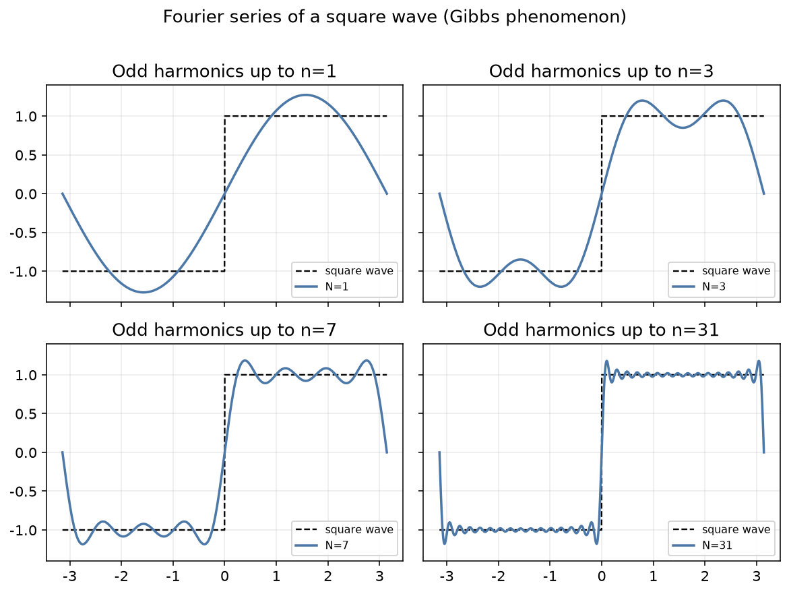

### 正交函数组

> **定义** 设\\(f(x), g(x) \\)为定义在区间\\([a,b]\\)上的函数, 积分

\\[
(f, g) \equiv \int\_a^b f(x) g(x) dx
\\]

叫做二函数\\(f(x)\\)和\\(g(x)\\)的内积\\((f,g)\\)或\\((fg)\\).

内积满足施瓦茨不等式(Schwarz inequality)

\\[
|(f,g)|^2 \leq (f,f)(g,g)
\\]

当且仅当\\(f(x)\\)和\\(g(x)\\)线性相关时,等号成立.
如果\\((f,g) = 0\\),则称\\(f(x)\\)和\\(g(x)\\)是**正交**的. 函数\\(f(x)\\)和它自己的内积称为**范数**或**模**,记作
\\(N f\\),

\\[
N f \equiv (f,f) = \int  f(x)^2 dx
\\]

范数为1的函数称为**单位函数**或**归一化函数**. 一组归一化函数\\(\varphi\_1(x), \varphi\_2(x), \cdots, \varphi\_n(x)\\),其中任意二者皆正交，
称**正交归一组**, 表示为

\\[
(\varphi\_i, \varphi\_j) = \delta\_{ij} .
\\]

对于复变函数， 内积定义为

\\[
( f, g ) = \int  f^{\ast}(x) g(x) dx
\\]

其中\\(\bar f\\)为\\(f\\)的复共轭.  若\\(N f = \int | f|^2 dx = 1\\), 称函数\\(f(x)\\)是归一化的.

若对于所有\\(x\\)都成立的常系数齐次线性关系

\\[
\sum\_{i=1}^n c\_i \varphi\_i(x) = 0,
\\]

其中系数不全为零, 我们称这\\(n\\)个函数\\(f\_1, f\_2, \cdots, f\_n\\)是**线性相关**的. 否则称为**线性无关**的. 值得注意的是
正交组中的各函数永远是线性无关的. 因为, 若恒等式

\\[
\sum\_{i=1}^n c\_i \varphi\_i(x) = 0,
\\]

成立，我们可以左乘\\(\varphi\_j(x)\\)并积分可得\\(c\_j = 0\\).

我们可以类比于线性代数中向量的施密特正交化的方法对函数组进行正交化. 设\\(f\_1(x), f\_2(x), \cdots, f\_n(x)\\)是线性无关的函数组, 我们可以通过

\\[
\varphi\_1(x) = f\_1(x),   \varphi\_2(x) = f\_2(x) - \frac{(f\_2, \varphi\_1)}{(\varphi\_1, \varphi\_1)} \varphi\_1(x), \cdots
  \varphi\_n(x) = f\_n(x) - \sum\_{j=1}^{n-1} \frac{(f\_n, \varphi\_j)}{(\varphi\_j, \varphi\_j)} \varphi\_j(x)
\\]

下面我们来讨论正交函数组的完备性. 设\\(\varphi\_1(x), \varphi\_2(x), \cdots, \varphi\_n(x)\\)是正交归一组, 我们可以定义

\\[
f(x) = \sum\_{i=1}^n c\_i \varphi\_i(x)
\\]

其中系数\\(c\_i\\)为

\\[
c\_i = (f, \varphi\_i) = \int f(x) \varphi\_i(x) dx
\\]

成为**展开系数**或**分量**.

由关系式

\\[
\int \left( f(x) - \sum\_{i=1}^n c\_i \varphi\_i(x) \right)^2 dx \geq  0
\\]

展开个平方并逐项积分, 我们可以得到

\\[
\int f^2(x) dx +  \sum\_{i=1}^n c\_i^2  -  2 \sum\_{i=1}^n   c\_i \int f  \varphi\_i  dx \geq 0
\\]

因此有,

\\[
\sum\_{i=1}^n c\_i^2 \leq N f
\\]

上式可以令\\(n \to \infty\\), 也可以得到

\\[
\sum\_{i=1}^{\infty} c\_i^2 \leq N f
\\]

这称为**贝塞尔不等式**(Bessel's inequality). 它对每一个正交归一组都成立, 它证明了展开系数的平方和是收敛有界的.

假如有一正交归一组\\(\varphi\_1(x), \varphi\_2(x), \cdots, \\), 使得对任意分段连续函数\\(f(x)\\),都有\\(n\\)使
平均平方误差

\\[
\int \left( f(x) - \sum\_{i=1}^n c\_i \varphi\_i(x) \right)^2 dx
\\]

小于任意给定正数\\(\epsilon\\), 那么我们称\\(\varphi\_1(x), \varphi\_2(x), \cdots\\)是**完备的**. 对于完备的正交归一组而言, 贝塞尔不等式
对任意函数\\(f(x)\\)都成为等式:

\\[
\sum\_{i=1}^{\infty} c\_i^2 = N f
\\]

这个关系称为"完备性关系". 更一般的形式为

\\[
\sum\_{i=1}^{\infty} c\_i d\_i = (f, g)   \text{其中}    c\_i = (f, \varphi\_i) , d\_i = (g, \varphi\_i)
\\]

可以验证, 对\\(f+g\\) 应用完备性关系~,

\\[
N (f + g) = Nf  + Ng + 2 (f, g) = \sum\_{i = 1}^{\infty} (c\_i + d\_i)^2 = \sum\_{i=1}^{\infty} (c\_i^2 + d\_i^2 + 2  c\_i d\_i)
\\]

并减去相应的\\(f,g\\)的范数.

### 傅里叶级数的引入

Fourier曾试图解决一个问题,在此过程中发展了傅里叶级数的概念.此问题处理长度为\\(\ell\\)的一维均匀棒的热传播过程,即
给定初始温度分布,求解在\\(t\\)时刻,\\(x\\)处的温度,\\(T(x,t)\\).该温度场满足微分方程

\\[
\frac{\partial^2}{\partial x^2} T(x,t) = \frac{\partial}{\partial t} T(x,t),    T(0,t) = T(\ell,t) = 0 .
\\]

该微分方程的一特殊解可以由分离变量法得到,具体方法后面会学习.令\\(T(x,t) = f(x) g(t)\\),代入该方程有

\\[
f"(x) g(t) = f(x) g'(t) ,
\\]

两边同除以\\(f(x)g(t)\\)得到

\\[
\frac{f"(x)}{f(x)} = \frac{g'(t)}{g(t)}   .
\\]

由于左式是与\\(t\\)无关的,而右边是与\\(x\\)无关的,于是唯一可能相等的情况为二者皆为同一个常数\\(c\\).
这时候若\\(c>0\\),可知\\(\lim\_{t\to \infty g(t) = \infty\\),因此我们令\\(c=-k^2\\).
那么可以知道

\\[
f(x) =  A \sin{k x} + B \cos{k x},
\\]

由边界条件确定\\(B = 0\\),且\\(k = \frac{n\pi{\ell}\\).求解\\(g(t)\\)得 \\(g(t) = e^{-k^2 t\\).
该方程的解可以表示为

\\[
T(x,t) = A \sin{\left( \frac{n\pi}{\ell} x \right)} e^{-\frac{n^2\pi^2}{\ell^2} t}
\\]

其中\\(A\\)由其他条件确定.
可以知道\\(t=0\\)时,\\(T\\)为一个正弦函数,节点数由\\(n\\)决定.但是,更普遍的情况是起始时刻的温度分布并不是正弦函数.
那该如何决定稍后某时刻\\(t\\)的分布呢?傅里叶发现我们并不需要对此问题反反复复求解.
对于线性微分方程可以知道若\\(T\_1(x,t)\\)和\\(T\_2(x,t)\\)满足微分方程

\\[
\frac{\partial^2}{\partial x^2} T(x,t) = \frac{\partial}{\partial t} T(x,t)
\\]

那么二者的任意线性组合

\\[
T\_3 = \alpha T\_1  + \beta T\_2
\\]

也是其解.
傅里叶得到结论,对于任意一种光滑的温度分布,其解总可以写成一系列有着不同振幅和模式的正弦函数的线性叠加,即

\\[
T(x,t) = \sum\_{n=1}^{\infty} A\_n \sin {\left( \frac{n\pi}{\ell} x \right)} e^{-\frac{n^2\pi^2}{\ell^2} t} .
\\]

若初始温度分布函数为\\(f(x) = T(x,0)\\),那么

\\[
f(x) =      \sum\_{n=1}^{\infty} A\_n \sin {\left( \frac{n\pi}{\ell} x \right)}
\\]

上式什么样的函数可以表示为正弦和余弦函数的叠加呢?每个模式的振幅\\(A\_n\\)该如何计算呢?
这就利用了正余弦函数的特征.

记

\\[
(f, g) = \int\_0^{2\pi} f^{*}(x) g(x) dx ,
\\]

可以验证

\\[
(\sin{ n x }, \sin{m x })  =  (\cos{ n x } \cos {m x })  =  \delta\_{mn}\pi    (m\neq 0, n\neq 0)
\\]

\\[
(\sin{ n x },  \cos{m x })  =  0
\\]

将上式代入,注意修改积分变量上下限可以得到振幅系数

\\[
A\_n = \frac{2}{\ell} \int\_0^{\ell} f(x) \sin{ \left( \frac{n\pi}{\ell} x \right) } dx
\\]

\\(A\_n\\)称为傅里叶级数的**系数**.若所有系数都求得后,我们就得到了\\(f(x)\\).原则上,所有的平滑的单值函数并没有什么问题,
但似乎缺乏数学的严谨.自然,越多的级数项对函数的逼近也就越好.

### 傅里叶定理

对于任意一个以\\(2\ell\\)为周期的函数,

\\[
f(x + 2\ell) = f(x),
\\]

我们可以通过三角函数族进行级数展开

\\[
f(x) = \frac{a\_0}{2} + \sum\_{n=1}^{\infty} \left[ a\_n \cos{ \frac{n\pi}{\ell} x } + b\_n \sin{ \frac{n\pi}{\ell} x } \right]
\\]

利用三角函数族的正交性,可以得到展开系数

\\[
\begin{aligned}
  a\_n = \frac{1}{\ell} \int\_{-\ell}^{\ell} f(x) \cos {  \left( \frac{n\pi}{\ell} x \right) } dx
  \\\\
  b\_n = \frac{1}{\ell} \int\_{-\ell}^{\ell} f(x) \sin {  \left( \frac{n\pi}{\ell} x \right) } dx
\end{aligned}
\\]

这里的积分上下限为一个周期\\(2\ell\\),也可以为\\([0,2\ell]\\).
上述傅里叶级数展开的成立条件被称为**狄里希利条件** (Dirichlet conditions),即\\(f(x)\\)在\\(\left[-\ell, \ell\right]\\)区间内只有有限个间断点,且每个周期内有有限个极值点.满足
这两个条件的函数称为**分段平常**.
满足狄里希利条件的函数\\(f(x)\\)在点\\(x\_0\\)处间断,那么其傅里叶级数在此点的值为该函数左右值的算术平均

\\[
\text{级数和}(x\_0) = \lim\_{\epsilon \to 0} \frac{1}{2} \left[
     f(x\_0 + \epsilon) + f(x\_0  - \epsilon) \right]
\\]

在间断点附近，部分和会出现约 \\(9\\%\\) 的过冲，且不随项数增加而消失——这就是 **Gibbs 现象**。下图以方波为例展示部分和的收敛过程。

对于奇函数和偶函数的傅里叶展开,不难发现,奇函数的展开为

\\[
f(x) = \sum\_{n=1}^{\infty} b\_n \sin {  \left( \frac{n\pi}{\ell} x \right) }
\\]

称为**傅里叶正弦级数**.
而偶函数的展开为

\\[
f(x) = \frac{a\_0}{2} + \sum\_{n=1}^{\infty}  a\_n \cos{  \left( \frac{n\pi}{\ell} x \right) }
\\]

称为**傅里叶余弦级数**.

对于复指数的展开,不难发现可以写成

\\[
f(x) = \sum\_{n=-\infty}^{\infty} c\_n e^{\mathrm{i} \frac{n\pi}{\ell} x},
\\]

其中
\\(c\_n = \frac{1}{2}(a\_n - \mathrm{i} b\_n)\\), \\(c\_{-n} = \frac{1}{2} (a\_n + \mathrm{i} b\_n)\\)（\\(n>0\\)），\\(c\_0 = \frac{1}{2} a\_0\\).
写出来为

\\[
c\_n = \frac{1}{2\ell} \int\_{-\ell}^{\ell} f(x) e^{-\mathrm{i} \frac{n\pi}{\ell} x} dx ,
\\]

尽管\\(f(x)\\)是实数,但其傅里叶系数却可能是复数,还可以看出\\(c\_{-n = c\_{n}^{\ast}\\).
复指数函数族也是正交的

\\[
\langle  e^{\mathrm{i} \frac{n\pi}{\ell} x } | e^{\mathrm{i} \frac{m\pi}{\ell} x }  \rangle = 2\ell \delta\_{mn} .
\\]

> **例** 对于锯齿函数

\\[
f(x)= \begin{cases}
  x,   &  0 < x \leq  \ell
  \\\\
  x - 2 \ell,   & \ell < x \leq 2\ell
\end{cases}
\\]

求其傅里叶级数.

> **解** 不难判定通过解析延拓,该函数为奇函数,根据傅里叶展开系数公式,可以得

\\[
\begin{aligned}
b\_n &=   \frac{1}{\ell} \int\_{0}^{2\ell} f(x) \sin {  \left( \frac{n\pi}{\ell} x \right) } dx
\\\\
&= \frac{1}{\ell} \int\_{0}^{\ell} x  \sin {  \left( \frac{n\pi}{\ell} x \right) } dx
  +
 \frac{1}{\ell} \int\_{\ell}^{2\ell} (x - 2\ell) \sin {  \left( \frac{n\pi}{\ell} x \right) } dx
 \\\\
 &= \frac{2}{\ell} \int\_{0}^{2\ell} x \sin {  \left( \frac{n\pi}{\ell} x \right) } dx
 -2 \int\_{\ell}^{2\ell}   \sin {  \left( \frac{n\pi}{\ell} x \right) } dx
 \\\\
 & = \frac{2\ell}{n\pi} (-1)^{n+1}
\end{aligned}
\\]

因此,该级数为

\\[
\begin{aligned}
f(x)
&= \sum\_{n=1}^{\infty} \frac{2 \ell }{n\pi} (-1)^{n+1} \sin\Bigl(\frac{n\pi}{\ell} x\Bigr) \\\\
&= \frac{2\ell}{\pi}\Biggl[ \sin\frac{\pi x}{\ell} - \frac{1}{2}\sin\frac{2\pi x}{\ell} + \frac{1}{3}\sin\frac{3\pi x}{\ell} + \cdots + \frac{(-1)^{n+1}}{n}\sin\frac{n\pi x}{\ell} \Biggr].
\end{aligned}
\\]

容易验证

\\[
f(0) = 0; f(\ell) = 0;
\\]

当\\(x=\ell/2\\),

\\[
f(\ell/2) = \ell/2 =   \frac{2\ell}{\pi} \left[ 1 - 0 - \frac{1}{3} + \frac{1}{5} - 0 -\frac{1}{7}+ \cdots \right]
\\]

因此,我们得到莱布尼兹等式,即以下等式

\\[
\frac{\pi}{4} = 1-\frac{1}{3} + \frac{1}{5} - \frac{1}{7} + \cdots = \sum\_{n=0} \frac{(-1)^n}{2n + 1} .
\\]

上式可以通过等式
\\(\int\_0^1 \frac{d x}{1+x^2}=\left.\tan ^{-1} x\right|\_0 ^1=\frac{\pi}{4}\\),和被积函数的级数展开验证.
其实,这里的锯齿函数可以直接用\\(f(x) = x, -\ell < x < \ell\\)来表示,相应的间断点则被移到\\(\pm \ell\\)处.

### Parseval 等式（能量定理）

设周期为 \\(2\ell\\) 的函数 \\(f,g\\) 分别有复傅里叶系数 \\(c\_n,d\_n\\)（约定见上文）。**Parseval 等式**的双线性形式为

\\[
\frac{1}{2\ell}\int\_{-\ell}^{\ell} g(x)^\ast f(x)\\,\mathrm{d}x
= \sum\_{n=-\infty}^{\infty} d\_n^\ast c\_n .
\\]

**证明概要** 将 \\(f=\sum\_n c\_n e^{\mathrm{i} n\pi x/\ell}\\)、\\(g=\sum\_m d\_m e^{\mathrm{i} m\pi x/\ell}\\) 代入左端，利用复指数在 \\([-\ell,\ell]\\) 上的正交性

\\[
\frac{1}{2\ell}\int\_{-\ell}^{\ell}e^{\mathrm{i}(n-m)\pi x/\ell}\\,\mathrm{d}x=\delta\_{nm},
\\]

交叉项消失，即得右端。特别地取 \\(g=f\\)（能量形式 / 范数守恒）：

\\[
\frac{1}{2\ell}\int\_{-\ell}^{\ell}|f(x)|^2\\,\mathrm{d}x
= \sum\_{n=-\infty}^{\infty}|c\_n|^2 .
\\]

右端很像系数序列 \\((\ldots,c\_{-1},c\_0,c\_1,\ldots)\\) 的“模方”，左端则是函数在区间上的（归一化）\\(L^2\\) 模方。于是 Parseval 等式表明：在傅里叶基下做展开时，**“向量长度”不变**——能量在时域与频域（系数空间）中守恒。

利用 \\(c\_n=\tfrac{1}{2}(a\_n-\mathrm{i}b\_n)\\)、\\(c\_{-n}=\tfrac{1}{2}(a\_n+\mathrm{i}b\_n)\\)（\\(n>0\\)）及 \\(c\_0=a\_0/2\\)，亦可写成实形式

\\[
\frac{1}{2\ell}\int\_{-\ell}^{\ell}|f(x)|^2\\,\mathrm{d}x
= \frac{a\_0^2}{4}+\sum\_{n=1}^{\infty}\frac{a\_n^2+b\_n^2}{2} .
\\]

其物理图像是：复杂波形分解为振幅为 \\(c\_n\\)（或 \\(a\_n,b\_n\\)）的谐波叠加时，总能量等于各成分强度之和。

**例** 对矩形波（周期取 \\(2\\)，在 \\((-1,0)\\) 上为 \\(-1\\)、在 \\((0,1)\\) 上为 \\(+1\\)），有

\\[
\frac{1}{2}\int\_{-1}^{1}|f|^2\\,\mathrm{d}x=1,
\qquad
c\_n=\frac{1-(-1)^n}{n\pi\mathrm{i}}\quad(n\neq 0).
\\]

由 Parseval 得

\\[
1=\sum\_{n\neq 0}\Bigl|\frac{1-(-1)^n}{n\pi}\Bigr|^2
= \frac{8}{\pi^2}\sum\_{k=0}^{\infty}\frac{1}{(2k+1)^2},
\\]

因而

\\[
\sum\_{k=0}^{\infty}\frac{1}{(2k+1)^2}=\frac{\pi^2}{8} .
\\]

（仅奇数分母的平方倒数之和；完整的 \\(\sum\_{n=1}^{\infty}n^{-2}=\pi^2/6\\) 可用锯齿波 \\(f(x)=x\\) 再施 Parseval 得到，见应用章。）
