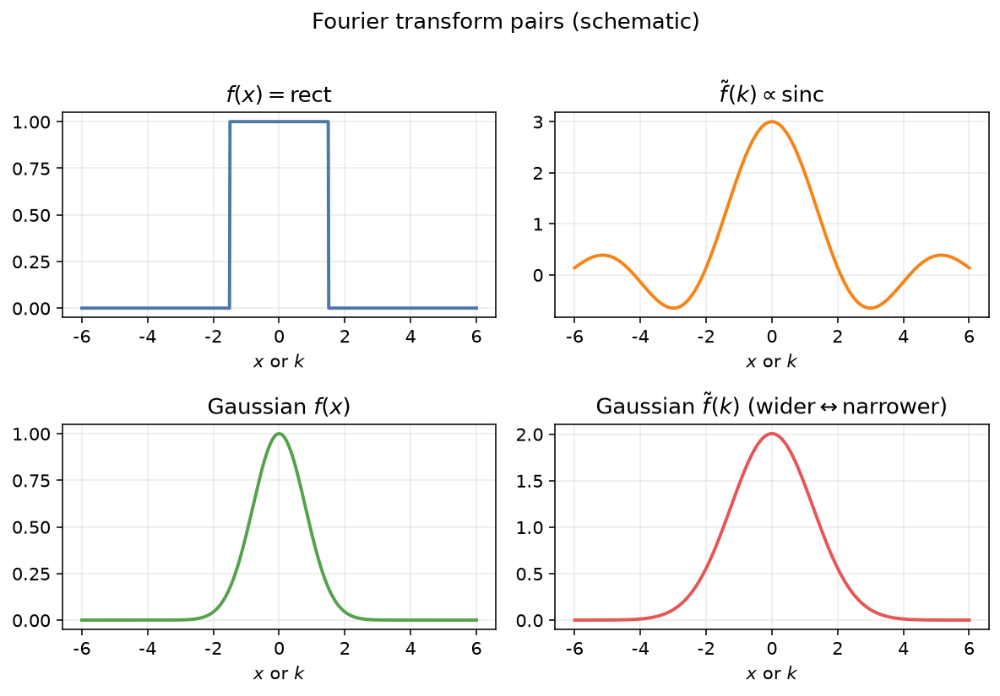

### 傅里叶变换

前面我们讨论了周期性体系的傅里叶级数展开.现在我们希望研究非周期性函数的傅里叶展开问题.
假设\\(f(x)\\)是定义在\\(-\infty < x < \infty\\)的实函数,我们依旧对该函数进行傅里叶级数展开,
该级数必须理解为周期\\(2\ell\\)扩展至\\(\infty\\)的极限情况.
由于三角函数族的变量为

\\[
\frac{n\pi x}{\ell}
\\]

引入非连续变量

\\[
\omega\_n = \frac{n\pi} {\ell},   k = 0,1,2,\cdots
\\]

可知\\(\omega\_n = n \omega\_0\\), 其中\\(\omega\_0 = \frac{\pi{\ell}\\)为基础频率(Fundamental Frequency),

\\[
\Delta \omega\_n = \omega\_n - \omega\_{n-1} = \omega\_0 .
\\]

有

\\[
f(x) = \lim\_{\ell\to \infty} \sum\_{n=-\infty}^{\infty} \left[
        c\_n e^{\mathrm{i} \omega\_n x}
\right]
\\]

其中系数

\\[
c\_n = \frac{1}{2\ell} \int\_{-\ell}^{\ell} f(x) e^{-\mathrm{i} \omega\_n x} dx
\\]

取\\(\ell\to \infty\\)的极限,则

\\[
\sum\_n \to  \frac{ \ell}{\pi}  \int d\omega
\\]

傅里叶系数记为\\(F(\omega)\\),
有

\\[
f(x) = \int\_{-\infty}^{\infty} d \omega F(\omega) e^{\mathrm{i} \omega x},
\\]

上式的积分称为**傅里叶积分**(Fourier integral),是\\(f(x)\\)的**傅里叶变换**(Fourier transform).
其中

\\[
F (\omega) \equiv \lim\_{\ell\to \infty} \frac{ 2\ell c\_n}{2\pi}  = \frac{1}{2\pi} \int\_{-\infty}^{\infty} e^{-\mathrm{i} \omega x} f(x) dx,
\\]

这被称为**逆傅里叶变换**(inverse Fourier transform). 这里积分前的系数并不要紧,更关键的是积分关于\\(\omega\\)的形式.

傅里叶积分存在的条件由**傅里叶积分定理**判定:
若函数 \\(f(x)\\) 在区间 \\((-\infty, \infty)\\) 上满足条件: \\((1) f(x)\\) 在 任一有限区间上满足狄里希利条件; (2) \\(f(x)\\) 在 \\((-\infty, \infty)\\)
上绝对可积 (即 \\(\int\_{-\infty}^{\infty}|f(x)| dx\\) 收敛), 则 \\(f(x)\\) 可表示成傅里叶积分, 且

\\[
\text{傅里叶积分值} = \lim\_{\epsilon\to 0} \frac{1}{2} \left[ f(x+\epsilon) + f(x-\epsilon) . \right]
\\]

若采用正余弦展开,

\\[
f(x) =\int\_{0}^{\infty} A(\omega) \cos {\omega x} d\omega + \int\_{0}^{\infty} B(\omega) \sin {\omega x} d\omega
\\]

其中

\\[
\left\{\begin{array}{l}
A(\omega)=\frac{1}{\pi} \int\_{-\infty}^{\infty} f(x) \cos \omega x d x, \\\\
B(\omega)=\frac{1}{\pi} \int\_{-\infty}^{\infty} f(x) \sin \omega x d x .
\end{array}\right.
\\]
上式还可以写成

\\[
f(x)=\int\_0^{\infty} C(\omega) \cos [\omega x-\varphi(\omega)] d \omega,
\\]

其中

\\[
\begin{gathered}
C(\omega)=\sqrt{[A(\omega)]^2+[B(\omega)]^2} \\\\
\varphi(\omega)=\arctan [B(\omega) / A(\omega)] .
\end{gathered}
\\]

\\(C(\omega)\\) 称为 \\(f(x)\\) 的振幅谱, \\(\varphi(\omega)\\) 称为 \\(f(x)\\) 的相位谱.如果\\(f(x)\\)是奇函数或偶函数,
对应的级数为**傅里叶余弦积分**或**傅里叶正弦积分**.

复数形式的傅里叶积分可以写成对称的形式,

\\[
\begin{aligned}
f(x) & =\frac{1}{\sqrt{2 \pi}} \int\_{-\infty}^{\infty} F(\omega)e^{\mathrm{i} \omega x} d \omega, \\\\
F(\omega) & =\frac{1}{\sqrt{2 \pi}} \int\_{-\infty}^{\infty} f(x)\left[e^{\mathrm{i} \omega x}\right]^* d x .
\end{aligned}
\\]

并常用符号简写为

\\[
F(\omega)=\mathcal{F}[f(x)],   f(x)=\mathcal{F}^{-1}[F(\omega)] .
\\]

\\(f(x)\\) 和 \\(F(\omega)\\) 分别称为傅里叶变换的**原函数**和**像函数**.

> **例** 求以下函数的复数傅里叶变换.

- \\(f(x) = e^{-\alpha |x|}, \alpha > 0\\);

- \\(f(x) = \delta (x)\\);

- \\(f(x) = e^{-\alpha x^2}, \alpha > 0\\).

> **解**

- 对\\(x\\)分段进行处理,利用对称形式的傅里叶变换有

\\[
\begin{aligned}
        F(\omega) &=
        \sqrt{\frac{1}{2 \pi}} \int\_{-\infty}^0 e^{\alpha x+i \omega t} dx
        +
        \sqrt{\frac{1}{2 \pi}} \int\_0^{\infty} e^{-\alpha x+i \omega t} dx
        \\\\
        &= \sqrt{\frac{1}{2 \pi}} \left[\frac{1}{\alpha + \mathrm{i} \omega } + \frac{1}{\alpha - \mathrm{i} \omega } \right]
        \\\\
        &= \sqrt{\frac{1}{2 \pi}} \frac{2\alpha}{\alpha^2 + \omega^2},
\end{aligned}
\\]

越大的\\(\alpha\\)则\\(f(x)\\)越窄,集中在\\(x=0\\)附近,也就是越局域,而其傅里叶变换则越弥散.当\\(f(x)\\)是偶函数时,傅里叶变换的像函数为实函数.

- 代入

\\[
\begin{aligned}
        F(\omega) &=
        \sqrt{\frac{1}{2 \pi}} \int\_{-\infty}^{\infty} \delta(x) e^{+\mathrm{i} \omega x} d x = \sqrt{\frac{1}{2 \pi}} ,
\end{aligned}
\\]

\\(f(x)\\)无限局域对应的傅里叶变换为无限弥散.

- 类似的,

\\[
\begin{aligned}
        F(\omega) &=\frac{1}{\sqrt{2 \pi}} \int\_{-\infty}^{\infty} e^{-\alpha x^2} e^{\mathrm{i} \omega x} d x = \frac{ e^{-\omega^2 / 4\alpha }}{\sqrt{2 \pi}} \int\_{-\infty}^{\infty} e^{-\alpha  \left( x - \frac{\mathrm{i} \omega}{2\alpha} \right)^2}  d x
        \\\\
        & = \frac{ e^{-\omega^2 / 4\alpha }}{\sqrt{2 \pi}} \int\_{-\infty - \mathrm{i} \omega / 2\alpha}^{\infty - \mathrm{i} \omega / 2\alpha} e^{-\alpha t^2} dt
        \\\\
        & = \frac{ e^{-\omega^2 / 4\alpha }}{\sqrt{2 \pi}} \sqrt{\frac{\pi}{\alpha}}
        \\\\
            & = \frac{1}{\sqrt{2\alpha}} e^{- \frac{\omega^2}{4\alpha}}  .
\end{aligned}
\\]

上式用了变量代换\\(t = x - \mathrm{i} \omega /2 \alpha\\),高斯函数的像函数还是高斯函数.

### 傅里叶变换基本性质

傅里叶变换满足以下基本性质.假定\\(f(x)\\)的傅里叶变换存在,记为\\(\mathcal{F[f(x)] = F(\omega)\\).

- 导数定理

\\[
\mathcal{F} [f'(x)] = \mathrm{i} \omega F(\omega)
\\]

- 积分定理

\\[
\mathcal{F} [ \int^{x} f(x) dx ] = \frac{1}{\mathrm{i} \omega} F(\omega)
\\]

- 相似性定理

\\[
\mathcal{F} [ f(ax) ] = \frac{1}{a} F(\frac{\omega}{a}),
\\]

- 延迟定理

\\[
\mathcal{F} [ f(x - x\_0 ) ] = e^{-\mathrm{i} \omega x\_0} F(\omega),
\\]

- 位移定理

\\[
\mathcal{F} [ e^{\mathrm{i} \omega\_0 x} f(x) ] = F(\omega - \omega\_0),
\\]

- 卷积定理, 如果

\\[
\mathcal{F} [f\_1(x)] =  F\_1(\omega), \mathcal{F} [f\_2(x)] =  F\_2(\omega),
\\]

有

\\[
\mathcal{F} [f\_1(x)\star f\_2(x) ] = F\_1(\omega) F\_2(\omega).
\\]

其中 \\(f\_1(x) \star f\_2(x)=\int\_{-\infty}^{\infty} f\_1(\alpha) f\_2(\alpha-x) d \alpha\\) 称为 \\(f\_1(x)\\) 与 \\(f\_2(x)\\) 的卷积.

以上部分定理作为作业由大家完成.

### 高维傅里叶变换

二维连续函数 \\(f(x, y)\\) 的傅里叶变换定义如下:
设 \\(f(x, y)\\) 是两个独立变量 \\(x, y\\) 的函数, 且在 \\(\pm \infty\\) 上绝对可积, 则定义积分

\\[
F\left(k\_1, k\_2\right)=\frac{1}{2 \pi} \int\_{-\infty}^{\infty} \int\_{-\infty}^{\infty} f(x, y) e^{-\mathrm{i}\left(k\_1 x+k\_2 y\right)} d x d y
\\]

为二维连续函数 \\(f(x, y)\\) 的傅里叶变换,并定义

\\[
f(x, y)=\int\_{-\infty}^{\infty} \int\_{-\infty}^{\infty} F\left(k\_1, k\_2\right) e^{\mathrm{i}\left(k\_1 x+k\_2 y\right)} d k\_1 d k\_2
\\]

为 \\(F\left(k\_1, k\_2\right)\\) 的逆变换.
\\(f(x, y)\\) 和 \\(F\left(k\_1, k\_2\right)\\) 称为傅里叶变换对. 注意这里可以取对称的形式,只有一个系数
\\(\frac{1}{(2 \pi)^2}\\), 结果与上面形式相同.

> **例** 求函数 \\(f(x, y)= \begin{cases}A, & |x| \leq X,|y| \leq Y \\ 0, & |x|>X,|y|>Y\end{cases}\\) 的傅里叶变换 (矩孔费琅和夫衍射).

> **解** 由傅里叶变换关系

\\[
F\left(k\_1, k\_2\right)=\frac{1}{(2 \pi)^2} \int\_{-\infty}^{\infty} \int\_{-\infty}^{\infty} f(x, y) e^{-i\left(k\_1 x+k\_2 y\right)} d x d y
\\]

有

\\[
\begin{aligned}
F\left(k\_1, k\_2\right) & =\frac{A}{2 \pi} \int\_{-X}^X e^{-i k\_1 x} d x \int\_{-Y}^Y e^{-i k\_2 y} d y \\\\
& =\left.\left.\frac{A}{2 \pi} \frac{1}{-i k\_1} e^{-i k\_1 x}\right|\_{-X} ^X \frac{1}{-i k\_2} e^{-i k\_2 y}\right|\_{-Y} ^Y \\\\
& =\frac{2A}{\pi} \frac{1}{i 2 k\_1}\left(e^{i k\_1 X}-e^{-i k\_1 X}\right) \frac{1}{i 2 k\_2}\left(e^{i k\_2 Y}-e^{-i k\_2 Y}\right) \\\\
& =\frac{2A X Y}{\pi} \frac{\sin \left(k\_1 X\right)}{k\_1 X} \frac{\sin \left(k\_2 Y\right)}{k\_2 Y}
\end{aligned}
\\]

对于三维情况,\\(\vec{k}=\left(k\_1, k\_2, k\_3\right), \vec{r}=(x, y, z)\\),

\\[
F(\vec{k})=\frac{1}{(2 \pi)^3} \iiint\_{-\infty}^{\infty} f(\vec{r}) e^{-\mathrm{i}  \vec{k} \cdot \vec{r}} d^3 \vec{r}
\\]

或者

\\[
F\left(k\_1, k\_2, k\_3\right)=\frac{1}{(2 \pi)^3} \iiint\_{\infty}^{\infty} f(x, y, z) e^{-\mathrm{i}\left(k\_1 x+k\_2 y+k\_3 z\right)} d x d y d z
\\]

逆变换为

\\[
f(\vec{r})=\iiint\_{-\infty}^{\infty} F(k) e^{\mathrm{i} \vec{k} \cdot \vec{r}} d^3 \vec{k}
\\]

或

\\[
f(x, y, z)=\iiint\_{-\infty}^{\infty} F\left(k\_1, k\_2, k\_3\right) e^{\mathrm{i}\left(k\_1 x+k\_2 y+k\_3 z\right)} d k\_1 d k\_2 d k\_3
\\]

### Parseval / Plancherel 定理（傅里叶变换）

对傅里叶级数的 Parseval 等式取周期 \\(2\ell\to\infty\\) 的连续极限，或直接代入傅里叶积分，可得傅里叶变换下的对应结果。在本书约定

\\[
f(x)=\int\_{-\infty}^{\infty}F(\omega)\\,e^{\mathrm{i}\omega x}\\,\mathrm{d}\omega,
\qquad
F(\omega)=\frac{1}{2\pi}\int\_{-\infty}^{\infty}f(x)\\,e^{-\mathrm{i}\omega x}\\,\mathrm{d}x
\\]

之下，设 \\(f,g\\) 的变换为 \\(F,G\\)，则

\\[
\int\_{-\infty}^{\infty}g(x)^\ast f(x)\\,\mathrm{d}x
= 2\pi \int\_{-\infty}^{\infty}G(\omega)^\ast F(\omega)\\,\mathrm{d}\omega .
\\]

**证明概要** 将 \\(f(x)=\int F(\omega)e^{\mathrm{i}\omega x}\\,\mathrm{d}\omega\\) 代入左端（对 \\(g^\ast\\) 同理展开，或先固定 \\(g\\) 只展开 \\(f\\)）：

\\[
\begin{aligned}
\int g^\ast f\\,\mathrm{d}x
&= \int\\!\mathrm{d}x\\,g(x)^\ast \int\\!\mathrm{d}\omega\\,F(\omega)e^{\mathrm{i}\omega x} \\\\
&= \int\\!\mathrm{d}\omega\\,F(\omega)\Bigl(\int\\!\mathrm{d}x\\,g(x)^\ast e^{\mathrm{i}\omega x}\Bigr)
= 2\pi \int G(\omega)^\ast F(\omega)\\,\mathrm{d}\omega ,
\end{aligned}
\\]

其中用到 \\(G(\omega)=\frac{1}{2\pi}\int g(x)e^{-\mathrm{i}\omega x}\\,\mathrm{d}x\\)，故 \\(\int g^\ast e^{\mathrm{i}\omega x}\\,\mathrm{d}x=2\pi G(\omega)^\ast\\)。（交换积分需在绝对可积等条件下论证，分布意义下可对更广的函数类成立。）

取 \\(g=f\\) 即得能量形式，亦常称为 **Plancherel 定理**：

\\[
\int\_{-\infty}^{\infty}|f(x)|^2\\,\mathrm{d}x
= 2\pi \int\_{-\infty}^{\infty}|F(\omega)|^2\\,\mathrm{d}\omega .
\\]

若改用对称约定 \\(\hat f(k)=\int e^{-\mathrm{i}kx}f\\,\mathrm{d}x\\)、\\(f=\frac{1}{2\pi}\int e^{\mathrm{i}kx}\hat f\\,\mathrm{d}k\\)（如 PX286），则同一事实写作

\\[
\int g(x)f(x)\\,\mathrm{d}x
= \frac{1}{2\pi}\int \hat g(k)\hat f(k)\\,\mathrm{d}k ,
\qquad
\int |f|^2\\,\mathrm{d}x
= \frac{1}{2\pi}\int |\hat f|^2\\,\mathrm{d}k .
\\]

两种写法只差 \\(2\pi\\) 因子的安置，物理内容相同：**时域能量等于频域能量（至多差约定常数）**。

**例（单边指数衰减）** 取

\\[
f(x)=
\begin{cases}
e^{-x/\xi}, & x>0, \\\\
0, & x<0,
\end{cases}
\qquad \xi>0.
\\]

在对称约定下 \\(\hat f(k)=1/(\mathrm{i}k+\xi^{-1})\\)。由 Plancherel，

\\[
\int\_0^{\infty}e^{-2x/\xi}\\,\mathrm{d}x=\frac{\xi}{2}
= \frac{1}{2\pi}\int\_{-\infty}^{\infty}\frac{\mathrm{d}k}{k^2+\xi^{-2}},
\\]

整理得（\\(\xi\neq 0\\)）

\\[
\int\_{-\infty}^{\infty}\frac{\xi^{-1}}{k^2+\xi^{-2}}\\,\mathrm{d}k=\pi .
\\]

这既是 Parseval 的应用，也给出了该有理函数积分的快捷求法。

**多维** 在 \\(\mathbb{R}^n\\) 上，若 \\(f=\frac{1}{(2\pi)^n}\int \hat f(k)e^{\mathrm{i}k\cdot x}\\,\mathrm{d}^n k\\)（或本书把 \\((2\pi)^{-n}\\) 放在正变换一侧），则

\\[
\int\_{\mathbb{R}^n}g(x)^\ast f(x)\\,\mathrm{d}^n x
= (2\pi)^{\pm n}\int\_{\mathbb{R}^n}G(k)^\ast F(k)\\,\mathrm{d}^n k ,
\\]

指数的正负随 \\(2\pi\\) 因子放在正变换还是逆变换而定；论证与一维完全平行。
