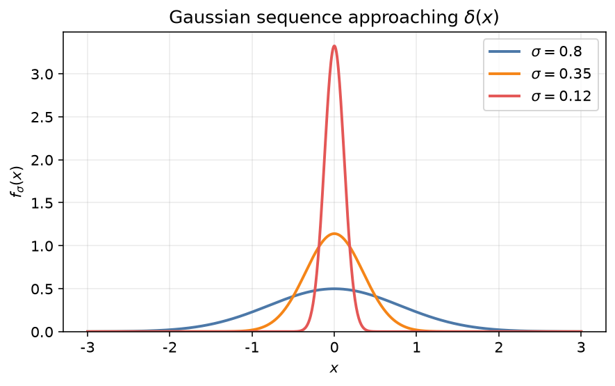
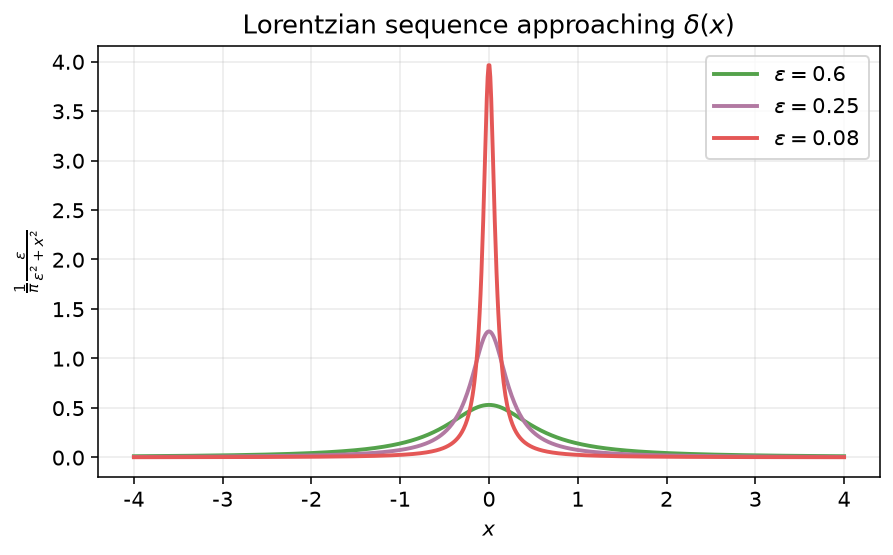
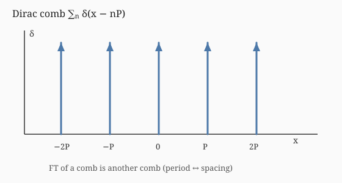

## \\(\delta\\) 函数

Dirac \\(\delta\\) 函数（Dirac delta function）是一种**广义函数**（distribution）。本节在原有讲义表述基础上，补入 PX286 第 4 章中的构造、性质证明、Dirac 梳、复合宗量公式，以及作为 Green 函数的应用。傅里叶变换的约定与第 [3 章](../ch03-fourier/02-fourier-transform.md)一致时可对照阅读。

### 基本概念

物理学常研究密度（质量、电荷、力等）的空间或时间分布，同时又使用质点、点电荷、瞬时力等“集中于一点”的模型。设质量 \\(m\\) 均匀分布在线段 \\([-\ell/2,\ell/2]\\) 上，线密度为

\\[
\rho\_\ell(x)=
\begin{cases}
m/\ell, & |x|\leqslant \ell/2, \\\\
0, & |x|>\ell/2,
\end{cases}
\qquad
\int\_{-\infty}^{\infty}\rho\_\ell(x)\\,\mathrm{d}x=m .
\\]

令 \\(\ell\to 0\\)，则对任意 \\(x\neq 0\\) 有 \\(\rho\_\ell(x)\to 0\\)，而积分仍为 \\(m\\)。由此抽象出位于原点、总质量为 \\(1\\) 的密度——\\(\delta\\) 函数：

\\[
\delta(x)=
\begin{cases}
0, & x\neq 0, \\\\
\infty, & x=0,
\end{cases}
\qquad
\int\_a^b \delta(x)\\,\mathrm{d}x=
\begin{cases}
1, & a<0<b, \\\\
0, & \text{其余（}0\text{ 不在开区间内）}.
\end{cases}
\\]

更干净的构造来自归一化高斯族。考虑傅里叶变换对

\\[
f(x)=\frac{1}{\sqrt{2\pi\sigma^2}}\\,e^{-x^2/(2\sigma^2)},
\qquad
\tilde f(k)=e^{-\sigma^2 k^2/2}.
\\]

当 \\(\sigma\to 0\\) 时，\\(\tilde f\to 1\\)；而对任意固定的 \\(x\neq 0\\)，有 \\(f(x)\to 0\\)，同时 \\(\int f=1\\) 始终成立。该极限对象记为 \\(\delta(x)\\)。数学上（Schwartz，约 1950）称之为**分布**；量纲为长度的倒数（\\(\mathrm{m}^{-1}\\)），而非质量。

**基本性质（挑选性 / sifting）** 对在原点连续的试验函数 \\(f\\)，

\\[
\int\_{-\infty}^{\infty}\delta(x)f(x)\\,\mathrm{d}x = f(0).
\\]

平移到 \\(x\_0\\) 则有 \\(\delta(x-x\_0)\\)，以及

\\[
\int\_{-\infty}^{\infty}\delta(x-x\_0)f(x)\\,\mathrm{d}x = f(x\_0).
\\]

与上述极限一致，\\(\delta\\) 的傅里叶变换为常数 \\(1\\)，因而有常用的傅里叶表示

\\[
\delta(x)=\frac{1}{2\pi}\int\_{-\infty}^{\infty}e^{\mathrm{i}kx}\\,\mathrm{d}k,
\qquad
\delta(x-x\_0)=\frac{1}{2\pi}\int\_{-\infty}^{\infty}e^{\mathrm{i}k(x-x\_0)}\\,\mathrm{d}k .
\\]

（积分在分布意义下理解。）也常把 \\(\delta\\) 看作下列函数列的极限：

\\[
\begin{aligned}
\delta(x)
&= \lim\_{\ell\to 0}\frac{1}{\ell}\operatorname{rect}\Bigl(\frac{x}{\ell}\Bigr)
= \lim\_{K\to\infty}\frac{1}{\pi}\frac{\sin Kx}{x}
= \lim\_{\varepsilon\to 0^{+}}\frac{1}{\pi}\frac{\varepsilon}{\varepsilon^2+x^2}.
\end{aligned}
\\]

### 偶性（证明）

\\(\delta\\) **表现为偶函数**：\\(\delta(-x)=\delta(x)\\)。由傅里叶表示出发：

\\[
\begin{aligned}
\delta(x\_0-x)
&= \frac{1}{2\pi}\int\_{-\infty}^{\infty}e^{\mathrm{i}k(x\_0-x)}\\,\mathrm{d}k
= \frac{1}{2\pi}\int\_{-\infty}^{\infty}e^{-\mathrm{i}k(x-x\_0)}\\,\mathrm{d}k \\\\
&= \frac{1}{2\pi}\int\_{\infty}^{-\infty}e^{\mathrm{i}k(x\_0-x)}(-\mathrm{d}k)
= \frac{1}{2\pi}\int\_{-\infty}^{\infty}e^{\mathrm{i}k(x-x\_0)}\\,\mathrm{d}k
= \delta(x-x\_0).
\end{aligned}
\\]

取 \\(x\_0=0\\) 即得 \\(\delta(-x)=\delta(x)\\)。相应地，若导数在分布意义下存在，则 \\(\delta'\\) 为奇：\\(\delta'(-x)=-\delta'(x)\\)。

### 有限区间上的积分

在有限区间 \\((a,b)\\) 上，

\\[
\int\_a^b f(x)\delta(x-x\_0)\\,\mathrm{d}x
=
\begin{cases}
f(x\_0), & x\_0\in(a,b), \\\\
0, & \text{其余}.
\end{cases}
\\]

**例（点电荷）** 电荷分布

\\[
\rho(x)=-e\\,\delta(x+4)+2e\\,\delta(x)-e\\,\delta(x-\pi)
\\]

的总电荷为 \\(Q=\int\rho=0\\)；落在 \\((-3,3)\\) 内的电荷仅为中心处的 \\(2e\\)。

**例** \\(\cos(qx)\\) 的傅里叶变换（在分布意义下）为

\\[
\widetilde{\cos(qx)}(k)
= \pi\bigl(\delta(k-q)+\delta(k+q)\bigr).
\\]

### 与 \\(\delta\\) 的卷积

设 \\(g(x)=\delta(x-x\_0)\\)。则

\\[
(f\ast g)(x)
= \int\_{-\infty}^{\infty}f(x-y)\delta(y-x\_0)\\,\mathrm{d}y
= f(x-x\_0).
\\]

亦即：与单个 \\(\delta\\) 卷积只产生平移，不改变波形。若

\\[
g(x)=\sum\_{i=1}^{n}\delta(x-x\_i),
\\]

则

\\[
(f\ast g)(x)=\sum\_{i=1}^{n}f(x-x\_i),
\\]

可在指定位置复制同一“特征”。这与傅里叶空间的卷积定理、平移性质一致：\\(\delta(x-x\_i)\\) 的变换为平面波 \\(e^{-\mathrm{i}k x\_i}\\)。

### Dirac 梳

**Dirac 梳**（Dirac comb）是周期为 \\(P\\) 的无限 \\(\delta\\) 列：

\\[
g(x)=\sum\_{n=-\infty}^{\infty}\delta(x-nP).
\\]

与普通函数卷积可生成周期重复的图案（例如矩形脉冲与梳卷积得到周期方波串）。

直接计算其傅里叶变换得

\\[
\tilde g(k)=\sum\_{n=-\infty}^{\infty}e^{-\mathrm{i}k nP}.
\\]

另一方面，梳本身以周期 \\(P\\) 为周期，可展成傅里叶级数（系数均为 \\(1/P\\)），从而有恒等式

\\[
\sum\_{n=-\infty}^{\infty}\delta(x-nP)
= \frac{1}{P}\sum\_{n=-\infty}^{\infty}e^{\mathrm{i} 2\pi n x/P}.
\\]

代回傅里叶变换，得到

\\[
\tilde g(k)
= \frac{2\pi}{P}\sum\_{n=-\infty}^{\infty}\delta\Bigl(k-\frac{2\pi n}{P}\Bigr).
\\]

即：**Dirac 梳的傅里叶变换仍是 Dirac 梳**（周期与间距互换）。这一事实是晶体衍射斑点图案的数学来源之一。

### 复合函数作宗量（证明）

若 \\(f\\) 具有孤立简单零点 \\(\\{x\_r\\}\\)，则作为广义函数恒等式有

\\[
\delta\bigl(f(x)\bigr)
= \sum\_{r}\frac{\delta(x-x\_r)}{|f'(x\_r)|}.
\\]

**证明概要** 取互不相交的开邻域 \\(U\_r\ni x\_r\\)。在 \\(\bigcup\_r U\_r\\) 之外 \\(f\neq 0\\)，故对试验函数 \\(g\\)，

\\[
\int\_{-\infty}^{\infty}g(x)\delta\bigl(f(x)\bigr)\\,\mathrm{d}x
= \sum\_r \int\_{U\_r}g(x)\delta\bigl(f(x)\bigr)\\,\mathrm{d}x .
\\]

在每个 \\(U\_r\\) 上 \\(f\\) 是到含原点开集 \\(V\\) 的双射。令 \\(y=f(x)\\)，逆映射 \\(x=\phi(y)\\)，则

\\[
\int\_{U\_r}g(x)\delta\bigl(f(x)\bigr)\\,\mathrm{d}x
= \int\_V g\bigl(\phi(y)\bigr)\delta(y)\frac{\mathrm{d}y}{|f'(\phi(y))|}
= \frac{g(x\_r)}{|f'(x\_r)|}.
\\]

对各根求和即得所述公式。

**特例**

\\[
\delta(ax)=\frac{\delta(x)}{|a|}\quad(a\neq 0),
\qquad
\delta(x^2-a^2)=\frac{\delta(x-a)+\delta(x+a)}{2|a|}\quad(a\neq 0).
\\]

**例** 计算 \\(\displaystyle\int\_{-\infty}^{\infty}g(x)\delta(x^3+ax)\\,\mathrm{d}x\\)。方程 \\(x^3+ax=0\\) 的实根为 \\(x=0\\)，以及当 \\(a<0\\) 时的 \\(\pm\sqrt{-a}\\)。导数 \\(3x^2+a\\) 在诸根处取值分别为 \\(a\\)、\\(-2a\\)、\\(-2a)\\)，故

\\[
\int\_{-\infty}^{\infty}g(x)\delta(x^3+ax)\\,\mathrm{d}x
=
\begin{cases}
g(0)/|a|, & a>0, \\\\
\dfrac{g(-\sqrt{-a})}{|2a|}+\dfrac{g(0)}{|a|}+\dfrac{g(\sqrt{-a})}{|2a|}, & a<0.
\end{cases}
\\]

（\\(a=0\\) 时该积分在通常意义下无定义。）

### Green 函数与微分方程

考虑常微分方程

\\[
\frac{\mathrm{d}u}{\mathrm{d}x}+\gamma u = f(x),
\qquad \gamma>0.
\\]

傅里叶变换后 \\((\mathrm{i}k+\gamma)\tilde u=\tilde f\\)，故

\\[
\tilde u(k)=\frac{\tilde f(k)}{\mathrm{i}k+\gamma}.
\\]

实空间解为卷积

\\[
u(x)=\int\_{-\infty}^{\infty}G(x-y)f(y)\\,\mathrm{d}y,
\\]

其中 Green 函数 \\(G\\) 是 \\(1/(\mathrm{i}k+\gamma)\\) 的逆变换：已知

\\[
G(x)=
\begin{cases}
e^{-\gamma x}, & x>0, \\\\
0, & x<0,
\end{cases}
\\]

因而

\\[
u(x)=\int\_{-\infty}^{x}e^{-\gamma(x-y)}f(y)\\,\mathrm{d}y .
\\]

**解释** Green 函数正是系统对 \\(\delta\\) 源的响应：取 \\(f=\delta\\) 即得 \\(u=G\\)。

对受迫阻尼谐振子

\\[
\ddot u + 2\gamma\dot u + \omega\_0^2 u = f(t),
\\]

同样有 \\(\tilde u(\omega)=\tilde G(\omega)\tilde f(\omega)\\)，其中

\\[
\tilde G(\omega)=\frac{1}{(\mathrm{i}\omega)^2+2\gamma(\mathrm{i}\omega)+\omega\_0^2}.
\\]

在欠阻尼情形 \\(\omega\_0>\gamma\\) 且 \\(t>0\\) 时，

\\[
G(t)=e^{-\gamma t}\frac{\sin\bigl(\sqrt{\omega\_0^2-\gamma^2}\\,t\bigr)}{\sqrt{\omega\_0^2-\gamma^2}},
\\]

而 \\(t<0\\) 时 \\(G=0\\)。一般解为

\\[
u(t)=\int\_{-\infty}^{t}e^{-\gamma(t-s)}
\frac{\sin\bigl(\sqrt{\omega\_0^2-\gamma^2}\\,(t-s)\bigr)}{\sqrt{\omega\_0^2-\gamma^2}}
f(s)\\,\mathrm{d}s .
\\]

### 多维 \\(\delta\\) 函数

三维空间中，集中于原点的密度满足

\\[
\delta(\mathbf{r})=0\quad(\mathbf{r}\neq\mathbf{0}),
\qquad
\iiint \delta(\mathbf{r})\\,\mathrm{d}^3\mathbf{r}=1.
\\]

直角坐标下

\\[
\delta(\mathbf{r})=\delta(x)\delta(y)\delta(z).
\\]

相对一点 \\(\mathbf{r}'\\) 的一般形式在正交曲线坐标中需除以体积元的雅可比。柱坐标 \\((\rho,\varphi,z)\\) 与球坐标 \\((r,\theta,\varphi)\\) 中，

\\[
\begin{aligned}
\delta(\mathbf{r}-\mathbf{r}')
&= \frac{\delta(\rho-\rho')\delta(\varphi-\varphi')\delta(z-z')}{\rho}, \\\\
\delta(\mathbf{r}-\mathbf{r}')
&= \frac{\delta(r-r')\delta(\theta-\theta')\delta(\varphi-\varphi')}{r^2\sin\theta}.
\end{aligned}
\\]

（当 \\(\rho'=0\\) 或 \\(r'=0\\) 时需单独讨论奇性。）

### 习题（选）

1. 计算 \\(\displaystyle\int\_{-\infty}^{\infty}\cos x\\,\delta(x)\\,\mathrm{d}x\\)、
   \\(\displaystyle\int\_{-\pi}^{\pi}\sin x\bigl(\delta(x-\pi/4)-\delta(x+\pi/4)\bigr)\\,\mathrm{d}x\\)，以及
   \\(\displaystyle\int\_{-\infty}^{\infty}e^{-k^2/2}\bigl(\delta(k+2)-2\delta(k)+\delta(k-2)\bigr)\\,\mathrm{d}k\\)。
2. 利用 Dirac 梳与卷积，说明如何构造周期为 \\(T\\)、每个脉冲为单边指数衰减（时标 \\(\tau\\)）的函数。
3. 计算
   \\(\displaystyle\int\_{-\infty}^{0}\tan(\pi x/4)\\,\delta(x^4-1)\\,\mathrm{d}x\\)。
   （提示：\\(x^4-1=0\\) 的实根中仅 \\(x=-1\\) 落在积分区间；\\(|f'(-1)|=4\\)，故结果为 \\(-1/4\\)。）
