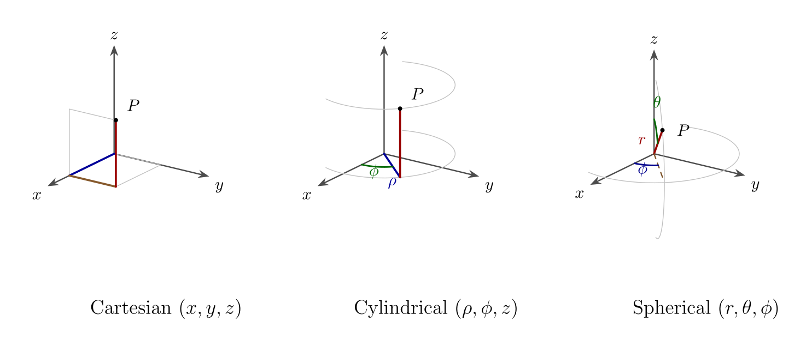

## 曲面正交坐标系

## 正交曲线坐标系中的分离变量

本章开始把分离变量法推广到比较实际的三维问题。前已指出，分离变量前，应该根据边界的形状采用适当的坐标系。本章的目的就是研究如何在球坐标系和柱坐标系中对各类方程进行分离变量。我们所知道的几类方程都包含Laplace算符，所以首先需要研究Laplace算符在曲线坐标系，尤其是球坐标系和柱坐标系中的形式。

## 正交曲线坐标系中的微分算符

### 正交曲线坐标系

直角坐标系 \\((x, y, z)\\)，球坐标系 \\((r, \theta, \phi)\\)，柱坐标系 \\((\rho, \phi, z)\\) 都是正交曲线坐标系。它们的三族坐标线处处相互正交。

现考虑一般曲线坐标系，其坐标记作 \\((q\_1, q\_2, q\_3)\\)，它们与直角坐标之间的变换关系为：

\\[
x = x(q\_1, q\_2, q\_3),   y = y(q\_1, q\_2, q\_3),   z = z(q\_1, q\_2, q\_3).
\\]

反之，\\((q\_1, q\_2, q\_3)\\) 也可以表示为 \\((x, y, z)\\) 的函数。一般来说，我们要求 Jacobi 行列式：

\\[
J = \frac{\partial (x, y, z)}{\partial (q\_1, q\_2, q\_3)} \neq 0.
\\]

### 正交曲线坐标系中的梯度算符

由于 \\(\nabla u\\) 是矢量，它一定可以展开为 \\(\nabla u = \sum\_{i=1^3 f\_i e\_i\\)，注意其中 \\(f\_i\\) 是 \\(r\\) 的函数，\\(e\_i\\) 的方向也是随着 \\(r\\) 变化的，这与直角坐标系的单位矢量不同。由正交归一关系式，易得 \\(f\_i = e\_i \cdot \nabla u\\)，另一方面，有

\\[
e\_i \cdot \nabla u = \frac{\partial u}{\partial s\_i} = \lim\_{\Delta s\_i \to 0} \frac{\Delta u}{\Delta s\_i} = \lim\_{\Delta q\_i \to 0} \frac{1}{h\_i} \frac{\Delta u}{\Delta q\_i} = \frac{1}{h\_i} \frac{\partial u}{\partial q\_i},
\\]

于是得到 \\(f\_i = h\_i^{-1} \frac{\partial u}{\partial q\_i}\\)，从而有

\\[
\nabla u = \sum\_{i=1}^3 \frac{1}{h\_i} \frac{\partial u}{\partial q\_i} e\_i = \frac{1}{h\_1} \frac{\partial u}{\partial q\_1} e\_1 + \frac{1}{h\_2} \frac{\partial u}{\partial q\_2} e\_2 + \frac{1}{h\_3} \frac{\partial u}{\partial q\_3} e\_3.
\\]

将上式与直角坐标系的相应表达式

\\[
\nabla u = \frac{\partial u}{\partial x} e\_x + \frac{\partial u}{\partial y} e\_y + \frac{\partial u}{\partial z} e\_z
\\]

作比较，容易看出，不同之处在于曲线坐标系的结果中出现了度规系数。

由一般结果和度规系数式，易得柱坐标系中的梯度算符为

\\[
\nabla u = \frac{\partial u}{\partial \rho} e\_\rho + \frac{1}{\rho} \frac{\partial u}{\partial \phi} e\_\phi + \frac{\partial u}{\partial z} e\_z.
\\]

又由度规系数式，易得球坐标系中的梯度算符为

\\[
\nabla u = \frac{\partial u}{\partial r} e\_r + \frac{1}{r} \frac{\partial u}{\partial \theta} e\_\theta + \frac{1}{r \sin \theta} \frac{\partial u}{\partial \phi} e\_\phi.
\\]

### 正交曲线坐标系的定义

现在的问题是，什么样的曲线坐标系才算是正交的？在直角坐标系中，相邻两点 \\(\vec{r}\\) 和 \\(\vec{r + d\vec{r}\\) 之间的距离记作 \\(ds\\)，则有

\\[
(ds)^2 = d\vec{r} \cdot d\vec{r} = (dx)^2 + (dy)^2 + (dz)^2.
\\]

如果写出详细的分量形式，则上式包含了18项。现在，我们可以给出正交曲线坐标系的定义：如果

\\[
\frac{\partial \vec{r}}{\partial q\_i} \cdot \frac{\partial \vec{r}}{\partial q\_j} = 0,   \text{for}   i \neq j,
\\]

则曲线坐标系 \\((q\_1, q\_2, q\_3)\\) 称为正交的。这时有

\\[
(ds)^2 = \sum\_{i=1}^3 \left( \frac{\partial \vec{r}}{\partial q\_i} \right)^2 (dq\_i)^2,
\\]

其中 \\(h\_i := \left| \frac{\partial \vec{r}}{\partial q\_i} \right|\\) 称为度规系数，这与直角坐标系中的形式 (9.2) 相似，只是 \\(dq\_i\\) 前面多了度规系数 \\(h\_i\\)。所以，正交的关键就是 \\((ds)^2\\) 的表达式中不包含 \\(dq\_i dq\_j\\) 这样的交叉项。

### 单位矢量的定义

现在在正交曲线坐标系 \\((q\_1, q\_2, q\_3)\\) 中的单位矢量 \\((e\_1, e\_2, e\_3)\\)，\\(e\_i\\) 的方向就是 \\(q\_i\\) 坐标线的切线方向。沿着坐标线 \\(q\_i\\)，有 \\(d\vec{r = (h\_i dq\_i) e\_i\\)，相应地 \\(ds = h\_i dq\_i\\)，故 \\(e\_i = \frac{1{h\_i} \frac{\partial \vec{r}}{\partial q\_i}\\)，\\(i = 1, 2, 3\\)。

由式 (9.4) 和度规系数的定义，易得

\\[
e\_i \cdot e\_j = \delta\_{ij},
\\]

其中 \\(\delta\_{ij}\\) 是Kronecker delta，当 \\(i = j\\) 时为1，否则为0。

### 正交曲线坐标系中的 Laplace 算符

本书主要用到 Laplace 算符，下面就给出两种常用的曲线坐标系、即柱坐标系和球坐标系中的 Laplace 算符形式。由于直角坐标系中的 Laplace 算符为

\\[
\nabla^2 u = \frac{\partial^2 u}{\partial x^2} + \frac{\partial^2 u}{\partial y^2} + \frac{\partial^2 u}{\partial z^2},
\\]

根据前面研究梯度算符所获得的经验，我们容易猜想，柱坐标系中的 Laplace 算符可能是

\\[
\nabla^2 u = \frac{\partial^2 u}{\partial \rho^2} + \frac{1}{\rho^2} \frac{\partial^2 u}{\partial \phi^2} + \frac{\partial^2 u}{\partial z^2},
\\]

而球坐标系中的 Laplace 算符可能是

\\[
\nabla^2 u = \frac{\partial^2 u}{\partial r^2} + \frac{1}{r^2} \frac{\partial^2 u}{\partial \theta^2} + \frac{1}{r^2 \sin^2 \theta} \frac{\partial^2 u}{\partial \phi^2}.
\\]

但这是不正确的。柱坐标系中的正确结果应该是

\\[
\nabla^2 u = \frac{1}{\rho} \frac{\partial}{\partial \rho} \left( \rho \frac{\partial u}{\partial \rho} \right) + \frac{1}{\rho^2} \frac{\partial^2 u}{\partial \phi^2} + \frac{\partial^2 u}{\partial z^2},
\\]

而球坐标系中的正确结果应该是

\\[
\nabla^2 u = \frac{1}{r^2} \frac{\partial}{\partial r} \left( r^2 \frac{\partial u}{\partial r} \right) + \frac{1}{r^2 \sin \theta} \frac{\partial}{\partial \theta} \left( \sin \theta \frac{\partial u}{\partial \theta} \right) + \frac{1}{r^2 \sin^2 \theta} \frac{\partial^2 u}{\partial \phi^2}.
\\]

散度、旋度以及“为何不能对分量直接偏导”的说明，见[柱/球坐标中的 ∇](04-del-cylindrical-spherical.md)。
