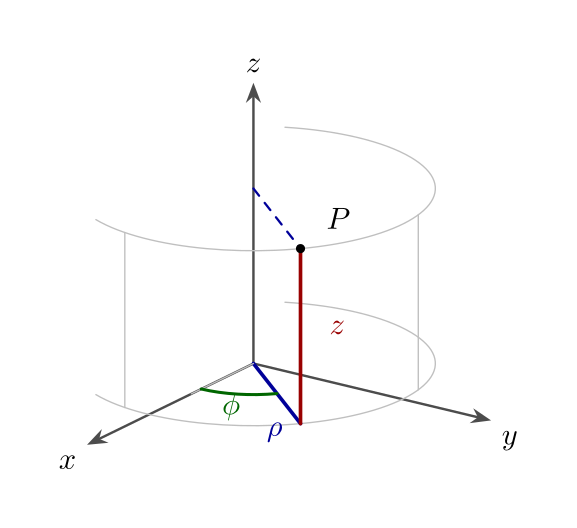
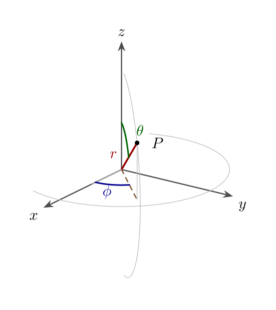

## 柱坐标系下的分离变量法

### 柱坐标系 \\((\rho, \phi, z)\\)

由于 \\(r = \rho \cos \phi e_x + \rho \sin \phi e_y + z e_z\\)，故有

\\[
\frac{\partial r}{\partial \rho} = \cos \phi e_x + \sin \phi e_y,   (9.8a)
\\]

\\[
\frac{\partial r}{\partial \phi} = -\rho \sin \phi e_x + \rho \cos \phi e_y,   (9.8b)
\\]

\\[
\frac{\partial r}{\partial z} = e_z.   (9.8c)
\\]

由此可以立得正交性，且有

\\[
h_\rho = 1,   h_\phi = \rho,   h_z = 1.   (9.9)
\\]

这些度规系数的几何意义是明显的，比如沿着 \\(\phi\\) 坐标线由 \\(\phi\\) 到 \\(\phi + d\phi\\) 的距离（弧长）不是 \\(d\phi\\)，而是 \\(h_\phi d\phi = \rho d\phi\\)，这正是我们所熟知的。易得柱坐标系的正交归一化矢量为

\\[
e_\rho = \cos \phi e_x + \sin \phi e_y,   (9.10a)
\\]

\\[
e_\phi = -\sin \phi e_x + \cos \phi e_y,   (9.10b)
\\]

\\[
e_z = e_z.   (9.10c)
\\]

### 球坐标系 \\((r, \theta, \phi)\\)

由于 \\(r = r \sin \theta \cos \phi e_x + r \sin \theta \sin \phi e_y + r \cos \theta e_z\\)，故有

\\[
\frac{\partial r}{\partial r} = \sin \theta \cos \phi e_x + \sin \theta \sin \phi e_y + \cos \theta e_z,   (9.11a)
\\]

\\[
\frac{\partial r}{\partial \theta} = r (\cos \theta \cos \phi e_x + \cos \theta \sin \phi e_y - \sin \theta e_z),   (9.11b)
\\]

\\[
\frac{\partial r}{\partial \phi} = r \sin \theta (-\sin \phi e_x + \cos \phi e_y).   (9.11c)
\\]

由此可以立得正交性，且有

\\[
h_r = 1,   h_\theta = r,   h_\phi = r \sin \theta.   (9.12)
\\]

这些度规系数的几何意义也是明显的。易得球坐标系的正交归一化矢量为

\\[
e_r = \sin \theta \cos \phi e_x + \sin \theta \sin \phi e_y + \cos \theta e_z,   (9.13a)
\\]

\\[
e_\theta
= \cos \theta \cos \phi e_x + \cos \theta \sin \phi e_y - \sin \theta e_z,   (9.13b)
\\]

## 球坐标系下的分离变量法

本节给出球坐标系下的分离变量法推导，导出球函数方程（球面调和函数的角部分）、连带勒让得方程，讨论轴对称情形，给出罗德里格斯公式、生成函数（施列夫利/Schläfli 类型公式）、正交性与广义傅里叶级数展开，以及勒让得多项式的递推关系与归一化。

### Laplace 算子与分离变量

在标准球坐标 \\((r,\theta,\varphi)\\) 下，Laplace 算子为

\\[
\nabla^2 = \frac{1}{r^2}\frac{\partial}{\partial r}\left(r^2\frac{\partial}{\partial r}\right)+\frac{1}{r^2\sin\theta}\frac{\partial}{\partial\theta}\left(\sin\theta\frac{\partial}{\partial\theta}\right)+\frac{1}{r^2\sin^2\theta}\frac{\partial^2}{\partial\varphi^2}.
\\]

对球面上的调和函数（或在球坐标分离边界值问题，如 Helmholtz 方程）采用分离变量法，令解表示为

\\[
u(r,\theta,\varphi)=R(r)\Theta(\theta)\Phi(\varphi).
\\]

代入 Helmholtz 方程 \\(\nabla^2 u + k^2 u=0\\)（或对 Laplace 方程 \\(k=0\\)），并乘以 \\(r^2/(R\Theta\Phi)\\)，得到角向部分与径向部分分离：

\\[
\frac{r^2}{R}\frac{d}{dr}\left(r^2\frac{dR}{dr}\right)+k^2 r^2 = -\frac{1}{\Theta\sin\theta}\frac{d}{d\theta}\left(\sin\theta\frac{d\Theta}{d\theta}\right)-\frac{1}{\Phi\sin^2\theta}\frac{d^2\Phi}{d\varphi^2} = \ell(\ell+1),
\\]

其中分离常数取为 \\(\ell(\ell+1)\\)（为方便与球谐函数标准化一致，\\(\ell\\) 为非负整数）。角向部分满足球面角算子本征问题：

\\[
\frac{1}{\sin\theta}\frac{d}{d\theta}\left(\sin\theta\frac{d\Theta}{d\theta}\right)+\left[\ell(\ell+1)-\frac{m^2}{\sin^2\theta}\right]\Theta=0,
\\]

同时径向方程为

\\[
\frac{1}{r^2}\frac{d}{dr}\left(r^2\frac{dR}{dr}\right)+\left(k^2-\frac{\ell(\ell+1)}{r^2}\right)R=0.
\\]

### 方位角部分与连带勒让得方程

方位角部分满足简单的常系数方程，取分离常数 \\(m^2\\)：

\\[
\frac{1}{\Phi}\frac{d^2\Phi}{d\varphi^2}=-m^2,   \Phi(\varphi)=e^{i m \varphi},  m\in\mathbb{Z}.
\\]

将 \\(m^2\\) 代入极角方程并设 \\(x=\cos\theta\\)，得连带勒让得方程（associated Legendre equation）对 \\(P_\ell^m(x)\\)：

\\[
(1-x^2)\frac{d^2 P_\ell^m}{dx^2}-2x\frac{d P_\ell^m}{dx}+\left[\ell(\ell+1)-\frac{m^2}{1-x^2}\right]P_\ell^m=0.
\\]

标准连带勒让得函数 \\(P_\ell^m(x)\\) 在 \\(-1\le x\le1\\) 上定义。

### 轴对称球函数 (m=0)

轴对称（无方位角依赖）情形 \\(m=0\\) 时，连带勒让得方程退化为普通勒让得方程：

\\[
(1-x^2)P_\ell"(x)-2xP_\ell'(x)+\ell(\ell+1)P_\ell(x)=0,
\\]

其解为勒让得多项式 \\(P_\ell(x)\\)（阶数 \\(\ell\\)）。这些多项式为多项式解（degree \\(\ell\\)），且满足正交性。

### 罗德里格斯公式与归一化

勒让得多项式的罗德里格斯（Rodrigues）公式为

\\[
P_\ell(x)=\frac{1}{2^\ell\ell!}\frac{d^\ell}{dx^\ell}\big[(x^2-1)^\ell\big].
\\]

连带勒让得函数可由下面的定义（用于 \\(m\ge0\\)）得到：

\\[
P_\ell^m(x)=(-1)^m(1-x^2)^{m/2}\frac{d^m}{dx^m}P_\ell(x).
\\]

为与球谐函数配合，常用规范化为

\\[
ilde P_\ell^m(x)=\sqrt{\frac{(2\ell+1)}{2}\frac{(\ell-m)!}{(\ell+m)!}} P_\ell^m(x),
\\]

使得

\\[
\int_{-1}^{1} \tilde P_\ell^m(x)\tilde P_{\ell'}^m(x) dx=\delta_{\ell\ell'}.
\\]

### 施列夫利/生成函数

勒让得多项式的经典生成函数（Schläfli / generating function）为

\\[
\frac{1}{\sqrt{1-2xt+t^2}}=\sum_{\ell=0}^{\infty} P_\ell(x) t^\ell,   |t|<1.
\\]

对连带勒让得函数可利用对 \\(x\\) 的微分得到相应的生成关系。

### 正交性与广义傅里叶级数

勒让得多项式在 \\([-1,1]\\) 上满足正交关系：

\\[
\int_{-1}^{1} P_\ell(x)P_{\ell'}(x) dx=\frac{2}{2\ell+1} \delta_{\ell\ell'}.
\\]

因此，对任意良好函数 \\(f(x)\\)（在 \\([-1,1]\\) 上平方可积），可展开为勒让得级数：

\\[
f(x)=\sum_{\ell=0}^\infty a_\ell P_\ell(x),   a_\ell=\frac{2\ell+1}{2}\int_{-1}^1 f(x)P_\ell(x) dx.
\\]

在球面上（角度坐标）可用球谐函数 \\(Y_\ell^m(\theta,\varphi)\\) 做广义傅里叶展开：

\\[
F(\theta,\varphi)=\sum_{\ell=0}^\infty\sum_{m=-\ell}^{\ell} c_{\ell m} Y_\ell^m(\theta,\varphi),
\\]

其中系数为

\\[
c_{\ell m}=\int_{S^2} F(\theta,\varphi)\overline{Y_\ell^m(\theta,\varphi)} d\Omega.
\\]

### 勒让得多项式的递推公式

常用递推关系包括：

\\[
(\ell+1)P_{\ell+1}(x)=(2\ell+1)xP_\ell(x)-\ell P_{\ell-1}(x),
\\]

以及导数相关的关系：

\\[
\frac{d}{dx}P_\ell(x)=\frac{\ell x P_\ell(x)-\ell P_{\ell-1}(x)}{x^2-1}.
\\]

### 连带勒让得多项式的详细推导与性质

下面给出连带勒让得多项式 \\(P_\ell^m(x)\\) 的详细推导与相互关系，按步骤展开以便教学与参考。

#### 从角方程到连带方程

角向方程为

\\[
\frac{1}{\sin\theta}\frac{d}{d\theta}\Big(\sin\theta\frac{d\Theta}{d\theta}\Big)+\Big[\ell(\ell+1)-\frac{m^2}{\sin^2\theta}\Big]\Theta=0.
\\]

用变换 \\(x=\cos\theta\\)，有 \\(d/d\theta = -\sin\theta d/dx\\)，代入并整理得到连带勒让得方程：

\\[
(1-x^2)\frac{d^2 P_\ell^m}{dx^2}-2x\frac{d P_\ell^m}{dx}+\Big[\ell(\ell+1)-\frac{m^2}{1-x^2}\Big]P_\ell^m=0.
\\]

这是标准的连带方程，要求在 \\(x\in(-1,1)\\) 上的解有良好行为（在端点有限或可积）。

#### 由 Rodrigues 推导连带函数

从 Rodrigues 公式得到基函数 \\(P_\ell(x)\\)：

\\[
P_\ell(x)=\frac{1}{2^\ell\ell!}\frac{d^\ell}{dx^\ell}(x^2-1)^\ell.
\\]

对 \\(m\ge0\\)，定义连带勒让得函数为对 \\(P_\ell\\) 的 \\(m\\) 次导数乘以 \\((1-x^2)^{m/2\\)：

\\[
P_\ell^m(x)=(-1)^m(1-x^2)^{m/2}\frac{d^m}{dx^m}P_\ell(x).
\\]

将 Rodrigues 公式代入并交换导数顺序，可以验证 \\(P_\ell^m(x)\\) 满足连带勒让得方程（这是直接代回方程并用 Leibniz 法则可验证的计算练习）。

#### 负阶与对称性

连带勒让得函数在负 \\(m\\) 时通过以下关系定义：

\\[
P_\ell^{-m}(x)=(-1)^m\frac{(\ell-m)!}{(\ell+m)!}P_\ell^{m}(x),   m\ge0.
\\]

该关系常用于将所有 \\(m\\) 的取值归一化并在球谐的定义中消去负阶的不便。

#### 生成函数与衍生式

已知生成函数

\\[
\frac{1}{\sqrt{1-2xt+t^2}}=\sum_{\ell=0}^\infty P_\ell(x)t^\ell.
\\]

对 \\(x\\) 作 \\(m\\) 次导数并乘以合适的因子，可得到关于 \\(P_\ell^m(x)\\) 的生成关系（经过整理给出连带项的级数展开），这是推导连带关系与快速生成表格的一种方法。

#### 递推关系（含 m 依赖）

连带勒让得函数满足带 \\(m\\) 的递推：

\\[
(\ell-m+1)P_{\ell+1}^m(x)=(2\ell+1)xP_\ell^m(x)-(\ell+m)P_{\ell-1}^m(x).
\\]

此外，关于 \\(x\\) 的导数与 \\(m\\) 的升降关系为：

\\[
(1-x^2)^{1/2}\frac{d}{dx}P_\ell^m(x)=\frac{1}{2}\Big[(\ell+m)(\ell-m+1)P_{\ell}^{m-1}(x)-P_{\ell}^{m+1}(x)\Big],
\\]

以及常用的升降算子形式（可作为推导工具）在教材中给出。

#### 正交性与归一化（更详细）

连带勒让得函数在固定 \\(m\\) 下满足正交关系：

\\[
\int_{-1}^1 P_\ell^m(x)P_{\ell'}^m(x) dx=\frac{2}{2\ell+1}\frac{(\ell+m)!}{(\ell-m)!}\delta_{\ell\ell'}.
\\]

因此归一化常数 \\(N_{\ell m}\\) 在球谐定义中选取为上文给出的值，使得球谐函数在球面上正交归一。

#### 示范性推导：从 Rodrigues 到连带方程（概览）

给出简要步骤：

- 写出 \\(P_\ell\\) 的 Rodrigues 形式并对其作 \\(m\\) 次导数得到 \\(P_\ell^{(m)(x)\\)。

- 代入连带方程，并采用分部积分与导数恒等式（Leibniz）整理项，利用 \\((x^2-1)\\) 的阶数限制来消去多余高阶导数项。

- 最终得到满足连带方程的恒等式，确认定义的一致性并完成证明。

#### 附：常用恒等式速查

- \\(P_\ell^m(1)=\delta_{m0}\\)（适当解的极限，注意阶数限制）

- \\(\displaystyle(2\ell+1)xP_\ell^m=(\ell-m+1)P_{\ell+1}^m+(\ell+m)P_{\ell-1}^m\\)（递推形式）

- \\(\displaystyle\frac{d}{dx}P_\ell^m=\frac{1}{1-x^2}\big[\ell x P_\ell^m-(\ell+m)P_{\ell-1}^m\big]\\)（另一常见形式）

以上推导与恒等式为连带勒让得函数的核心理论与计算工具；如需我可把每一条恒等式分步写出完整代数推导并加上行间注释以便课堂讲解或作业参考。

### 球谐函数与归一化

球谐函数定义为

\\[
Y_\ell^m(\theta,\varphi)=N_{\ell m} P_\ell^{m}(\cos\theta) e^{i m \varphi},
\\]

其中常数 \\(N_{\ell m}\\) 可取为

\\[
N_{\ell m}=(-1)^m\sqrt{\frac{2\ell+1}{4\pi}\frac{(\ell-m)!}{(\ell+m)!}},
\\]

使得在球面上满足归一化和正交性：

\\[
\int_{S^2} Y_\ell^m(\theta,\varphi)\overline{Y_{\ell'}^{m'}(\theta,\varphi)} d\Omega=\delta_{\ell\ell'}\delta_{mm'}.
\\]

### 备注

- 对于奇异端点（例如 \\(r=0\\) 或 \\(x=\pm1\\)），需选取合适的解与边界条件（常用有限性或正则性条件）。
- 连带勒让得函数满足一系列对称与阶数变换关系，可用于构造实值球谐（通过线性组合 \\(\cos m\varphi,\sin m\varphi\\)）。

本节给出的要点足以在物理与工程问题中构造并使用球函数（球谐）展开、求解球对称与非对称边界值问题。
