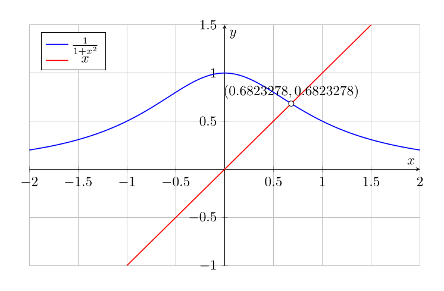
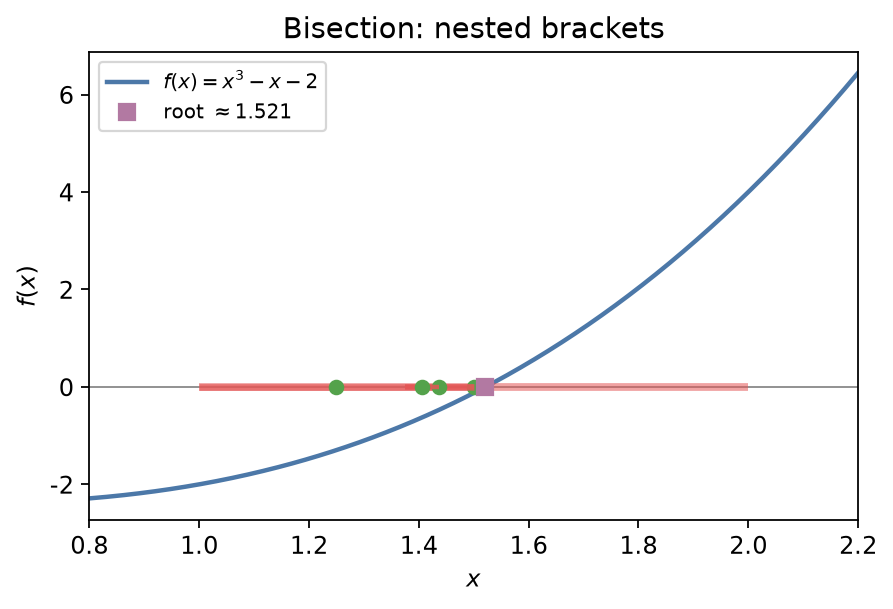
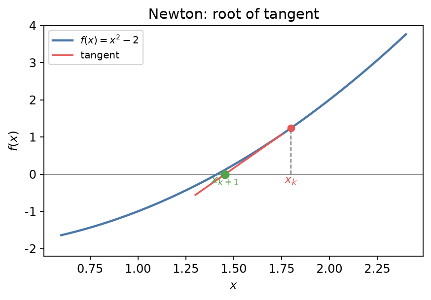

## 零点求解

一元二次、三次、四次方程有求根公式；一般五次及以上多项式**无**根式解（Abel–Ruffini）。此外还有 \\(e^x=\cos x\\) 这类超越方程。实际中依赖数值求根。

### 二分法（bisection）

以

\\[
f(x)=\frac{1}{1+x^2}-x=0
\\]

为例：图上可读出实根大约在 \\((0.5,1)\\)。

**算法.** 若连续函数 \\(f\\) 在 \\([a,b]\\) 上满足 \\(f(a)f(b)<0\\)，则至少有一根。反复取中点：

1. \\(m=(a+b)/2\\)；
2. 若 \\(f(a)f(m)<0\\) 则令 \\(b\leftarrow m\\)，否则 \\(a\leftarrow m\\)；
3. 直到区间长度或 \\(|f(m)|\\) 足够小。

### 收敛阶与速率

> **定义.** 数列 \\(\{x\_k\}\\) 收敛于 \\(x^{\ast}\\)。若存在 \\(p\geq 1\\) 与常数 \\(r\\)（\\(p=1\\) 时要求 \\(r\in(0,1)\\)）使得
>
> \\[
> \lim\_{k\to\infty}\frac{|x\_{k+1}-x^{\ast}|}{|x\_k-x^{\ast}|^p}=r,
> \\]
>
> 则称以 **阶** \\(p\\)、**速率** \\(r\\) 收敛。\\(p=1\\) 为线性；\\(p=2\\) 为二次；割线法约 \\(p\approx 1.618\\)。

初始区间 \\(I^{(0)}=[a,b]\\)，二分每步长度减半：

\\[
|e^{(k)}|\leq |I^{(k)}|=2^{-k}|b-a|.
\\]

故为**线性**收敛，\\(r=1/2\\)。要误差 \\(<\varepsilon\\)，约需

\\[
k=\bigl\lceil\log\_2(|b-a|/\varepsilon)\bigr\rceil
\\]

步。二分全局可靠但偏慢，常用来为牛顿法提供好初值。

**例.** \\(f(x)=x^3-x-2\\)，区间 \\([1,2]\\)。

\\[
f(1)=-2,\quad f(2)=4.
\\]

中点 \\(m=1.5\\)，\\(f(1.5)=-0.125\\)，新区间 \\([1,1.5]\\)。继续若干步后可得 \\(x^{\ast}\approx 1.521\\)。

### 牛顿法（Newton）

由 Taylor：\\(f(x+p)\approx f(x)+f'(x)p\\)。令近似为零得

\\[
x\_{k+1}=x\_k-\frac{f(x\_k)}{f'(x\_k)}.
\\]

几何上：在 \\(x\_k\\) 作切线，与横轴交点为 \\(x\_{k+1}\\)。

**例.** \\(f(x)=x^2-2\\)，根 \\(\sqrt{2}\\)。迭代化为

\\[
x\_{k+1}=\frac{x\_k}{2}+\frac{1}{x\_k}.
\\]

取 \\(x\_0=1.5\\)：\\(x\_1\approx 1.4167\\)，\\(x\_2\approx 1.4142\\)，很快稳定。若 \\(x\_0\\) 靠近 \\(f'=0\\) 或离根太远，可能发散——牛顿法通常只是**局部**收敛。在根处 \\(f'(x^{\ast})\neq 0\\) 且 \\(f''\\) 连续时，收敛为**二次**。

### 割线法（secant）

不用导数，用两点差商代替 \\(f'\\)：

\\[
x\_{k+1}=x\_k-f(x\_k)\frac{x\_k-x\_{k-1}}{f(x\_k)-f(x\_{k-1})}.
\\]

需两个初值；收敛阶约 \\(1.618\\)（超线性），每步一次函数值，常比牛顿更省。

### 方法比较

| 方法 | 导数 | 全局性 | 典型阶 | 备注 |
|------|------|--------|--------|------|
| 二分 | 否 | 强（异号区间） | \\(1\\) | 稳健、偏慢 |
| 割线 | 否 | 局部 | \\(\approx 1.618\\) | 两次初值 |
| 牛顿 | 是 | 局部 | \\(2\\) | 最快但要 \\(f'\\) |

实用策略：先二分缩小区间，再牛顿或割线加速。多根、重根时需改用修正牛顿（\\(x-mf/f'\\)，\\(m\\) 为重数）或避免 \\(f'\\approx 0\\) 的区域。

下一节：[数值积分](02-integration.md)。
