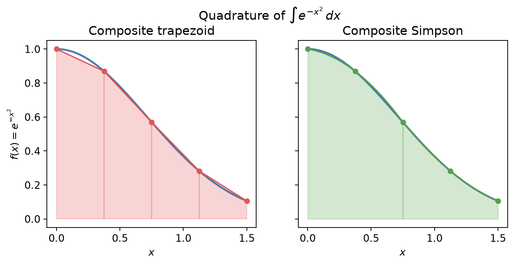

## 数值积分

解析原函数不可得，或只有离散观测时，需要用**数值积分（求积）**近似

\\[
I=\int\_a^b f(x)\,\mathrm{d}x.
\\]

基本思路：用易积分的多项式在节点上插值 \\(f\\)，再对插值多项式精确积分。

### 复合梯形公式

把 \\([a,b]\\) 等分为 \\(n\\) 段，步长 \\(h=(b-a)/n\\)，节点 \\(x\_i=a+ih\\)。每段用直线连接端点，得

\\[
T\_n
= \frac{h}{2}\Bigl(f(x\_0)+2\sum\_{i=1}^{n-1}f(x\_i)+f(x\_n)\Bigr).
\\]

若 \\(f\in C^2[a,b]\\)，误差

\\[
I-T\_n=-\frac{(b-a)}{12}h^2 f''(\xi),
\quad \xi\in(a,b).
\\]

故梯形法为 **\\(O(h^2)\\)**。

### 复合 Simpson 公式

\\(n\\) 为偶数。相邻两段用过三点的抛物线近似，得

\\[
S\_n
= \frac{h}{3}\Bigl(
f(x\_0)+4\sum\_{j=1}^{n/2}f(x\_{2j-1})+2\sum\_{j=1}^{n/2-1}f(x\_{2j})+f(x\_n)
\Bigr).
\\]

若 \\(f\in C^4\\)，

\\[
I-S\_n=-\frac{(b-a)}{180}h^4 f^{(4)}(\xi).
\\]

为 **\\(O(h^4)\\)**，通常明显优于同 \\(h\\) 的梯形法。

### Romberg 积分

梯形值 \\(T(h)\\) 的误差展开含偶次幂。Richardson 外推：由粗、细网格结果消去首项误差。记 \\(R\_{k,0}=T\_{2^k}\\)（\\(n=2^k\\) 的梯形），

\\[
R\_{k,j}=\frac{4^j R\_{k,j-1}-R\_{k-1,j-1}}{4^j-1},\qquad j=1,\ldots,k.
\\]

则 \\(R\_{k,1}\\) 等价于 Simpson；更高 \\(j\\) 给出更高阶近似。Romberg 表对角元常很快收敛。

### 例：误差函数型积分

计算

\\[
I=\int\_0^1 e^{-x^2}\,\mathrm{d}x
\\]

（与 \\(\mathrm{erf}\\) 相关，无初等原函数）。精确值约 \\(0.746824\\)。

| 方法 | \\(n\\) | 近似值 | 绝对误差（约） |
|------|--------|--------|----------------|
| 梯形 | \\(4\\) | \\(0.742984\\) | \\(3.8\times 10^{-3}\\) |
| 梯形 | \\(8\\) | \\(0.745866\\) | \\(9.6\times 10^{-4}\\) |
| Simpson | \\(4\\) | \\(0.746855\\) | \\(3\times 10^{-5}\\) |
| Simpson | \\(8\\) | \\(0.746826\\) | \\(2\times 10^{-6}\\) |

可见 Simpson 的 \\(h^4\\) 优势。

### 使用注意

- **奇异性 / 端点发散**：先换元或拆开奇点邻域。
- **振荡积分**：需专用方法（Filon、数值最速下降等），普通复合公式要极细网格。
- **自适应**：在误差大的子区间加密（许多库的 `quad` 即此类）。
- 高维积分迅速变贵（维数灾难），可改用 Monte Carlo 或稀疏网格。

下一节：[插值](03-interpolation.md)。与 Fourier / 特殊函数相关的积分技巧见第 3、4 章。
