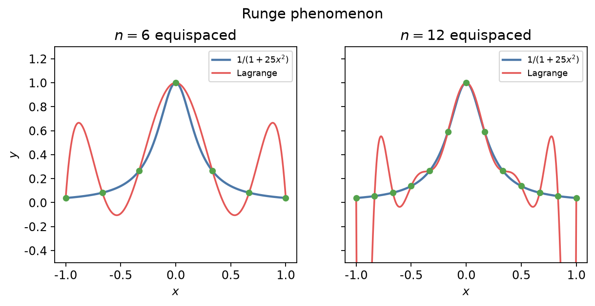

## 插值

已知节点 \\((x\_i,y\_i)\\)（\\(i=0,\ldots,n\\)，\\(x\_i\\) 互异），构造简单函数 \\(p\\) 使 \\(p(x\_i)=y\_i\\)，用以近似未知 \\(f\\) 或补全表格数据。多项式插值是基础。

### Lagrange 插值

唯一次数 \\(\leq n\\) 的多项式满足插值条件：

\\[
p\_n(x)=\sum\_{i=0}^n y\_i\,\ell\_i(x),
\qquad
\ell\_i(x)=\prod\_{j\neq i}\frac{x-x\_j}{x\_i-x\_j}.
\\]

\\(\ell\_i(x\_k)=\delta\_{ik}\\)。形式对称，加点时需整体重算。

**误差.** 若 \\(f\in C^{n+1}\\)，则存在 \\(\xi\\) 使

\\[
f(x)-p\_n(x)=\frac{f^{(n+1)}(\xi)}{(n+1)!}\prod\_{i=0}^n(x-x\_i).
\\]

节点越密、导数越大，误差未必单调下降。

### Newton 均差形式

便于递推加点：

\\[
p\_n(x)=a\_0+a\_1(x-x\_0)+a\_2(x-x\_0)(x-x\_1)+\cdots,
\\]

其中 \\(a\_k=f[x\_0,\ldots,x\_k]\\) 为均差，可由表递推

\\[
f[x\_i,x\_{i+1},\ldots,x\_{i+k}]
=\frac{f[x\_{i+1},\ldots,x\_{i+k}]-f[x\_i,\ldots,x\_{i+k-1}]}{x\_{i+k}-x\_i}.
\\]

与 Lagrange 表示同一多项式，但增节点时只加一项。

### Runge 现象

在等距节点上用高次多项式插值

\\[
f(x)=\frac{1}{1+25x^2},\qquad x\in[-1,1]
\\]

时，靠近端点会剧烈振荡；节点增多反而更糟。

**对策：**

- 改用 Chebyshev 节点（把振荡压到最小极大意义下）；
- 或改用**分段**低次插值（分段线性、三次样条）：局部、稳定，科学计算中更常用。

样条在节点处 \\(C^2\\) 连续，并带端点条件（自然样条 \\(p''=0\\) 等），是实验数据光滑化的标准工具。

下一节：[常微分方程初值问题的数值解](04-ode.md)。求积公式本质是对插值多项式积分，见[数值积分](02-integration.md)。
