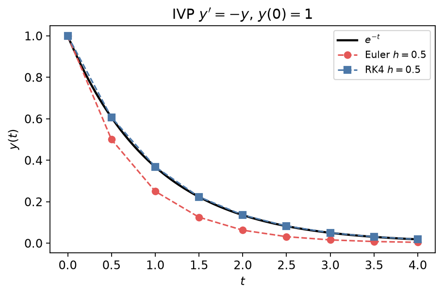

## 常微分方程的数值解

一阶初值问题（IVP）

\\[
y'=f(t,y),\qquad y(t\_0)=y\_0
\\]

在 Lipschitz 条件下局部存在唯一解，但显式解往往没有。数值方法在网格 \\(t\_{n+1}=t\_n+h\\) 上逐步推进。

### Euler 法

用差商代替导数：

\\[
y\_{n+1}=y\_n+h\,f(t\_n,y\_n).
\\]

局部截断误差 \\(O(h^2)\\)，整体误差通常 \\(O(h)\\)（一阶方法）。几何上沿点 \\((t\_n,y\_n)\\) 的切线走一步。

改进 Euler（Heun / 显式梯形）：

\\[
\begin{aligned}
k\_1&=f(t\_n,y\_n),\\\\
k\_2&=f(t\_n+h,\,y\_n+h k\_1),\\\\
y\_{n+1}&=y\_n+\frac{h}{2}(k\_1+k\_2).
\end{aligned}
\\]

整体 \\(O(h^2)\\)。

### 经典 Runge–Kutta 四阶（RK4）

\\[
\begin{aligned}
k\_1&=f(t\_n,y\_n),\\\\
k\_2&=f\bigl(t\_n+\tfrac{h}{2},\,y\_n+\tfrac{h}{2}k\_1\bigr),\\\\
k\_3&=f\bigl(t\_n+\tfrac{h}{2},\,y\_n+\tfrac{h}{2}k\_2\bigr),\\\\
k\_4&=f(t\_n+h,\,y\_n+h k\_3),\\\\
y\_{n+1}&=y\_n+\frac{h}{6}(k\_1+2k\_2+2k\_3+k\_4).
\end{aligned}
\\]

整体误差 \\(O(h^4)\\)，性价比高，是手写与教学中的默认显式格式。

**例.** \\(y'=-y\\)，\\(y(0)=1\\)，真解 \\(e^{-t}\\)。取 \\(h=0.5\\) 时 Euler 明显落后，RK4 几乎贴合曲线。

### 系统与高阶方程

\\(y''=g(t,y,y')\\) 化为

\\[
\mathbf{u}'=\mathbf{F}(t,\mathbf{u}),
\qquad
\mathbf{u}=\begin{pmatrix}y\\\\ y'\end{pmatrix}.
\\]

例如谐振子 \\(y''+y=0\\) 写成 \\((y,v)'=(v,-y)\\)，可用同一套 Euler/RK4。见第 6 章 PDE/ODE 背景与 `scripts/ch06_ode_solver.py`。

### 稳定性与刚性问题

显式方法的步长受稳定性限制：对 \\(y'=\lambda y\\)（\\(\mathrm{Re}\,\lambda<0\\)），\\(|1+h\lambda|\\)（Euler）须 \\(<1\\) 一类条件。若系统同时含快、慢衰减模态（**刚性**），显式 RK 被迫用极小 \\(h\\)；宜改用隐式方法（后向 Euler、隐式梯形、BDF）或自适应求解器（如 `scipy.integrate.solve_ivp` 的 `Radau`/`BDF`）。

### 实用建议

| 场景 | 建议 |
|------|------|
| 光滑非刚性、中等精度 | RK4 或库中显式 RK |
| 要误差控制 | 自适应步长（Dormand–Prince 等） |
| 刚性 / 化学反应动力学 | 隐式或 BDF |
| 检验实现 | 用有精确解的问题（如 \\(y'=-y\\)）对照 |

边值问题（两端给条件）需打靶法或差分/有限元，超出本节初值推进的范围。

返回：[零点](01-finding-zeros.md) · [积分](02-integration.md) · [插值](03-interpolation.md)。
