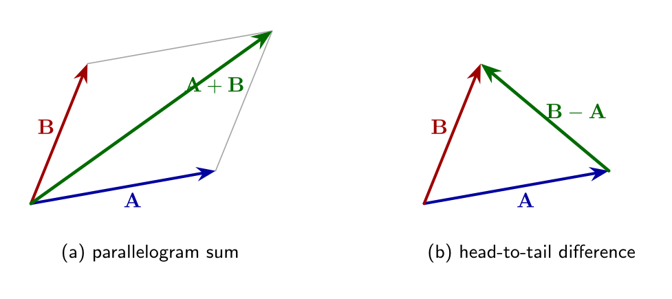
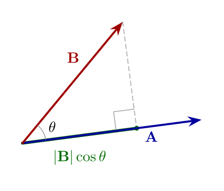
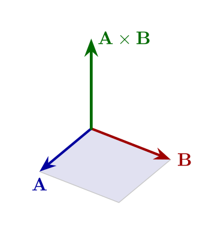

## 向量代数

### 标量与向量

标量是仅由大小决定的量，例如温度、质量、电荷等。向量（例如速度与力）除了大小外还必须指明方向，本文用粗体表示向量。向量可用其在三个坐标方向上的分量来完整描述。在直角坐标系中，任一向量可写为

\\[
\mathbf{A}=A\_x \mathbf{i}\_x+A\_y \mathbf{i}\_y+A\_z \mathbf{i}\_z,
\\]

其模长为

\\[
|\mathbf{A}|=\sqrt{A\_x^2+A\_y^2+A\_z^2}.
\\]

### 向量与标量相乘

向量乘以一个正的标量只会伸缩其长度而不改变方向；若乘以负标量则方向反向：

\\[
a\mathbf{A}=aA\_x \mathbf{i}\_x+aA\_y \mathbf{i}\_y+aA\_z \mathbf{i}\_z.
\\]

### 向量的加法与减法

向量的加法与减法按分量逐个相加减完成。几何上，加法对应平行四边形对角线；减法可用头尾相接：从 \\(\mathbf{A}\\) 的终点指向 \\(\mathbf{B}\\) 的终点得到 \\(\mathbf{B}-\mathbf{A}\\)。

### 点积（数量积）

两个向量的点积是一个标量，定义为

\\[
\mathbf{A}\cdot\mathbf{B}=|\mathbf{A}| |\mathbf{B}|\cos\theta,
\\]

其中 \\(\theta\\) 为两向量之间的夹角。几何上，这等于 \\(|\mathbf{A}|\\) 乘以 \\(\mathbf{B}\\) 在 \\(\mathbf{A}\\) 方向上的投影。点积也可用分量表示为

\\[
\mathbf{A}\cdot\mathbf{B}=A\_xB\_x+A\_yB\_y+A\_zB\_z.
\\]

点积满足交换律 \\(\mathbf{A}\cdot\mathbf{B}=\mathbf{B}\cdot\mathbf{A}\\)，并且在笛卡尔坐标下同样适用于圆柱与球坐标（替换相应坐标符号）。

### 叉积（向量积）

叉积 \\(\mathbf{A}\times\mathbf{B}\\) 是垂直于 \\(\mathbf{A}\\) 与 \\(\mathbf{B}\\) 的向量，方向由右手法则确定，其大小为

\\[
|\mathbf{A}\times\mathbf{B}|=|\mathbf{A}| |\mathbf{B}|\sin\theta,
\\]

等于以 \\(\mathbf{A},\mathbf{B}\\) 为邻边的平行四边形面积，并具有反交换性 \\(\mathbf{A}\times\mathbf{B}=-\mathbf{B}\times\mathbf{A}\\)。在分量上，叉积可由行列式展开写为

\\[
\mathbf{A}\times\mathbf{B}=\begin{vmatrix}\mathbf{i}\_x & \mathbf{i}\_y & \mathbf{i}\_z \\\\
A\_x & A\_y & A\_z \\\\
B\_x & B\_y & B\_z \end{vmatrix}.
\\]

### 标量三重积与体积

标量三重积 \\((\mathbf{A}\times\mathbf{B})\cdot\mathbf{C}\\) 等于由 \\(\mathbf{A},\mathbf{B},\mathbf{C}\\) 构成的平行六面体的体积（带方向），并满足置换不变性：
\\[
(\mathbf{A}\times\mathbf{B})\cdot\mathbf{C}=(\mathbf{B}\times\mathbf{C})\cdot\mathbf{A}=(\mathbf{C}\times\mathbf{A})\cdot\mathbf{B}.
\\]

### 若干例题（保留原文例题结构）

**例 1-1（向量加减）** 给定

\\[
\mathbf{A}=4\mathbf{i}\_x+4\mathbf{i}\_y,   \mathbf{B}=\mathbf{i}\_x+8\mathbf{i}\_y.
\\]

求和与差以及它们的模长。

解：按分量相加得

\\[
\mathbf{S}=\mathbf{A}+\mathbf{B}=(4+1)\mathbf{i}\_x+(4+8)\mathbf{i}\_y=5\mathbf{i}\_x+12\mathbf{i}\_y.
\\]

因此

\\[
|\mathbf{S}|=\sqrt{5^2+12^2}=\sqrt{25+144}=\sqrt{169}=13.
\\]

差为

\\[
\mathbf{D}=\mathbf{B}-\mathbf{A}=(1-4)\mathbf{i}\_x+(8-4)\mathbf{i}\_y=-3\mathbf{i}\_x+4\mathbf{i}\_y,
\\]

所以

\\[
|\mathbf{D}|=\sqrt{(-3)^2+4^2}=\sqrt{9+16}=\sqrt{25}=5.
\\]

**例 1-2（点积求角度）** 例题给出

\\[
\mathbf{A}=\sqrt{3} \mathbf{i}\_x+\mathbf{i}\_y,   \mathbf{B}=2\mathbf{i}\_x.
\\]

求两向量间的夹角 \\(\theta\\)。

解：先计算各自的模长

\\[
|\mathbf{A}|=\sqrt{(\sqrt{3})^2+1^2}=\sqrt{3+1}=2,   |\mathbf{B}|=\sqrt{(2)^2}=2.
\\]

再用点积的分量表达式

\\[
\mathbf{A}\cdot\mathbf{B}=A\_xB\_x+A\_yB\_y=(\sqrt{3})(2)+1\cdot 0=2\sqrt{3}.
\\]

由点积定义

\\[
\mathbf{A}\cdot\mathbf{B}=|\mathbf{A}| |\mathbf{B}|\cos\theta=2\cdot 2\cos\theta=4\cos\theta.
\\]

于是

\\[
\cos\theta=\dfrac{\mathbf{A}\cdot\mathbf{B}}{4}=\dfrac{2\sqrt{3}}{4}=\dfrac{\sqrt{3}}{2}.
\\]

因此

\\[
\theta=\cos^{-1}\left(\dfrac{\sqrt{3}}{2}\right)=30^{\circ}.
\\]

**例 1-3（叉积与单位法向量）** 例题给出

\\[
\mathbf{A}=-\mathbf{i}\_x+\mathbf{i}\_y+\mathbf{i}\_z,   \mathbf{B}=\mathbf{i}\_x-\mathbf{i}\_y+\mathbf{i}\_z.
\\]

要求与问题：求与这两向量都垂直且方向遵循右手准则的单位向量 \\(\mathbf{i}\_n\\)，并求出 \\(\mathbf{A}\\) 与 \\(\mathbf{B}\\) 的夹角。

解：先计算叉积 \\(\mathbf{A}\times\mathbf{B}\\)（它垂直于两向量）：

\\[
\mathbf{A}\times\mathbf{B}=\begin{vmatrix}\mathbf{i}\_x&\mathbf{i}\_y&\mathbf{i}\_z\\ -1&1&1\\ 1&-1&1\end{vmatrix}.
\\]

按行列式展开（沿第一行）：

\\[
\mathbf{A}\times\mathbf{B}=\mathbf{i}\_x\begin{vmatrix}1&1\\ -1&1\end{vmatrix}-\mathbf{i}\_y\begin{vmatrix}-1&1\\ 1&1\end{vmatrix}+\mathbf{i}\_z\begin{vmatrix}-1&1\\ 1&-1\end{vmatrix}.
\\]

计算各个子式：

\\[
\begin{vmatrix}1&1\\ -1&1\end{vmatrix}=1\cdot 1-1\cdot(-1)=1+1=2,
\begin{vmatrix}-1&1\\ 1&1\end{vmatrix}=(-1)\cdot 1-1\cdot 1=-1-1=-2,
\\]

\\[
\begin{vmatrix}-1&1\\ 1&-1\end{vmatrix}=(-1)(-1)-1\cdot 1=1-1=0.
\\]

代回得

\\[
\mathbf{A}\times\mathbf{B}=2\mathbf{i}\_x-(-2)\mathbf{i}\_y+0\mathbf{i}\_z=2\mathbf{i}\_x+2\mathbf{i}\_y.
\\]

叉积的模长为

\\[
|\mathbf{A}\times\mathbf{B}|=\sqrt{2^2+2^2}=\sqrt{8}=2\sqrt{2}.
\\]

因此相应的单位法向量为

\\[
\mathbf{i}\_n=\dfrac{\mathbf{A}\times\mathbf{B}}{|\mathbf{A}\times\mathbf{B}|}=\dfrac{2\mathbf{i}\_x+2\mathbf{i}\_y}{2\sqrt{2}}=\dfrac{1}{\sqrt{2}}(\mathbf{i}\_x+\mathbf{i}\_y).
\\]

再求两向量的夾角，先計算點積：

\\[
\mathbf{A}\cdot\mathbf{B}=(-1)(1)+1\cdot(-1)+1\cdot 1=-1-1+1=-1.
\\]

两向量的模长：

\\[
|\mathbf{A}|=\sqrt{(-1)^2+1^2+1^2}=\sqrt{3},   |\mathbf{B}|=\sqrt{1^2+(-1)^2+1^2}=\sqrt{3}.
\\]

因此

\\[
\cos\theta=\dfrac{\mathbf{A}\cdot\mathbf{B}}{|\mathbf{A}| |\mathbf{B}|}=\dfrac{-1}{3}.
\\]

于是

\\[
\theta=\cos^{-1}\left(-\dfrac{1}{3}\right)\approx 109.47^{\circ},
\\]

这恰好接近正四面体中顶点之间的夹角（为约 109.47°）。
