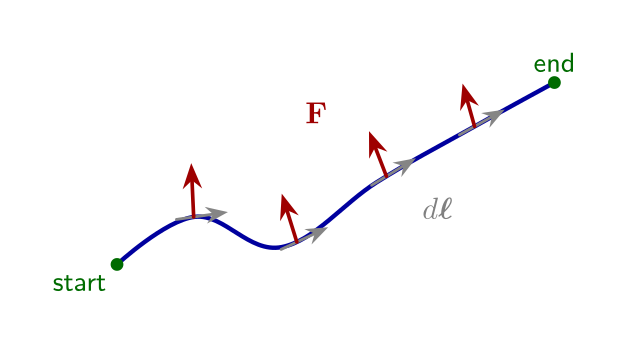

## 梯度与算子 \\(\nabla\\)（del）

设标量场 \\(f\\)。在直角坐标下微分变化可写为

\\[
\mathrm{d}f=\frac{\partial f}{\partial x}\,\mathrm{d}x+\frac{\partial f}{\partial y}\,\mathrm{d}y+\frac{\partial f}{\partial z}\,\mathrm{d}z.
\\]

定义梯度为

\\[
\nabla f=\frac{\partial f}{\partial x} \mathbf{i}\_x+\frac{\partial f}{\partial y} \mathbf{i}\_y+\frac{\partial f}{\partial z} \mathbf{i}\_z,
\\]

于是 \\(\mathrm{d}f=\nabla f\cdot\mathrm{d}\boldsymbol{\ell}\\)，其中 \\(\mathrm{d}\boldsymbol{\ell}=\mathrm{d}x\,\mathbf{i}\_x+\mathrm{d}y\,\mathbf{i}\_y+\mathrm{d}z\,\mathbf{i}\_z\\)。符号 \\(\nabla\\)（del）单独无意义，但与标量、点积、叉积组合后分别给出梯度、散度、旋度。

由 \\(\mathrm{d}f=|\nabla f|\,|\mathrm{d}\boldsymbol{\ell}|\cos\theta\\) 可见：\\(\nabla f\\) 指向 \\(f\\) 增加最快的方向；沿等值面运动时 \\(\theta=\pi/2\\)，故 \\(\mathrm{d}f=0\\)。

### 曲线坐标中的梯度

梯度的坐标无关定义是：与 \\(\mathrm{d}\boldsymbol{\ell}\\) 点乘后给出 \\(\mathrm{d}f\\) 的那个向量。柱、球坐标下据此得到

\\[
\nabla f=\mathbf{i}\_r\frac{\partial f}{\partial r}+\mathbf{i}\_\phi\frac{1}{r}\frac{\partial f}{\partial\phi}+\mathbf{i}\_z\frac{\partial f}{\partial z}
\quad\text{（柱）},
\\]

\\[
\nabla f=\mathbf{i}\_r\frac{\partial f}{\partial r}+\mathbf{i}\_\theta\frac{1}{r}\frac{\partial f}{\partial\theta}+\mathbf{i}\_\phi\frac{1}{r\sin\theta}\frac{\partial f}{\partial\phi}
\quad\text{（球）}.
\\]

完整的散度/旋度/Laplace 公式见第 7 章[柱/球坐标中的 ∇](../ch07-coordinates/04-del-cylindrical-spherical.md)。

### 例题 1-4（梯度）

求下列函数的梯度，其中 \\(a,b\\) 为常数：

- (a) \\(f=ax^2 y+b y^2 z\\)；
- (b) \\(f=a r^2\sin\phi+b r z\cos 2\phi\\)（柱坐标）；
- (c) \\(f=a+b r\sin\theta\cos\phi\\)（球坐标）。

**解.** (a) 直角坐标下

\\[
\nabla f=2 a x y\,\mathbf{i}\_x+(a x^2+2 b y z)\,\mathbf{i}\_y+b y^2\,\mathbf{i}\_z.
\\]

（若原文为 \\(b y^3 z\\) 则 \\(z\\) 分量改为 \\(b y^3\\)，\\(y\\) 分量含 \\(3 b y^2 z\\)。）

(b) 柱坐标梯度：

\\[
\begin{aligned}
\nabla f
&=(2 a r\sin\phi+b z\cos 2\phi)\,\mathbf{i}\_r \\\\
&\quad+\frac{1}{r}(a r^2\cos\phi-2 b r z\sin 2\phi)\,\mathbf{i}\_\phi
+b r\cos 2\phi\,\mathbf{i}\_z.
\end{aligned}
\\]

(c) 球坐标梯度：

\\[
\nabla f
=b\sin\theta\cos\phi\,\mathbf{i}\_r
+b\cos\theta\cos\phi\,\mathbf{i}\_\theta
-b\sin\phi\,\mathbf{i}\_\phi.
\\]

### 线积分与路径无关

力场沿路径做功是点积的自然应用：把路径拆成许多小位移 \\(\mathrm{d}\boldsymbol{\ell}\\)，增量功 \\(\mathrm{d}W=\mathbf{F}\cdot\mathrm{d}\boldsymbol{\ell}\\)，总功为线积分

\\[
W=\int\_L \mathbf{F}\cdot\mathrm{d}\boldsymbol{\ell}.
\\]

对标量场的梯度，由链式法则有

\\[
\int\_A^B \nabla f\cdot\mathrm{d}\boldsymbol{\ell}=f(B)-f(A).
\\]

右端只依赖端点，故**梯度场的线积分与路径无关**；沿任意闭合路径则为零。这是后面“\\(\nabla\times(\nabla f)=\mathbf{0}\\)”的积分表述。

### 例题 1-5（线积分）

取 \\(f=x^2 y\\)，验证从原点到 \\(P=(x\_0,y\_0)\\) 沿不同路径有

\\[
\int \nabla f\cdot\mathrm{d}\boldsymbol{\ell}=f(P)-f(O)=x\_0^2 y\_0.
\\]

**解.** \\(\nabla f=2 x y\,\mathbf{i}\_x+x^2\,\mathbf{i}\_y\\)。

- 路径 1：先沿 \\(x\\) 轴到 \\((x\_0,0)\\)，再竖直到 \\(P\\)。第一段 \\(y=0\\) 故积分为零；第二段 \\(x=x\_0\\)、\\(\mathrm{d}\boldsymbol{\ell}=\mathrm{d}y\,\mathbf{i}\_y\\)，得 \\(\int\_0^{y\_0} x\_0^2\,\mathrm{d}y=x\_0^2 y\_0\\)。
- 路径 2：先竖直再水平，同样得到 \\(x\_0^2 y\_0\\)。
- 路径 3：直线 \\(y=(y\_0/x\_0)x\\)，代入后积分仍得 \\(x\_0^2 y\_0\\)。

下一节讨论通量与散度，见[通量与散度](04-flux-divergence.md)。
