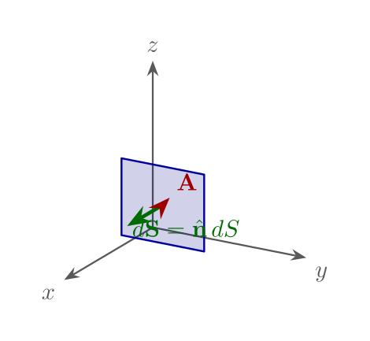

## 通量与散度

本节据 Zahn《Vector Analysis》整理：用流体类比引入通量，再由微元盒子得到散度，最后拼成散度定理。柱/球坐标公式见[柱/球坐标中的 ∇](../ch07-coordinates/04-del-cylindrical-spherical.md)。

### 通量与源、汇

若测量进入某体积的流体质量少于离开的质量，则体积内必有**源**；反之有**汇**。无源无汇时流线连续，净流出为零。

向量场 \\(\mathbf{A}\\) 穿过封闭曲面 \\(S\\) 的**通量**定义为

\\[
\Phi=\oint\_S \mathbf{A}\cdot\mathrm{d}\mathbf{S}.
\\]

面元 \\(\mathrm{d}\mathbf{S}=\hat{\mathbf{n}}\,\mathrm{d}S\\) 指向**外法向**。只有垂直于曲面的分量贡献通量；切向分量只沿面流动，不穿过。净通量 \\(\Phi>0\\) 表示内部有源，\\(\Phi<0\\) 表示有汇，\\(\Phi=0\\) 表示无净源。

### 散度：微元盒子

取边长 \\(\Delta x,\Delta y,\Delta z\\) 的直角微元，计算六面外通量。例如沿 \\(x\\) 的一对面：

\\[
\bigl[A\_x(x+\Delta x)-A\_x(x)\bigr]\Delta y\Delta z
\approx \frac{\partial A\_x}{\partial x}\,\Delta x\,\Delta y\,\Delta z,
\\]

\\(y,z\\) 方向类似。除以体积 \\(\Delta V=\Delta x\Delta y\Delta z\\) 并取极限，得到

\\[
\nabla\cdot\mathbf{A}
= \frac{\partial A\_x}{\partial x}+\frac{\partial A\_y}{\partial y}+\frac{\partial A\_z}{\partial z}
= \lim\_{\Delta V\to 0}\frac{1}{\Delta V}\oint\_{\partial(\Delta V)}\mathbf{A}\cdot\mathrm{d}\mathbf{S}.
\\]

散度即**单位体积净外通量**的极限。

### 散度定理

把宏观体积剖成许多微元盒子。相邻微元的公共面上，外法向相反，通量成对抵消，只剩最外层表面的贡献：

\\[
\oint\_S \mathbf{A}\cdot\mathrm{d}\mathbf{S}
= \int\_V (\nabla\cdot\mathbf{A})\,\mathrm{d}V.
\\]

### 例题 1-6（散度定理）

取 \\(\mathbf{A}=x\mathbf{i}\_x+y\mathbf{i}\_y+z\mathbf{i}\_z\\)（即 \\(\mathbf{A}=\mathbf{r}\\)），验证边长为 \\(a,b,c\\) 且一角在原点的长方体上的散度定理。

**解.** \\(\nabla\cdot\mathbf{A}=3\\)，故

\\[
\int\_V (\nabla\cdot\mathbf{A})\,\mathrm{d}V=3 a b c.
\\]

六面通量：\\(x=a\\) 面贡献 \\(a\cdot(b c)\\)，\\(x=0\\) 面贡献 \\(0\\)；\\(y\\)、\\(z\\) 方向同理，总和亦为 \\(3 a b c\\)。两边一致。

（球坐标中对径向场 \\(A\_r=r\\) 有 \\(\nabla\cdot\mathbf{A}=3\\)，与上相合。）

下一节：[旋度与 Stokes 定理](05-curl-stokes.md)。预备性简述见第 0 章[向量分析基础](../ch00-prerequisites/05-vector-analysis.md)。
