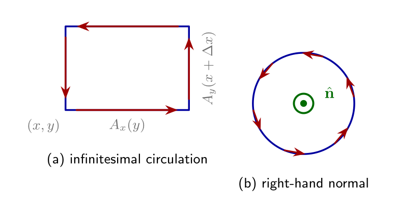
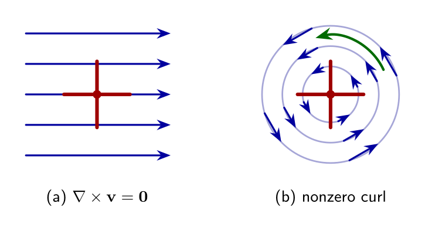
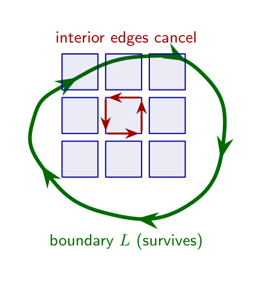

## 旋度与 Stokes 定理

本节据 Zahn《Vector Analysis》整理：由闭合环量定义旋度，再用“内边抵消”得到 Stokes 定理。柱/球坐标旋度公式见[柱/球坐标中的 ∇](../ch07-coordinates/04-del-cylindrical-spherical.md)。

### 环量与微元回路

向量场沿闭合路径的线积分称为**环量**

\\[
C=\oint\_L \mathbf{A}\cdot\mathrm{d}\boldsymbol{\ell}.
\\]

在 \\(xy\\) 平面取边长 \\(\Delta x,\Delta y\\) 的矩形回路（逆时针），四边近似后得

\\[
C
\approx
\Bigl(\frac{\partial A\_y}{\partial x}-\frac{\partial A\_x}{\partial y}\Bigr)\Delta x\Delta y
= (\nabla\times\mathbf{A})\_z\,\Delta S.
\\]

对 \\(yz\\)、\\(zx\\) 平面的回路作循环置换，即得旋度的三个直角分量。行列式写法：

\\[
\nabla\times\mathbf{A}
= \begin{vmatrix}
\mathbf{i}\_x & \mathbf{i}\_y & \mathbf{i}\_z \\\\
\partial/\partial x & \partial/\partial y & \partial/\partial z \\\\
A\_x & A\_y & A\_z
\end{vmatrix}.
\\]

坐标无关表述：法向分量等于环量密度

\\[
(\nabla\times\mathbf{A})\cdot\hat{\mathbf{n}}
= \lim\_{\Delta S\to 0}\frac{1}{\Delta S}\oint\_{\partial(\Delta S)}\mathbf{A}\cdot\mathrm{d}\boldsymbol{\ell}.
\\]

回路绕向与法向由**右手法则**联系。

### 桨轮图景

流体速度场中，若放入一小桨轮会发生转动，则该处旋度非零；均匀平动流中桨轮不转，旋度为零。旋度分量沿桨轮转轴方向。

**提醒**：场线“绕圈”并不等于处处 \\(\nabla\times\mathbf{A}\neq\mathbf{0}\\)。直导线磁场在导线外旋度为零，但包围导线的回路环量非零——旋度是局域性质。见第 0 章[向量分析基础](../ch00-prerequisites/05-vector-analysis.md)。

### Stokes 定理

把开曲面剖成许多微元回路。相邻微元的公共边走向相反，线积分抵消，只剩外边界 \\(L\\) 的贡献：

\\[
\oint\_L \mathbf{A}\cdot\mathrm{d}\boldsymbol{\ell}
= \int\_S (\nabla\times\mathbf{A})\cdot\mathrm{d}\mathbf{S}.
\\]

同一边界可张许多不同曲面；Stokes 定理对其中每一个都成立。

### 例题 1-7（Stokes 定理）

取 \\(\mathbf{A}=-y\mathbf{i}_x+x\mathbf{i}_y-z\mathbf{i}_z\\)（柱坐标下为 \\(r\mathbf{i}\_\phi-z\mathbf{i}_z\\)），边界 \\(L\\) 为 \\(xy\\) 平面上半径 \\(R\\) 的圆。验证：平面圆盘、半球面、以该圆为底的圆柱侧面（加顶）上，面积分均等于环量。

**解.** 在 \\(L\\) 上 \\(\mathrm{d}\boldsymbol{\ell}=R\,\mathrm{d}\phi\,\mathbf{i}\_\phi\\)，\\(\mathbf{A}\cdot\mathrm{d}\boldsymbol{\ell}=R^2\mathrm{d}\phi\\)，故

\\[
C=\oint\_L \mathbf{A}\cdot\mathrm{d}\boldsymbol{\ell}=2\pi R^2.
\\]

又 \\(\nabla\times\mathbf{A}=2\mathbf{i}_z\\)。

- 平面圆盘：\\(\int (\nabla\times\mathbf{A})\cdot\mathrm{d}\mathbf{S}=2\cdot(\pi R^2)=2\pi R^2\\)。
- 半球：用法向与 \\(\mathbf{i}_z\\) 的夹角积分，同样得 \\(2\pi R^2\\)。
- 圆柱：侧面法向与 \\(\mathbf{i}_z\\) 正交，贡献为零；顶面与圆盘相同，仍得 \\(2\pi R^2\\)。

### 两条恒等式（积分证明）

1. \\(\nabla\times(\nabla f)=\mathbf{0}\\)：对任意曲面用 Stokes，左边面积分化为 \\(\oint \nabla f\cdot\mathrm{d}\boldsymbol{\ell}=0\\)（见[梯度与线积分](03-grad-del.md)），故旋度为零。
2. \\(\nabla\cdot(\nabla\times\mathbf{A})=0\\)：对封闭曲面，Stokes 要求边界缩为空，环量为零；再对 \\(\nabla\times\mathbf{A}\\) 用散度定理即得。

更多恒等式见[附录：矢量恒等式](../appendix/vector-identities.md)。电磁学中 Gauss/Stokes 如何局域化 Maxwell 方程，见[电磁学中的数学方法](../ch05-math-physics-eq/06-em-methods.md)。
